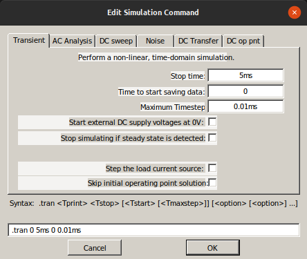

# LTSpice XVII a través de ejemplos

## Introducción

Vamos a explicar los tipos de simulaciones posibles basándonos en el libro publicado bajo licencia Creative Common Share Alike titulado **LTSPICE - Análisis de circuitos y dispositivos electrónicos** de Mónica Liliana González de la serie Libros de Cátedra publicado por la editorial de la Universidad nacional de la Plata. En la bibliografia se encuentra en enlace de descarga desde la fuente. También podemos [descargarlo](../Miscelanea/LTSpiceXVII.pdf) desde esta misma web.

Este libro es un manual completo de manejo del programa que recomendamos como guia del mismo.

En esta introducción simplemente describiremos los aspectos fundamentales de manejo básico.

En la imagen 1 tenemos la descripción breve de los elementos que componen la barra de herramientas.

| Imagen 1 |
|:-:|
|  |
| Descripción de la barra de herramientas |

## Ejemplo 1. Simulación DC

A continuación vemos una animación como ejemplo básico de captura de un esquema, colocación de nombres de nodos y edición del valor de los componentes.

En la animación siguiente vemos las selecciones para crear una simulación con análisis DC del punto de trabajo.

El esquema está disponible para su descarga en el [enlace](../Ejemplos/E1-captura/E1-captura.asc)

## Ejemplo 2. Circuito RLC serie para simulación en el tiempo

Para esta simulación vamos en primer lugar a realizar la captura del circuito RLC de la imagen 2.

| Imagen 2 |
|:-:|
|  |
| Captura circuito RLC serie |

La configuración de la fuente de tensión V1 es un pulso de amplitud 10 V. Configurada como señal lineal a trozos o PWL (Piece-Wise Linear) de la forma que vemos en la imagen 3.

| Imagen 3 |
|:-:|
|  |
| Configuración PWL de la fuente |

Para mas detalles sobre este, y otros, tipos de fuente se puede consultar este [enlace](http://espice.ugr.es/ayuda2/manual/c4_modelos/cap4.php) o bien este [otro](https://desi.iteso.mx/erayas/documents/cad_course/lectures/SPICE/spice_basic_functions.pdf).

En esta ocasión la simulación se realiza en un intervalo de tiempo definido por la sentencia:

`.tran 0 0.5ms 0 0.01m`

que aparece en la imagen 2 y que se configura como vemos en la imagen 4.

| Imagen 4 |
|:-:|
|  |
| Configuración de la simulación en el tiempo |

Esta configuración indica que se va a realizar un análisis el tiempo (.tran), en el rango de 0 a 5 ms y tomando un intervalo de tiempo de simulación de 0.01ms.

El esquema está disponible para su descarga en el [enlace](../Ejemplos/E1-captura/E2-RLC-tran.asc)

En la siguiente animación vemos el efecto de correr la simulación y si vamos moviendo el cursor vemos que al apuntar a un nodo aparece una punta de prueba de tensión de color rojo, Al hacer clic con el botón izquierdo se obtiene la forma de onda del nodo seleccionado respecto de la referencia de 0V. Observamos también que si se coloca el cursor sobre un componente aparece el icono de una sonda de corriente que nos permite obtener la forma de onda de la corriente por el componente seleccionado.

También podemos medir la tensión entre dos nodos y para ello debemos hacer clic en un nodo y manteniendo pulsado el botón del ratón, arrastramos hacia el otro nodo respecto del cual se pretende medir. Si queremos medir la corriente que circula por un conductor hacemos clic sobre el cable mientras se mantiene presionada la tecla "Alt". Si con la tecla "Alt" pulsada hacemos clic en un componente lo que obtendremos es la forma de onda de la potencia instantánea en ese componente. En la imagen 5 vemos distintas gráficas correspondientes a esto.

| Imagen 5 |
|:-:|
|  |
| Gráficas de corrientes, tensiones y potencias |

Estas situaciones las vemos reflejadas en la animación siguiente.

Si estamos trabajando con el circuito anterior y queremos recuperar estas gráficas las tenemos disponibles en el enlace para [descargar](../img/Ejemplos/E2-RLC-tran.plt).

## Ejemplo 3. Recortador de dos niveles con diodos zener

Comenzamos por situar en nuestro esquema una fuente de tensión de la que editamos sus propiedades de forma que en *avanzadas* tengamos lo que observamos en la imagen 6.

| Imagen 6 |
|:-:|
|  |
| Opciones avanzadas de configuración de la fuente de tensión |

Cuando cerramos la ventana de la imagen 6 pulsando el botón Ok la situación en la zona de trabajo es la que vemos en la imagen 7.

| Imagen 7 |
|:-:|
|  |
| Fuente de tensión configurada |

Ahora situamos una resistencia en nuestro esquema posicionandola de forma horizontal (Ctrl+r) y le ponemos como valor 2k2. Opcionalmente podemos establecer su tolerancia y su potencia. Si ahora nos situamos sobre la referencia de la resistencia y hacemos clic con el botón derecho accedemos a las opciones de dicha referencia y, en este caso, le cambiamos el nombre a la resistencia, quedando el resultado que vemos en las imágenes 8a y 8b, durante la edición y una vez confirmada esta.

| Imagen 8a | Imagen 8b |
|:-:|:-:|
|  |  |
| Configuración de la referencia de una resistencia | Resistencia con referencia modificada |

Ahora procedemos a colocar un diodo en nuestro esquema y situándonos sobre el mismo editamos sus propiedades accediendo a la ventana que observamos en la imagen 9.

| Imagen 9 |
|:-:|
|  |
| Acceso a configuraciones del diodo |

Hacemos clic en el botón *Pick new diode* y en la lista vamos a escoger el diodo zener de 4.7 V 1N750, tal y como se observa en la imagen 10.

| Imagen 10 |
|:-:|
|  |
| Escogemos el zener 1N750 |

Hacemos una copia del diodo zener, colocamos un simbolo de referencia GND y conectamos los elementos para obtener el esquema que observamos en la imagen 11.

| Imagen 11 |
|:-:|
|  |
| Esquema final |

Vamos a configurar los datos de simulación, para ello nos dirigimos al menú *Simulate* y escogemos *Edit Simulation Cmd*. En la ventana que se nos abre (imagen 12) establecemos un análisis temporal con un tiempo de simulación de 1 ms y con un tiempo de paso o intervalo para cada muestra de 0.01ms.

| Imagen 12 |
|:-:|
|  |
| Configuración de los parámetros de simulación |

Corremos la simulación y configuramos las trazas para obtener en un gráfico la comparativa entre la entrada y la salida y en otro gráfico para ver la tensión en extremos de la resistencia. Debemos obtener algo similar a lo que vemos en la imagen 13.

| Imagen 13 |
|:-:|
|  |
| Resultado de la simulación |

El esquema está disponible para su descarga en el [enlace](../Ejemplos/E1-captura/E3-recortador-nivel.asc), las gráficas las tenemos [aqui](../Ejemplos/E1-captura/E3-recortador-nivel.plt).
