# Elementos mas usuales en los circuitos electrónicos

Antes de comenzar con las descripciones de los distintos elementos básicos vamos a ver como se ponen las unidades y que sufijos multiplicadores son válidos. En la tabla siguiente vemos las unidades que se puede usar.

| Sufijo | Valor (nombre) |
|:-:|---|
| F = f | 10-15 (femto)|
| P = p | 10-12 (pico) |
| N = n | 10-9 (nano) |
| U = u | 10-6 (micro) |
| M = m | 10-3 (mili) |
| K = k | 103 (kilo) |
| MEG = meg | 106 (mega) |
| G = g | 109 (giga|
| T = t | 1012 (tera) |

| Unidad | Nnombre |
|:-:|---|
| V | Voltios |
| A | Amperios |
| OHM | Ohmios |
| Hz | Hercios |
| H | Henrios |
| F | Faradios |

## Resistencia

Se trata sin duda del componente mas utilizado en circutos electrónicos. En LTSpice disponemos de dos modelos que solamente difieren en el símbolo. En la imagen 1 vemos el símbolo para ambos casos y la edición de las propiedades (idénticas para ambos) de uno de ellos,

| Imagen 1 |
|:-:|
| 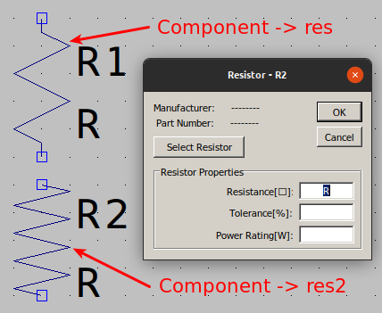 |
| Símbolo y propiedades de res y res2 |

Desde el menú Wiev podemos acceder a SPICE netlist que nos mostrará una descripción como la que se observa en la imagen 2.

| Imagen 2 |
|:-:|
| 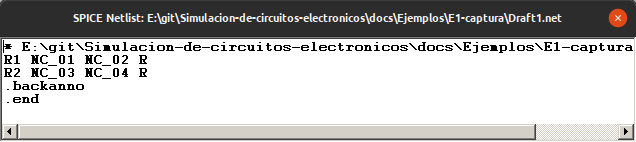 |
| Netlist de los dos modelos de resistencia |

La netlist es un archivo de texto con la descripción del circuito y es una forma que usan otras versiones del simulador Spice.

La forma R1 NC_01 NC_02 R se lee como que la resistencia R1 se conecta entre los nodos 01 y 02 (NC indica que es el pin de un componente no conectado) y que tiene como valor R que podemos suministrar directamente o seleccionar de la base de datos con *Select Resistor*.

En la imagen 3 vemos el efecto en la netlist al realizar una conexión entre ambas resistencias y como quedan renombrados los nodos que describen la conexión.

| Imagen 3 |
|:-:|
| 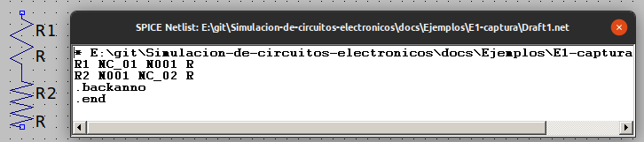 |
| Cambios en la netlist por cambios en el circuito |

## Condensador

En este caso disponemos de dos posibilidades, condensador no polarizado (cap) y condensador polarizado o electrolítico (polcap). En la imagen 4 vemos un condensador no polarizado y sus propiedades con un modelo escogido de la base de datos.

| Imagen 4 |
|:-:|
| 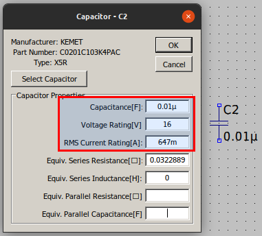 |
| Condensador no polarizado y sus propiedades |

Los valores destacados corresponden a los valores nominales de capacidad, tensión máxima soportada y corriente.

En la imagen 5 tenemos la misma situación pero en este caso para un condensador polarizado.

| Imagen 5 |
|:-:|
| 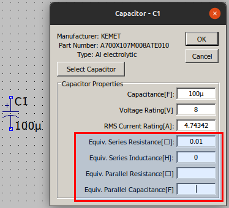 |
| Condensador polarizado y sus propiedades  |

Los valores destacados permiten establecer los valores para un modelo equivalente como el que vemos en la imagen 6.

| Imagen 6 |
|:-:|
| 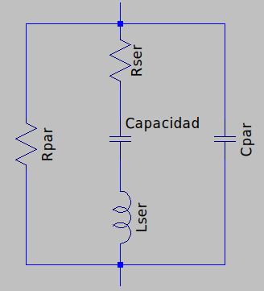 |
| Modelo equivalente de un condensador |

Las descripciones en modo texto de ambos componentes son las siguientes:

* C1 NC_01 NC_02 100µ V=8 Irms=4.74342 Rser=0.01 Lser=0 mfg="KEMET" pn="A700X107M008ATE010" type="Al electrolytic"

* C2 NC_03 NC_04 0.01µ V=16 Irms=647m Rser=0.0322889 Lser=0 mfg="KEMET" pn="C0201C103K4PAC" type="X5R"

## Bobina o inductor

Están disponibles dos modelos de componente, ind para una bobina normal e ind2 que incluye en el símbolo un punto para indicar la fase del componente. En la imagen 7 vemos una bobina y sus propiedades con un modelo escogido de la base de datos.

| Imagen 7 |
|:-:|
| 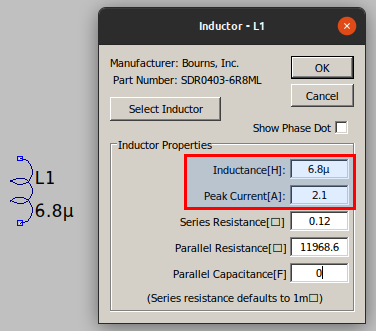 |
| Bobina y sus propiedades |

Los valores destacados corresponden a los valores nominales de inductancia y corriente de pico.

En la imagen 8 tenemos la misma situación pero en este caso para una bobina con punto indicador de fase.

| Imagen 8 |
|:-:|
| 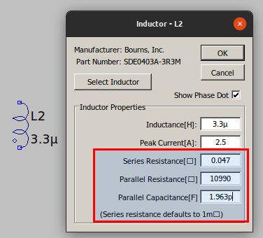 |
| Bobina con indicador de fase y sus propiedades  |

Los valores destacados permiten establecer los valores para un modelo equivalente como el que vemos en la imagen 9.

| Imagen 9 |
|:-:|
| 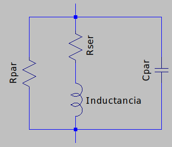 |
| Modelo equivalente de una bobina |

Las descripciones en modo texto de ambos componentes son las siguientes:

* L1 N001 N002 68µ Ipk=0.55 Rser=0.822 Rpar=112000 Cpar=2.186p mfg="Bourns, Inc." pn="SDE0403A-680K"
  
* L2 N002 N003 2.2µ Ipk=3.3 Rser=0.032 Rpar=8999 Cpar=2.181p mfg="Bourns, Inc." pn="SDE0403A-2R2M"
 
## Fuente de excitación de tensión o corriente continua

En la imagen 10 observamos una fuente de tensión que podemos localizar como *voltage* y observamos que le podemos incluir una impedancia en serie.

| Imagen 10 |
|:-:|
| 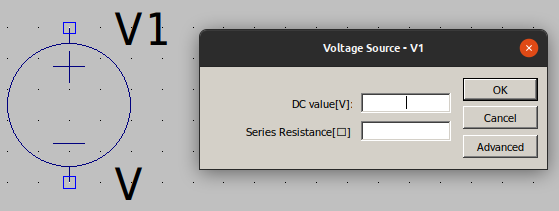 |
| Fuente de tensión constante y su configuración básica |

En la imagen 11 observamos una fuente de tensión que podemos localizar como *current* y observamos que le podemos incluir una impedancia en serie.

| Imagen 11 |
|:-:|
| 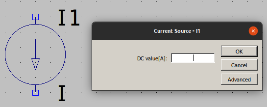 |
| Fuente de tensión constante y su configuración básica |

Para los dos tipos tenemos el botón *Advanced* que nos abre la ventana que vemos en la imagen 12, donde se observan los principales tipos de fuentes.

| Imagen 12 |
|:-:|
| 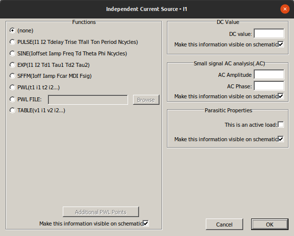 |
| Opciones avanzadas de configuración de fuente DC |

### Fuente sinusoidal

Si en las opciones avanzadas de configuración de una fuente DC escogemos la opción *SINE* la ventana nos mostrará las opciones que observamos en la imagen 13.

| Imagen 13 |
|:-:|
| 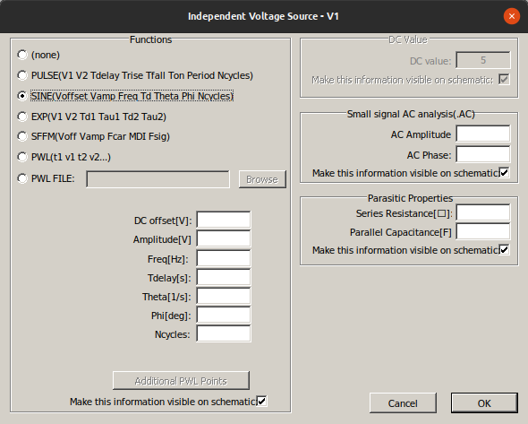 |
| Opciones para fuente DC sinusoidal |

En la tabla siguiente se describen estos parámetros.

| Parámetro | Descripción | Unidades |
|:-:|---|:-:|
| DC offset | Tensión de offset | V o A |
| Amplitude | Amplitud | V o A |
| Freq | Frecuencia | Hz |
| Tdelay | Tiempo de retardo | s |
| Theta | Factor de amortiguamiento | 1/s |
| Phi | Angulo de fase inicial | grados |
| Ncycles | Número de ciclos ciclos | |

En la imagen 14 tenemos un sencillo ejemplo de simulacción con una fuente sinusoidal configurada según se observa en la propia imagen. Hemos creado una simulación de tipo *Transient* que dura 15 ms a intervalos de 1 ms y comienza en 0.

| Imagen 14 |
|:-:|
| 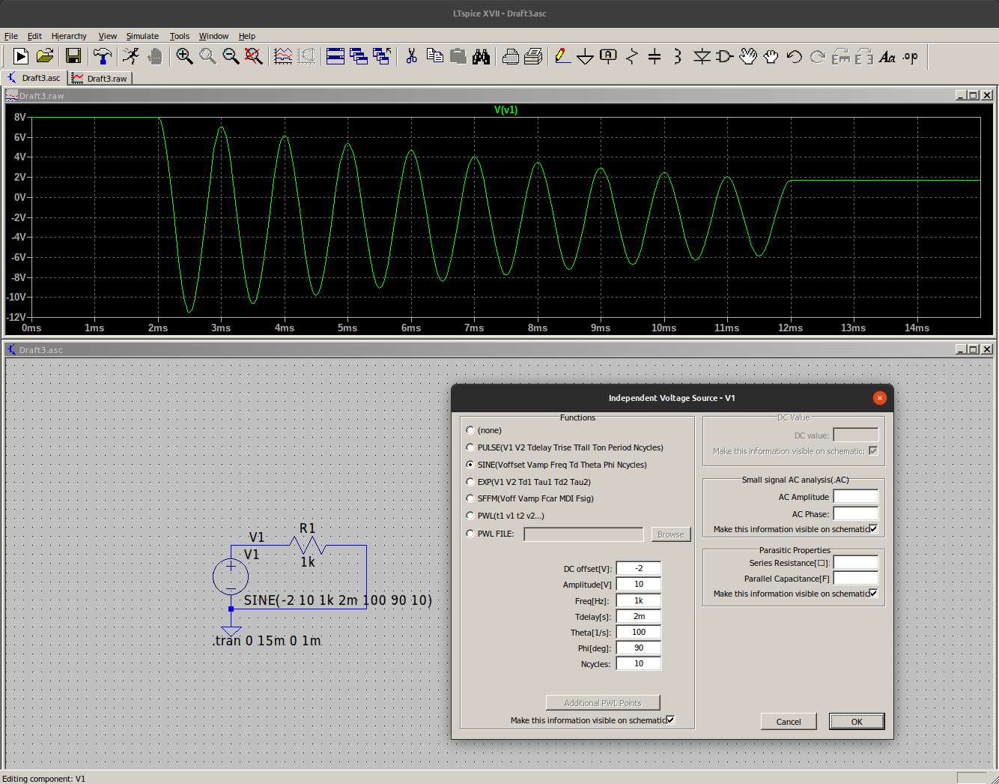 |
| Simulación fuente sinusoidal configurada con parámetros |

Vamos a explicar la señal que entrega la fuente V1. Para ello vamos a partir de las ecuaciones que describen su funcionamiento.

* Desde el instante t = 0s hasta el tiempo de retardo td:

vfuente = voff + vampl sen(2 PI fase/360 PI)

* Desde el tiempo td hasta el tiempo final de análisis:

vfuente = voff + vampl . sen(2 PI (frec (tiempo – td) + fase/360PI)) e –(tiempo –td).df

A  continuación se analizan los resultados obtenidos:

1. Un offset de -2V para una amplitud de 10 V (Vpp = 20V) va a tener como consecuencia que la excursión de la señal esté entre los -12V y los 8V acusando ese desplazamiento de 2V negativos en ambos semiciclos.

2. Se establecen 10 ciclos a una frecuencia de 1kHz que tendrá una duración menor que laestablecida en las condiciones de simulación de forma que aparezcan los 10 ciclos completos en la gráfica.

3. Se observa claramente en la gráfica el retardo de 2ms antes de iniciar el ciclo con un desfase de 90 grados.

4. Finalmente observamos como la señal se va amortiguando según la constante establecida.

5. Una vez transcurridos los 10 ciclos previstos la fuente entrega de forma constante el valor de tensión que se obtiene tras la amortiguación.
   
6. Se aconseja al lector [descargar el ejemplo](../../Ejemplos/Elementos/E1-Fuente-sinusoidal.asc) y jugar con estos valores para controlar el funcionamiento de este tipo de fuente de excitación. En la animación siguiente vemos un ejemplo de esto.

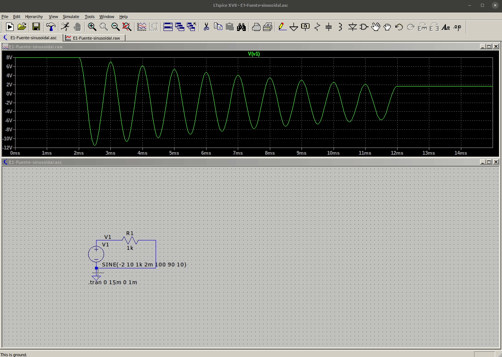

### Fuente exponencial

Si en las opciones avanzadas de configuración de una fuente DC escogemos la opción *EXP* la ventana nos mostrará las opciones que observamos en la imagen 15.

| Imagen 15 |
|:-:|
| 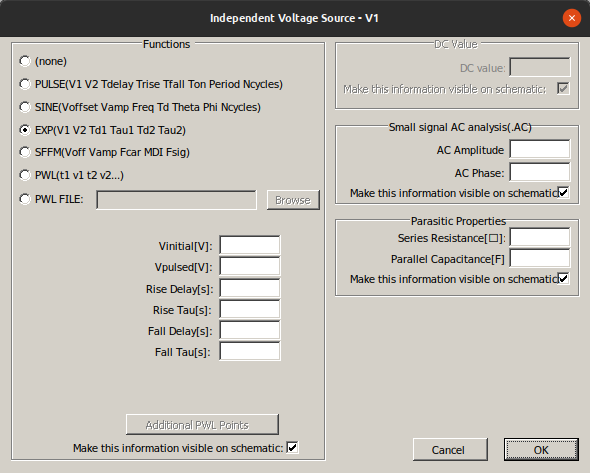 |
| Opciones para fuente DC exponencial |

En la tabla siguiente se describen estos parámetros.

| Parámetro | Descripción | Unidades |
|:-:|---|:-:|
| Vinitial | Valor de la tensión inicial | V o A |
| Vpulsed | Valor del pulso | V o A |
| Rise Delay | Tiempo de retardo de subida | s |
| Rise Tau | Constante de tiempo de subida | s |
| Fall Delay | Tiempo de retardo de caida | s |
| Fall Tau | Constante de tiempo de caida | s |

En la imagen 16 tenemos un sencillo ejemplo de simulacción con una fuente exponencial configurada según se observa en la propia imagen. Hemos creado una simulación de tipo *Transient* que dura 5 s a intervalos de 0.2 s y comienza en 0.

| Imagen 16 |
|:-:|
| 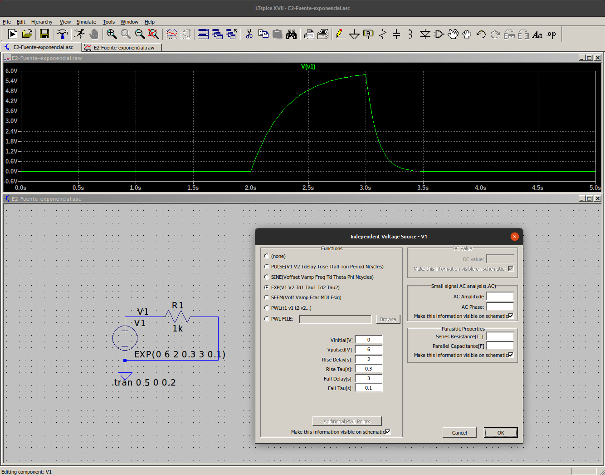 |
| Simulación fuente exponencial configurada con parámetros |

Vamos a explicar la señal que entrega la fuente V1. Para ello vamos a partir de las ecuaciones que describen su funcionamiento.

* [0 <= t <= Rise Delay] intervalo de tiempo que va desde 0 hasta el tiempo de retardo de subida:

vfuente = Vinitial

* [Rise Delay <= t <= Fall Delay] intervalo entre el tiempo de retardo de subida y el tiempo de retardo de bajada o caida:

vfuente = Vinitial + (Vpulsed - Vinitial)(1 - e - (t - Rise Delay)/Rise Tau) 

* [t > Fall Delay] intervalo cuando el tiempo se hace mayor que el establecido para el de caida.
  

vfuente = Vinitial + (Vpulsed - Vinitial)(1 - e-(t - Fall Delay)/Fall Tau) 

A  continuación se analizan los resultados obtenidos:

1. Partimos de un valor de 0V que se mantiene hasta el momento que transcurre el tiempo establecido como retardo de subida (en nuestro caso dos segundos).

2. Transcurridos dos segundo comienza la subida exponencial con la constante de tiempo establecida de 0.3 segundo tratando de alcanzar los 6V establecidos como máximo. La tendencia de la exponencial trata de ser asintótica con el valor límite pero en cualquier caso durará hasta el tiempo que se ha establecido para iniciar la caida, que en nuestro caso es los 3 segundos.

3. Se observa claramente en la gráfica que con esa constante de subida no da tiempo a alcanzar los 6V antes de que se inicie la caida.

4. Una vez alcanzado el instante de tiempo establecido para iniciar la caida esta se produce de forma abrupta dado que la constante de tiempo establecida en este caso en pequeña.

5. Se aconseja al lector [descargar el ejemplo](../../Ejemplos/Elementos/E2-Fuente-exponencial.asc) y jugar con estos valores para controlar el funcionamiento de este tipo de fuente de excitación. En la animación siguiente vemos un ejemplo de esto.

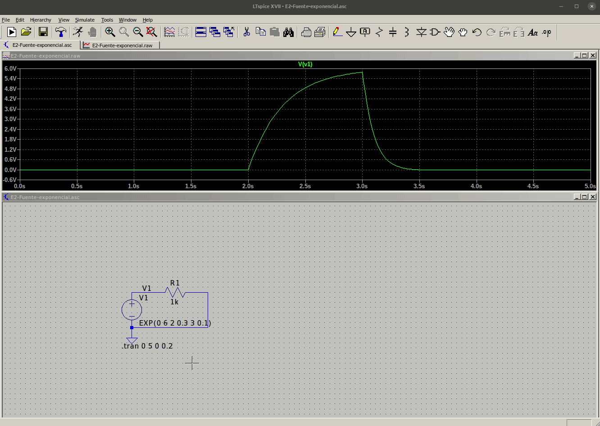

### Fuente de tensión a pulsos

Si en las opciones avanzadas de configuración de una fuente DC escogemos la opción *PULSE* la ventana nos mostrará las opciones que observamos en la imagen 17.

| Imagen 17 |
|:-:|
| 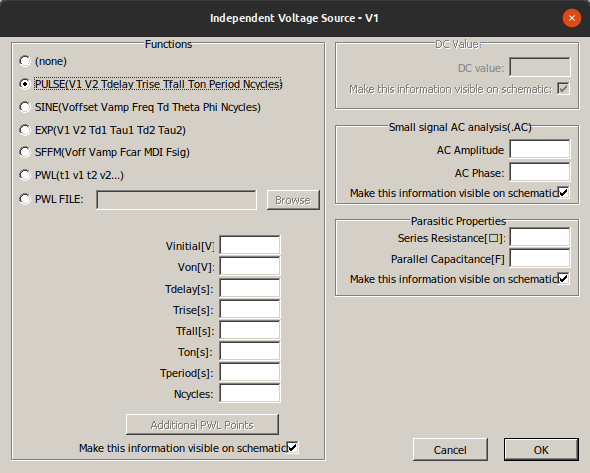 |
| Opciones para fuente DC a pulsos |

En la tabla siguiente se describen estos parámetros.

| Parámetro | Descripción | Unidades |
|:-:|---|:-:|
| Vinitial | Valor de la tensión inicial | V o A |
| Von | Valor del pulso | V o A |
| Tdelay | Retardo | s |
| Trise | Tiempo de subida | s |
| Tfall | Tiempo de caida | s |
| Ton | Tiempo de duración del pulso | s |
| Tperiod | Periodo | s |
| Ncycles | Número de ciclos | |

En la imagen 18 tenemos un sencillo ejemplo de simulación con una fuente pulsante configurada según se observa en la propia imagen. Hemos creado una simulación de tipo *Transient* que dura 100 ms a intervalos de 0.1 ms y comienza en 0.

| Imagen 18 |
|:-:|
| 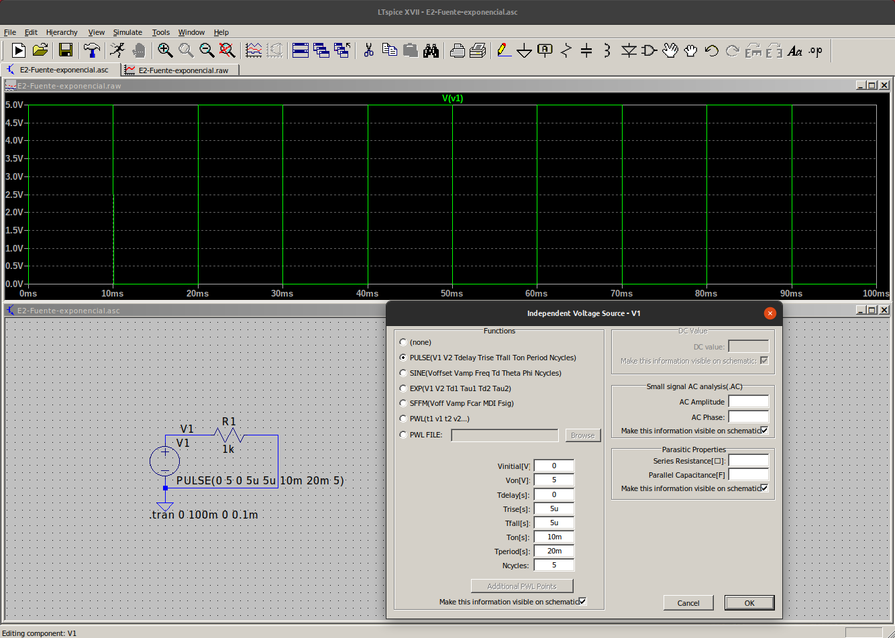 |
| Simulación fuente a pulsos configurada con parámetros |

En este caso la explicación del funcionamiento es bastante simple ya que los datos sirven para configurar una fuente que genera un tren de pulsos con las características especificadas.

A  continuación se analizan los resultados obtenidos:

1. Partimos de un valor de 0V que cambia a 5V en un tiempo establecido en 5 us-

2. El nivel de 5V se mantiene durante los 10 ms estsblecidos, instante en que pasa de nuevo a valer 0 con un retardo de 5 us y se mantiene en 0V hasta completar el peeriodo de 20 ms configurado.

3. Finalizado el primer ciclo la secuencia se repite hasta completar los 5 ciclos establecidos.

4. Se aconseja al lector [descargar el ejemplo](../../Ejemplos/Elementos/E3-Fuente-pulsante.asc) y jugar con estos valores para controlar el funcionamiento de este tipo de fuente de excitación. En la animación siguiente vemos un ejemplo de esto.

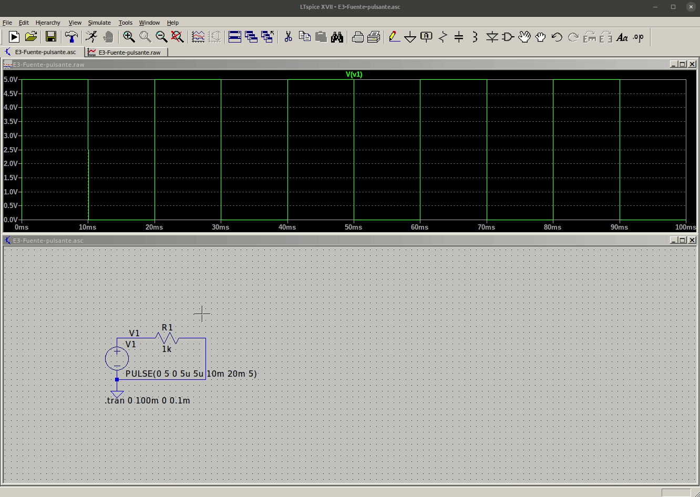

### Fuente lineal a tramos

Si en las opciones avanzadas de configuración de una fuente DC escogemos la opción *PWL* la ventana nos mostrará las opciones que observamos en la imagen 19. PWL es acrónimo del inglés PieceWise Linear que se traduce como lineal a trozos o tramos.

| Imagen 19 |
|:-:|
| 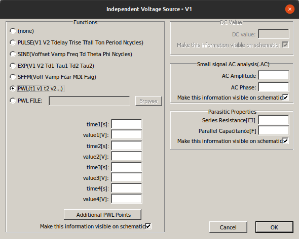 |
| Opciones para fuente DC PWL |

En la tabla siguiente se describen estos parámetros.

| Parámetro | Descripción | Unidades |
|:-:|---|:-:|
| time_n | Instante de tiempo del para el valor n | s |
| value_n | Valor de tensión para el valor n | V o A |

La señal que entrega la fuente se construye con cada par de valores (time_n,value_n) y se pueden añadir mas puntos de los mostrados en la imagen 19 haciendo clic en el botón *Additional PWL Points*.

En la imagen 20 tenemos un sencillo ejemplo de simulación con una fuente PWL configurada según se observa en la propia imagen. Hemos creado una simulación de tipo *Transient* que dura 10s a intervalos de 1s y comienza en 0. En la imagen también podemos ver todos los pares de puntos (time,value) establecidos.

| Imagen 20 |
|:-:|
| 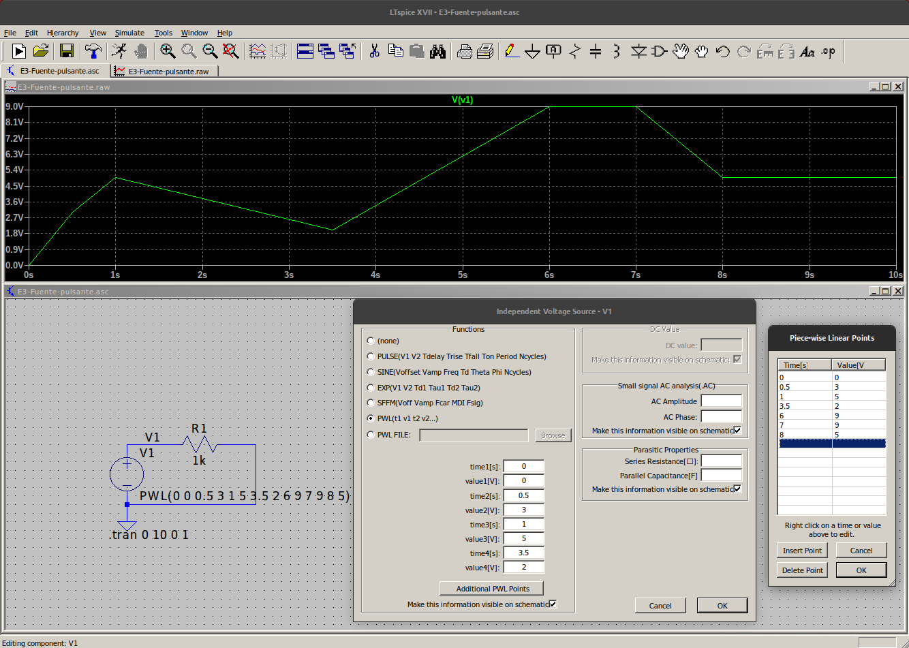 |
| Simulación fuente PWL |

En este caso la explicación del funcionamiento es muy simple y tan solo indicaremos como reseñable que, a partir del último punto establecido la salida de la fuente mantiene constante su valor en el tiempo.

Se aconseja al lector [descargar el ejemplo](../../Ejemplos/Elementos/E4-Fuente-PWL.asc) y jugar con estos valores para controlar el funcionamiento de este tipo de fuente de excitación. En la animación siguiente vemos un ejemplo de esto.

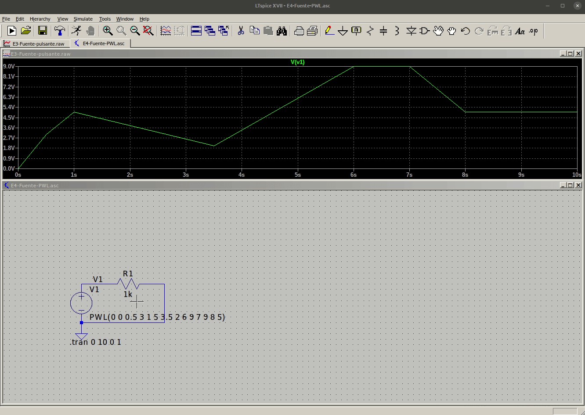

Los datos de los puntos se pueden especificar a través de un fichero de texto plano como .txt o .csv separando las parejas de datos en dos columnas, tal y como observamos en la imagen 21, donde hemos seleccionado la opción *PWL FILE* y el fichero [E4.csv](../../Ejemplos/Elementos/E4.csv) (tambien podemos cargar el fichero [E4.txt](../../Ejemplos/Elementos/E4.txt) que nos dará idéntico resultado.

| Imagen 21 |
|:-:|
| 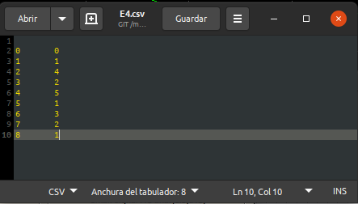 |
| Fichero de texto plano |

La simulación a partir de archivo nos origina los resultados que vemos en la imagen 22.

| Imagen 22 |
|:-:|
| 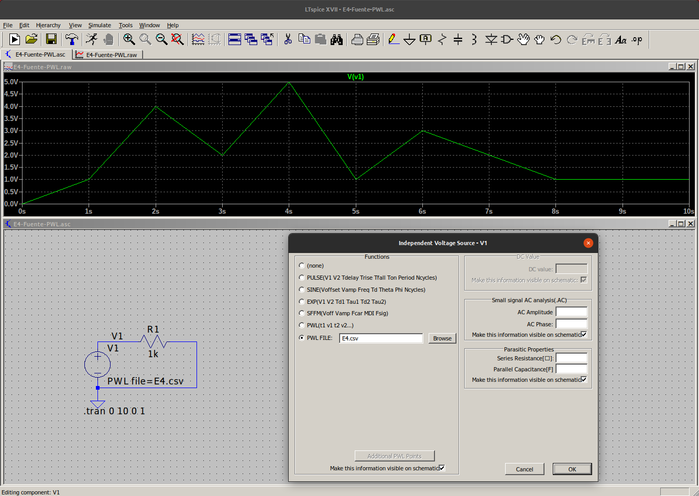 |
| Simulación fuente PWL a partir de archivo |

### Fuente de frecuencia simple FM

Si en las opciones avanzadas de configuración de una fuente DC escogemos la opción *SFFM* la ventana nos mostrará las opciones que observamos en la imagen 23. 

| Imagen 23 |
|:-:|
| 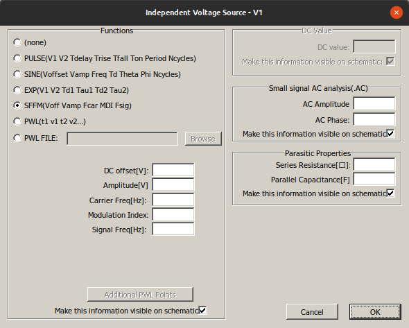 |
| Opciones para fuente de frecuencia simple FM |

En la tabla siguiente se describen estos parámetros.

| Parámetro | Descripción | Unidades |
|:-:|---|:-:|
| DC offset | Tensión continua de offset | V o A |
| Amplitude | Amplitud de la señal | V o A |
| Carrier Freq | Frecuencia de la portadora | Hz |
| Modulation Index | Indice o coeficiente de modulación ||
|Signal Freq | Frecuencia de la señal | Hz |

En la imagen 24 tenemos un sencillo ejemplo de simulación con una fuente SFFM configurada según se observa en la propia imagen. Hemos creado una simulación de tipo *Transient* que dura 2 ms a intervalos de 0.5 ms y comienza en 0. 

| Imagen 24 |
|:-:|
| 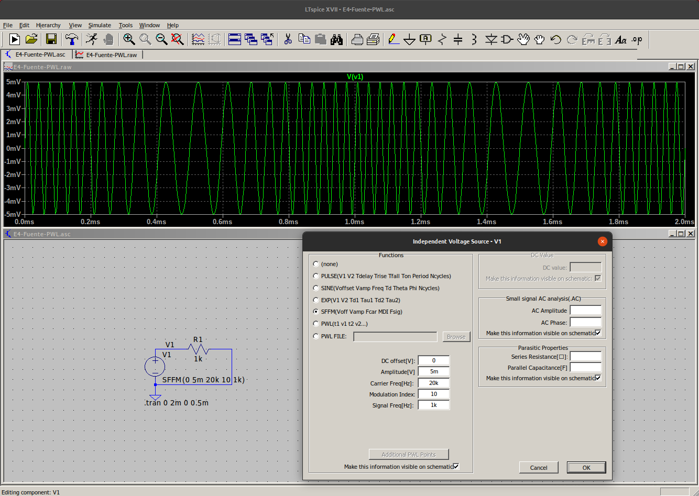 |
| Simulación fuente SFFM |

La explicación del funcionamiento es bastante simple si se tienen claros los conceptos de señal portadora e índice de modulación.

La señal se describe por la siguiente ecuación:

Vfuente = DCoffset + Amplitude . sen(2PI.Carrier.t + Index . sen(2PI.Carrier.t)

paso es renombrar nuestro diodo reemplazando D por 1N4002.escargar el ejemplo](../../Ejemplos/Elementos/E5-Fuente-SFFM.asc) y jugar con estos valores para controlar el funcionamiento de este tipo de fuente de excitación.

## Otros componentes

Existen infinidad de componente y elementos que no vamos a describir uno por uno pues con las bases explicadas hasta el momento tenemos claras las ideas del significado de los parámetros de los componentes principales.

Simplemente nombramos algunos a título de ejemplo.

* Inductancia mutua  
* Fuente de tensión controlada por tensión  
* Fuente de corriente controlada por corriente  
* Fuente de corriente controlada por tensión  
* Fuente de tensión controlada por corriente  
* Componentes electrónicos diversos

## Usar un componente que no está en las librerías

Cuando necesitamos utilizar un componente concreto del que no disponemos modelo en las librerias disponibles, ya sea las que se instalan por defecto o simplemente no existe aunque tengamos una base de datos de componentes mas amplia que la original, podemos importar un modelo desde alguna librería de las disponibles en la web.

Por ejemplo, en el [enlace](http://ltwiki.org/?title=Standard.dio) tenemos modelos compatibles con LTSpice XVII.

Supongamos por ejemplo que necesitamos obtener la curva característica del diodo 1N4007 que es un diodo rectificador de la serie 1N4001 - 1N4007 en la que todos son muy similares cambiando solamente el valor de la tensión eficaz inversa entre ellos.

Si buscamos en el enlace encontramos justamente el 1N4007 del que nos suministran los siguientes datos:

`.model 1N4007 D(IS=7.02767n RS=0.0341512 N=1.80803 EG=1.05743 XTI=5 BV=1000 IBV=5e-08 CJO=1e-11 VJ=0.7 M=0.5 FC=0.5 TT=1e-07 mfg=OnSemi type=silicon)`

En la imagen 25 tenemos el circuito que vamos a construir y el proceso para renombrar al diodo por el valor que necesitamos.

| Imagen 25 |
|:-:|
| 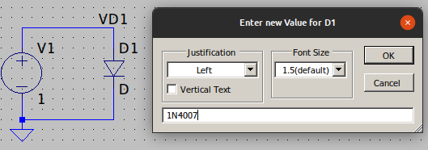 |
| Circuito con diodo 1N4007 |

El siguiente paso es indicar el modelo del diodo con todos sus parámetros. Para ello abrimos la ventana de SPICE Directive (último icono de la barra de herramientas) y copiamos los datos del modelo del diodo obtenidos en Internet, imagen 26. 

| Imagen 26 |
|:-:|
| 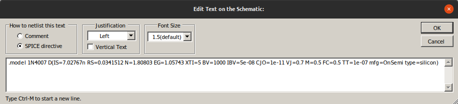 |
| Modelo para el diodo 1N4007 |

Cuando cerramos la ventana los datos del modelo aparecen sobre la hoja de trabajo, imagen 27.

| Imagen 27 |
|:-:|
| 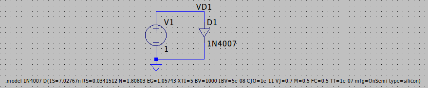 |
| Modelo de diodo 1N4007 establecido |

Procedemos a establecer unas condiciones de simulación por barrido DC como las que vemos en la imagen 28 sin preocuparnos de ello puesto que serán explicadas mas adelante.

| Imagen 28 |
|:-:|
| 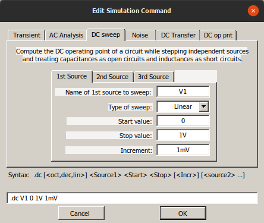 |
| Condiciones de simulación por barrido DC |

En la imagen 29 tenemos el resultado de obtener la corriente que circula por el diodo.

| Imagen 29 |
|:-:|
| 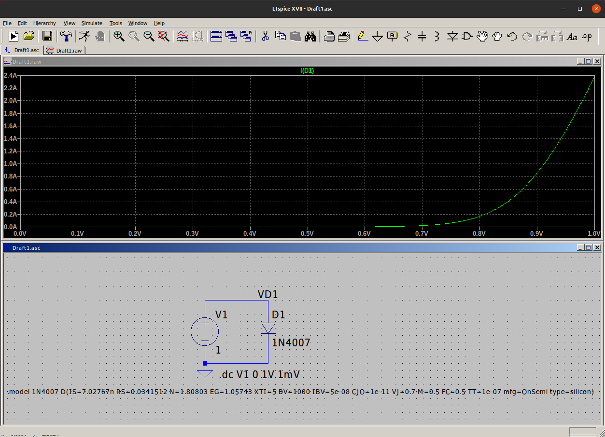 |
| Curva característica del diodo 1N4007 |

Podemos [descargar](../../Ejemplos/Elementos/E6-Curva-1N4007.asc) este ejemplo para su estudio.

