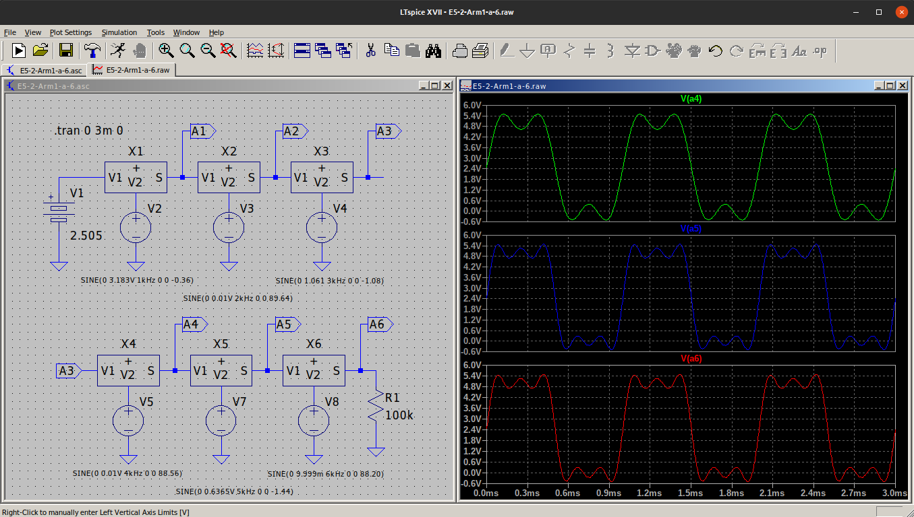

# Análisis de Fourier

Este tipo de análisis lo vamos a ver en un apartado específico dada su amplitud y porque describiremos las matemáticas necesarias para llevarlo a cabo lo mas claramente posible.

Todas las descripciones van a tender a obtener el desarrollo en serie de Fourier de funciones periódicas aunque conceptualmente se nombre otros contenidos.

Vamos a ponernos en contexto del significado de análisis de Fourier desde el punto de vista de la electrónica.

La transformada Fourier fue planteada por el matemático francés [Joseph Fourier](https://es.wikipedia.org/wiki/Joseph_Fourier) en el año 1822 en sus teorías sobre la transmisión del calor.

## Dominios del tiempo y de la frecuencia

El análisis de Fourier básicamente plantea que cualquier señal **periódica** (de la forma que sea) puede descomponerse como la suma de señales sinusoidales de **distintas frecuencias**. Tal y como hemos destacado en la frase hay que relacionar tiempo y frecuencia para trabajar con estos conceptos.

En la imagen 1 tenemos algunas de las señales (funciones) periódicas mas habituales en electrónica, lógicamente todas ellas función del tiempo.

| Imagen 1 |
|:-:|
|  |
| Señales periódicas habituales |

En la imagen 2 tenemos representadas tres señales sinusoidales de distintas frecuencias y amplitudes representadas en ambos dominios.

| Imagen 2 |
|:-:|
|  |
| Señales representadas en los dominios del tiempo y la frecuencia |

La señal representada en negro tiene un periodo de 1 ms, lo que supone que su frecuencia es de 1 kHz y con un valor que podemos expresar como 10 V de pico o 20 V pico a pico o 10 V de amplitud, y esos valores se dan indistintamente del dominio en el que nos situemos, pues bien, en el dominio de la frecuencia el punto con esas coordenadas de amplitud y frecuencia se representa como el extremo de un vector y tiene exactamente el mismo significado. De forma similar la señal roja tiene un periodo que es la mitad del de la negra y una amplitud de 5 V y finalmente la verde con un periodo de la mitad que la roja y una amplitud de 2V.

## Conocimientos previos útiles

Antes de entrar en las series de Fourier vamos a recordar algunas nociones básicas de las funciones seno y coseno que nos van a resultar muy útiles posteriormente.

En la imagen 3 tenemos representada una función seno con indicación de los principales puntos de corte con los ejes.

| Imagen 3 |
|:-:|
|  |
| Función seno |

* Lo primero que observamos es que la función está acotada entre 1 y -1 por lo que la función f(t) = sen(t) nunca puede ser mayor que 1 ni menos que -1, o sea:

$f\left( t\right) =sen\left( t\right)$  

siempre que

$-1\leq sen\left( t\right) \leq 1$

* También podemos observar que la función seno es periódica ya que se repite con un periodo $T = 2\pi$. Esto se expresa matemáticamente de la siguiente forma:

$sen\left( t\right) =sen\left( t+2\pi \right)$

* El cálculo de los ceros de la función es bastante sencillo a partir de la ecuación anterior, tal y como vemos a continuación:

$\begin{aligned}sen\left( 0\right) =0\\sen\left( \pi \right) =0\\ sen\left( 2\pi \right) =0\\ sen\left( 3\pi \right) =sen\left( 2\pi +\pi \right) =0\end{aligned}$

Es decir:

$\begin{aligned}sen\left( n\pi \right)=0\end{aligned}$

siendo: $\begin{aligned}n\in \mathbb{N} \end{aligned}$

* Vamos ahora a aplicar el mismo concepto para el cálculo de los valores máximo y mínimo de la función seno.

$sen\left( \dfrac{\pi }{2}\right) =1;sen\left( \dfrac{3\pi }{2}\right) =-1$

$sen\left( \dfrac{5\pi }{2}\right) =sen\left( \dfrac{\pi }{2}+2 \pi \right) =sen\left( \dfrac{\pi }{2}\right) =1$

$sen\left( \dfrac{7\pi }{2}\right) =sen\left( \dfrac{3\pi }{2}+2 \pi \right) =sen\left( \dfrac{3\pi }{2}\right) =-1$

y genéricamente se puede poner que:

$sen\left[ \dfrac{\left( 2n- 1\right)\pi }{2}\right] =\left( -1\right) ^{n+1}$

Por ejemplo:

$\begin{aligned}n=6\Rightarrow sen\left( \dfrac{11\times \pi }{2}\right) =\left( -1\right) ^{7}=-1\\\\ n=9\Rightarrow sen\left( \dfrac{17\times \pi }{2}\right) =\left( -1\right) ^{10}=1\end{aligned}$

En la imagen 4 tenemos representada una función coseno con indicación de los principales puntos de corte con los ejes.

| Imagen 4 |
|:-:|
|  |
| Función coseno |

* Observamos también que la función está acotada entre 1 y -1 por lo que la función f(t) = cos(t) nunca puede ser mayor que 1 ni menos que -1, o sea:

$f\left( t\right) =cos\left( t\right)$  

siempre que

$-1\leq cos\left( t\right) \leq 1$

* Vemos que la función coseno es periódica ya que se repite con un periodo $T = 2\pi$. Esto se expresa matemáticamente de la siguiente forma:

$cos\left( t\right) =cos\left( t+2\pi \right)$

* Hacemos el cálculo de los ceros de la función de forma similar a como hicimos en el seno y tenemos que:

$cos\left( \dfrac{\pi }{2}\right) =0;cos\left( \dfrac{3\pi }{2}\right) =0$

$cos\left( \dfrac{5\pi }{2}\right) =cos\left( \dfrac{\pi }{2}+2 \pi \right) =cos\left( \dfrac{\pi }{2}\right) =0$

$cos\left( \dfrac{7\pi }{2}\right) =cos\left( \dfrac{3\pi }{2}+2 \pi \right) =cos\left( \dfrac{3\pi }{2}\right) =0$

y genéricamente se puede poner que:

$\cos \left( \dfrac{2n-1}{2}\right) \cdot \pi =0\hspace{1cm};\hspace{1cm}\forall n\in \mathbb{N}$

* Vamos ahora a aplicar el mismo concepto para el cálculo de los valores máximo y mínimo de la función seno.

$\begin{aligned}cos\left( 0\right) =1\\cos\left( \pi \right) =-1\\ cos\left( 2\pi \right) =1\\ cos\left( 3\pi \right) =cos\left( 2\pi +\pi \right) =-1\end{aligned}$

Es decir:

$cos\left( n\pi \right) =\left( -1\right) ^{n}$

siendo: $\begin{aligned}n\in \mathbb{N} \end{aligned}$

También nos va a resultar muy útil recordar que cuando hablamos de señales periódicas y realizamos integración con limites iguales al periodo de la señal, el valor de la integral es cero. A continuación vemos algunos ejemplos de esto.

$\int _{0}^{2\pi}sen\left( t\right) dt = 0$

$\int _{-\pi}^{+\pi}cos\left( t\right) dt = 0$

$\int _{4\pi}^{6\pi}sen\left( t\right) dt = 0$

## Serie de Fourier

Una función f(t) con $x\in \mathbb{R}$ que sea integrable dentro de un intervalo de longitud T se puede definir como una serie de Fourier haciendo:

Pues bien, Fourier lo que dijo fue que cualquier señal periódica se puede representar como una suma infinita de funciones sinusoidales. Esto se expresa matemáticamente de la siguiente forma:

$f\left( t\right) =\dfrac{a_{0}}{2} + \sum ^{\infty }_{n=1}\left[ a_{n}\cos \left( n\omega t\right) +b_{n}sen\left( n\omega t\right) \right]$

siendo  
n: un número natural.  
$t\in \mathbb{R}$ con un periodo o longitud T  
a0, an, bn: los denominados coeficientes de Fourier.  
$\omega$ = 2π/T0: frecuencia angular fundamental.  
n$\omega$: frecuencia de la componente armónica de orden n.

Para que una función cualquiera pueda ser expresada como serie de Fourier es condición necesaria que cumpla las condiciones de Dirichlet, que son:

* f(t) tiene un valor único para cualquier valor de t.  
* f(t) tiene un número finito de discontinuidades en un periodo.  
* f(t) tiene un número finito de máximos y mínimos en su periodo.  
* Existe la integral del módulo de la funciónen ese periodo:

$\int ^{T/2}_{-T/2}\left| f\left( t\right) \right|  dt$

El problema de expresar una función por su serie de Fourier consiste en calcular los coeficientes de Fourier, o lo que es lo mismo, en calcular las siguientes integrales definidas:

$a_{0}=\dfrac{1}{T/2}\int _{T}f\left( t\right) dt$

$a_{n}=\dfrac{1}{T/2}\int _{T}f\left( t\right) \cos \left( n\omega t\right) dt$

$b_{n}=\dfrac{1}{T/2}\int _{T}f\left( t\right) sen \left( n\omega t\right) dt$

siendo T el intervalo o periodo de la función, que, si por ejemplo varia entre 0 y 2π, nos permite poner:

$a_{0}=\dfrac{1}{{2\pi }/{2}}\int _{0}^{2\pi}f\left( t\right) dt$

$a_{n}=\dfrac{1}{2\pi/2}\int _{0}^{2\pi}f\left( t\right) \cos \left( n\omega t\right) dt$

$b_{n}=\dfrac{1}{2\pi/2}\int _{0}^{2\pi}f\left( t\right) \cos \left( n\omega t\right) dt$

## Convergencia

Damos a continuación una notas aclaratorias.

1. Se cumple que la serie de Fourier de la función f(t) converge o tiende a f(t) dentro del intervalo de integración.
2. Si f(t) es periódica con un periodo T igual a la longitud del intervalo la función f(t) converge a la serie de Fourier siempre con $x\in \mathbb{R}$, es decir que converge en cualquier punto y no solo dentro del intervalo.
3. Definimos suma parcial para la serie de Fourier de una función f(t) periódica y definida en un intervalo de longitud T la k-ésima suma parcial, representada por Sk(t) se calcula así:

$S_{k}\left( t\right)  =\dfrac{a_{0}}{2} + \sum ^{k}_{n=1}\left[ a_{n}\cos \left( n\omega t\right) +b_{n}sen\left( n\omega t\right) \right]$

Esta suma ya no es de infinitos términos sino de un número k de ellos.

El caso mas común que nos vamos a encontrar es cuando $T=2\pi$ lo que se cumple para situaciones como:

$T=2\pi \rightarrow \left[ -2\pi ,0 \right] ; \left[ 0,2\pi \right] ;\left[ 2\pi ,4\pi \right] ;\left[ -\pi ,\pi \right ]$

En estos casos se cumple que:

$\omega =\dfrac{2\pi }{T}=\dfrac{2\pi }{2\pi }=1$

Por lo tanto podemos escribir la serie de Fourier de la siguiente forma:

$f\left( t\right) =\dfrac{a_{0}}{2} + \sum ^{\infty }_{n=1}\left[ a_{n}\cos \left( nt\right) +b_{n}sen\left( nt\right) \right]$

Es decir, cuando el intervalo es $2\pi$ los coeficientes de Fourier toman la siguiente forma:

$a_{0}=\dfrac{1}{{\pi }}\int _{2\pi}f\left( t\right) dt$

$a_{n}=\dfrac{1}{\pi}\int _{2\pi}f\left( t\right) \cos \left( nt\right) dt$

$b_{n}=\dfrac{1}{\pi}\int _{2\pi}f\left( t\right) sen\left( nt\right) dt$

Este tipo de expresiones suelen ser complejas de solucionar dado que implican distintos niveles de integración, pero al menos con un par de ejemplos vamos a intentar dejar claro como proceder.

## Funciones pares e impares

Una función par es una función que satisface la relación $f\left( x\right) =f\left( -x\right)$. La imagen 5 muestra la gráfica de una función par.

| Imagen 5 |
|:-:|
|  |
| Gráfica de una función par |
| Imagen obtenida de [wikipedia](https://es.wikipedia.org/wiki/Funciones_pares_e_impares)|

La función es simétrica respecto del eje y.

Cuando una función es par se cumple que **bn= 0** con lo que podemos poner que:

$f\left( t\right) =\dfrac{a_{0}}{2} + \sum ^{\infty }_{n=1} a_{n}\cos \left( nt\right)$

Una función impar es cualquier función que satisface la relación $f\left( -x\right) =-f\left( x\right)$. La imagen 6 muestra la gráfica de una función impar.

| Imagen 6 |
|:-:|
|  |
| Gráfica de una función impar |
| Imagen obtenida de [wikipedia](https://es.wikipedia.org/wiki/Funciones_pares_e_impares)|

La función es simétrica de forma rotacional respecto al origen de coordenadas.

Cuando una función es impar se cumple que **an= 0** con lo que podemos poner que:

$f\left( t\right) =\dfrac{a_{0}}{2} + \sum ^{\infty }_{n=1} b_{n}sen \left( nt\right)$

## Ejemplos resueltos

Vamos a ver como aplicar estos conceptos con dos ejemplos desarrollados de forma completa en cuanto a cálculos se refiere.

### Función matemática a trozos

Obtener el desarrollo en serie de Fourier de una función definida de la siguiente forma:

$\begin{aligned}f\left( t\right) =0 \hspace{1cm} si \hspace{1cm} -\pi <t <0\\ f\left( t\right) =\pi -t  \hspace{1cm} si \hspace{1cm}0\leq t <\pi \end{aligned}$

El intervalo del periodo es $\left[ -\pi ,\pi \right]$ por lo que $T=2\pi$ y entonces lor términos de Fourier vendrán dados por:

$a_{0}=\dfrac{1}{\pi }\int _{-\pi }^{\pi }f\left( t\right) dt\\ a_{n}=\dfrac{1}{\pi }\int _{-\pi }^{\pi }f\left( t\right) \cdot \cos \left( nt\right) dt\\ b_{n}=\dfrac{1}{\pi }\int _{-\pi }^{\pi }f\left( t\right) \cdot sen\left( nt\right) dt$

* Cálculo de $a_{0}$

Si descomponemos la ecuación para los dos valores de f(t) podemos poner:

$a_{0}=\dfrac{1}{\pi }\int ^{0}_{-\pi }0\cdot dt+\dfrac{1}{\pi }\int ^{\pi }_{0}\left( \pi -t\right) dt=\dfrac{1}{\pi }\int _{0}^{\pi }\left( \pi -t\right) dt$

Procedemos a evaluar la integral de forma indefinida:

$\int \left( \pi -t\right) dt=\int \pi dt-\int tdt=\pi t-\dfrac{t^{2}}{2}$

Llevamos el resultado a la integral definida y sustituimos t por los límites de integración y tenemos:

$\begin{aligned} a_{0}=\dfrac{1}{\pi }\left( \pi \cdot t-\dfrac{t^{2}}{2}\right) ] _{0}^{\pi }=\dfrac{1}{\pi }\left[ \pi \cdot \pi -\dfrac{\pi ^{2}}{2}-\left( \pi \cdot 0-\dfrac{0^{2}}{2}\right) \right] = \dfrac{1}{\pi }\cdot \dfrac{\pi ^{2}}{2} = \dfrac{\pi }{2}\end{aligned}$

* Cálculo de $a_{n}$

De la misma forma que en $a{0}$ podemos descomponer la integral en dos siendo cero para el periodo entre $\pi$ y cero, o sea:

$a_{n}=\dfrac{1}{\pi }\int ^{\pi }_{-\pi }f\left( t\right) \cdot \cos \left( nt\right) dt=\dfrac{1}{\pi }\int _{0}^{\pi }\left( \pi -t\right) \cdot \cos \left( nt\right) dt$

Vamos a resolver la integral de forma indefinida. Podemos poner que:

$\int \left( \pi -t\right) \cdot \cos \left( nt\right) dt=\int \pi \cos \left( nt\right) dt-\int t\cos \left( nt\right) dt \hspace{2cm} \left[ 1\right]$

La primera es una integral inmediata que toma como valor $\pi /{n} \cdot sen\left( nt\right)$ y la segunda es una integral que debemos resolver por partes, así que escribimos:

$\begin{aligned}\int u\cdot dv=u \cdot v-\int v\cdot du \hspace{2cm} \left[ 2\right] \end{aligned}$

Hacemos:

$u=t\Rightarrow du=1\cdot dt =dt\\ dv=\cos \left( nt\right) dt\Rightarrow \int dv=\int \cos \left( nt\right) dt\Rightarrow v=\dfrac{1}{n}sen\left( nt\right) $

Si sustituimos en [2] los valores obtenidos de u y v tenemos:

$\begin{aligned}\int t\cos \left( nt\right) dt=t\cdot \dfrac{1}{\pi }sen\left( nt\right) -\int \dfrac{1}{n}sen\left( nt\right) dt=\\ \dfrac{t}{\pi }sen\left( nt\right) -\dfrac{1}{n^{2}}\left[ -\cos \left( nt\right) \right] =\dfrac{t}{\pi }sen\left( nt\right) +\dfrac{1}{n^{2}}\cos \left( nt\right) \end{aligned}$

Si llevamos los resultados obtenidos a la integral indefinida que tenemos en [1] nos queda:

$\int \left( \pi -t\right) \cos \left( nt\right) dt=\dfrac{\pi }{n}sen\left( nt\right) -\left[ \dfrac{t}{\pi }sen\left( nt\right) +\dfrac{1}{n^{2}}\cos \left( nt\right) \right]$

Llevamos este valor a la integral definida y podemos poner que:

$a_{n}=\dfrac{1}{\pi }\left[ \dfrac{\pi }{n}sen\left( nt\right) -\dfrac{1}{n^{2}}\cos \left( nt\right) -\dfrac{t}{n}sen\left( nt\right) \right] _{0}^{\pi }\\\\ a_{n}=\dfrac{1}{\pi }\left\{ \left[ \dfrac{\pi }{n}scn\left( n\pi \right) -\dfrac{1}{n^{2}}\cos \left( n\pi \right) -\dfrac{\pi }{n}sen( n\pi \right] -\left[ 0-\dfrac{1}{n^{2}}\cos 0-\right] \right\} \\\\ a_{n}=\dfrac{1-\cos }{\pi n}\dfrac{\left( n\pi \right) }{2}\left[ como\cos \left( n\pi \right) =\left( -1\right) ^{n}\right] \Rightarrow an=\dfrac{1-\left( -1\right) ^{n}}{\pi n^{2}}\hspace{1cm}\forall n\in N$

De forma similar podemos obtener $b_{n}$ que vendrá dado por:

$b_{n}=\dfrac{1}{\pi }\left\{ -\dfrac{\pi }{n}\cos \left( nt\right) -\left[ \dfrac{1}{n^{2}}sen\left( nt\right) -\dfrac{t}{n}\cos \left( nt\right) \right] \right\} _{0}^{\pi}\\ b_{n}=\dfrac{\pi }{n}\cdot \dfrac{1}{\pi }=\dfrac{1}{n}$

Finalmente la función expresada como serie de Fourier quedaría de la siguiente forma:

$f\left( t\right) =\dfrac{\pi }{4}+\sum ^{\infty }_{n=1}\left[ \dfrac{1-\left( -1\right) ^{n}}{\pi n^{2}}\cos \left( nt\right) +\dfrac{1}{n}sen\left( nt\right) \right]$

Dando valores a n en esta ecuación podemos obtener todos los armónicos necesarios para aproximarnos a la definición de la función.

### Rectificador de media onda

En la imagen 7 tenemos representada la señal que entrega un rectificador de media onda y a la derecha tenemos la señal escrita en términos matemáticos.

| Imagen 7 |  |
|:-:|:-:|
|  | $\begin{aligned}\\\\0 < t < \pi \rightarrow f\left( t\right) =V_{p}sen\omega t\\\\ \pi\leq t < {2\pi} \rightarrow f\left( t\right) =0 \\\\ T = {2\pi} \end{aligned}$ |
| Señal de salida de un rectificador de media onda | Expresión matemática |

Observamos que se trata ade una función a trozos que podemos escribir como:

$f\left( t\right) =\dfrac{a_{0}}{2} + \sum ^{\infty }_{n=1}\left[ a_{n}\cos \left( nt\right) +b_{n}sen\left( nt\right) \right]$

Los coeficientes de Fourier vendrán dados por:

$a_{0}=\dfrac{1}{{\pi }}\int _{2\pi}f\left( t\right) dt\hspace{3mm}=\hspace{3mm}\dfrac{1}{\pi }\int _{0}^{\pi }V_{p}sen\left( nt\right) dt$

$a_{n}=\dfrac{1}{\pi}\int _{2\pi}f\left( t\right)\cdot\cos \left( nt\right) dt \hspace{3mm} = \hspace{3mm}\dfrac{1}{\pi }\int _{0}^{\pi }f\left( t\right)\cdot\cos\left( nt\right) dt$

$b_{n}=\dfrac{1}{\pi}\int _{2\pi}f\left( t\right)\cdot sen \left( nt\right) dt\hspace{3mm} = \hspace{3mm}\dfrac{1}{\pi }\int _{0}^{\pi }f\left( t\right)\cdot sen\left( nt\right) dt$

Sustituimos f(t) por su valor y podemos poner que:

$a_{n}=\dfrac{1}{\pi }\int _{0}^{\pi }V_{p}sen\left( nt\right) cos\left( nt\right)dt\\\\b_{n}=\dfrac{1}{\pi }\int _{0}^{\pi }V_{p}sen\left( nt\right) sen\left( nt\right)dt$

Se trata de integrales trigonométrica que se resuelven transformando el producto en suma y recordando las identidades trigonométricas.

Si realizamos un análisis en el tiempo (Transient) podemos obtener el espectro de una señal utilizando la siguiente sentencia:

.FOUR <frecuencia> [Numero de armónicos] <señal>

El número de armónicos es opcional y si no se introduce se calculan 9 por defecto.

En la imagen 8 tenemos el circuito del rectificador de media onda con el análisis temporal configurado y la ventana de *Spice directive* con la sentencia que vamos a introducir para su análisis.

| Imagen 8 |  |
|:-:|:-:|
|  |  |
| Rectificador de media onda y análisis temporal configurado | Ventana Spice directive |

El resultado de la simulación está en un archivo de texto al que accedemos a través del menú *View → SPICE Error Log*, y para el caso que nos ocupa es el de la imagen 9.

| Imagen 9 |
|:-:|
|  |
| Descomposición en la componente continua y sus armónicos |

La primera columna de la tabla indica el número de armónico. La segunda columna indica la frecuencia del armónico de esa fila. La tercera indica la amplitud de cada armónico y la cuarta el valor normalizado, respecto del primer armónico. La quinta columna indica la fase de cada armónico y la sexta columna la fase normalizada. El valor de la componente contínua es *DC component*.

## La transformada rápida de Fourier

Normalmente conocida por la abreviatura FFT (del inglés Fast Fourier Transform).

Aunque vamos a dar las ecuaciones base no vamos a entrar en profundidades de matemáticas, bastante complejas por otro lado, porque lo que tratamos es de que se entienda el concepto para poder analizar los resultados que nos devuelva LTSpice XVII. 

La tranformada de Fourier convierte una señal expresada en el dominio del tiempo al dominio de la frecuencia. Ya vimos el concepto anteriormente y la ecuación que convierte la trayectoria en vectores es:

$\begin{aligned}X_{k}=\sum ^{N-1}_{n=0}x_{n}\cdot e^{-j2\pi k n/N}\end{aligned}$

Donde: 

- $X_{k}$ es el valor de la frecuencia k de la señal. Cada k-ésimo valor es un complejo que incluye la amplitud y la fase.

- N es el número de muestras.
  
- n es la muestra actual, con $n\in \left\{ 0\ldots N-1\right\}$

- k es la frecuencia actual, entre 0 y N-1 Hz

- n/N es el porcentaje de tiempo que ha pasado.

- $2\pi k$ es la velocidad en radianes por segundo.

- $e^{-jx}$ es el desarrollo de una trayectoria circular en sentido antihorario.

La función FFT() devuelve esos $X_{k}$

Una transformada inversa de Fourier convierte el dominio de la frecuencia en el originario dominio temporal. La ecuación matemática que realiza esta operación es:

$\begin{aligned}x_{n}=\dfrac{1}{N}\sum ^{N-1}_{k=0}X_{k}\cdot e^{j2\pi k n/N}\end{aligned}$

Vamos a hacernos una serie de preguntas dando sus respuestas en torno a algo que conocemos mucho mejor que estas ecuaciones. Vamos a usar una receta de arroz con leche como simil.

| Pregunta real | Respuesta utilizando la receta |
|---|---|
| ¿Qué hace la transformada de Fourier? | A partir del arroz con leche encuentra su receta |
| ¿Cómo encuentra la receta? | Utiliza filtros para separar los ingredientes: arroz, leche, canela y azúcar |
| ¿Por que es útil tener la receta? | Es mas fácil de analizar, comparar y modificar que el postre en si |
| ¿Cómo recuperamos el arroz con leche? | Mezclando los ingredientes |

Podemos imaginar los ingredientes como señales con la forma de onda básica y el arroz con leche como una serie temporal compleja.

Técnicamente podemos decir que la transformada de Fourier toma un patrón basado en el tiempo, mide cada ciclo posible y devuelve la "receta de ciclo" general, o sea la amplitud, el desfase y la frecuencia para cada ciclo que encontró.

Una serie temporal es, en el fondo, la suma de muchas ondas como las que ya hemos visto y que tienen la forma típica de un *sin(x) o cos(x)*.

Pues bien, la máquina capaz de obtener los ingredientes la podemos asemejar a la transformada de Fourier que nos permite:

* Pasar de una serie temporal complicada a una suma de ondas simples.

* Dibujar esto en un diagrama de frecuencias. Utilizando la frecuencia como medida para diferenciar las diferentes ondas.

Este diagrama se conoce como espectro de frecuencias o mapa de frecuencias y permite ver a simple vista el contenido de las ondas resultado de utilizar la transformada de Fourier. Ya vimos que una serie temporal la puedes pasar a una gráfico en frecuencia.

## Ejemplos

### Circuito RLC para mostrar FFT

Vamos a analizar el circuito de la imagen 10 dando los valores adecuados a los componentes, configurando la fuente V1 con los parámetros que se indican y el análisis transitorio que se muestra.

| Imagen 10 |
|:-:|
|  |
| Circuito y configuraciones de V1 y análisis |

Una vez completado el trabajo de la imagen 10 procedemos con la ejecución del análisis y tras unos instantes estarán realizados los cálculos y podemos añadir una sonda de tensión para mostrar la señal de salida. En la animación siguiente observamos este proceso.

Teniendo seleccionada la traza podemos acceder a FFT de cualquiera de la formas que vemos en la imagen 11.

| Imagen 11 |
|:-:|
|  |
| Formas de acceso a FFT |

Si accedemos a FFT y escogemos la señal indicada en la imagen 12 generamos la FFT inicial que vemos en la imagen 13.

| Imagen 12 |
|:-:|
|  |
| Selección de señal para añadir a FFT |

Vemos que la transformada que se genera es poco legible debido a la configuración de los ejes de coordenadas por defecto.

| Imagen 13 |
|:-:|
|  |
| FFT inicial |

En la siguiente animación vemos como reconfigurar los ejes para tener un espectro mas legible. El eje de ordenadas lo transformamos en lineal y cambiamos el rango del eje de abcisas para destacar los valores mas importantes.

### Directiva .options

Permite cambiar determinadas opciones para ajustar el control del programa, como controlar la salida, el tipo de análisis, etc. La sintaxis es `.OPTIONS opc1 opc2 ...`. En la tabla siguiente las tenemos especificadas.

| Opción | Tipo de dato | Valor por defecto | Descripción |
|:-:|:-:|:-:|---|
| abstol | Número | 1 pA | Tolerancia absoluta de corriente | 
| baudrate | Número | Ninguno | Se usa para diagramas de ojo en cronogramas. Indica como ajustar el tiempo de abcisas para superponer los bits de transición |
| chgtol | Número | 10fC | Tolerancia absoluta de carga |
| cshunt | Número | 0 | Capacidad opcional añadida desde cada nodo a masa |
| cshuntintern | Número | cshunt | Capacidad opcional añadida desde cada nodo interno de dispositivo a masa |
| defad | Número | 0 | Área de difusión de drenaje MOS predeterminada |
| defas | Número | 0 | Área de difusión de fuente MOS predeterminada |
| defl | Número | 100µm | Longitud predeterminada del canal fuente MOS |
| defw | Número | 100µm | Anchura predeterminada del canal MOS |
| delay | Número | 0 | Cambia las transiciones de bits en el diagrama de ojo |
| fastaccess | flag | false | Convierte a formato de archivo de acceso rápido al final de la simulación |
| flagloads | flag | false | Marca las fuentes de corriente externas como cargas |
| Gmin | Número | 1e-12 | Conductancia agregada a cada unión PN para ayudar a la convergencia |
| gminsteps | Número | 25 | Poner a cero para prevenir gminstepping en la solución inicial en continua |
| gshunt | Número | 0 | Conductancia opcional añadida entre cada nodo y masa |
| itl1 | Número | 100 | Límite de iteraciones DC |
| itl2 | Número | 50 | Límite de iteraciones de la curva de transferencia en continua |
| itl4 | Número | 10 | Límite de iteraciones en análisis transitorio |
| itl6 | Número | 25 | Poner a cero para prevenir source stepping en el análisis incial DC |
| srcsteps | Número | 25 | Nombre alternativo de itl6 |
| maxclocks | Número | Infinito | Máximo número de ciclos de reloj a salvar |
| maxstep | Número | Infinito | Máximo tamaño de pasos para análisis transitorio |
| meascplxfmt | string | bode | Formato de número complejo de los resultados de la instrucción .meas. Uno entre "polar", "cartesiano" o "bode" |
| measdgt | Número | 6 | Número de figuras significativas usadas para .measure |
| method | string | trap | Método de integración numérica. Puede ser trapezoidal o Gear |
| minclocks | Número | 10 | Número mínimo de ciclos de reloj hasta salvar |
| MinDeltaGmin | Número | 1e-4 | Establece un limite para finalizar gmin |
| nomarch | flag | false | No dibujar formas de onda |
| noopiter | flag | false | Ir a la directiva gmin directamente |
| numdgt | Número | 6 | Históricamente, "numdgt" se usa para establecer el número de cifras significativas utilizadas para los datos de salida. En LTspice, si "numdgt" se establece mayor que 6, se usa doble precisión para datos de variables dependientes |
| pivrel | Número | 1e-3 | Relación relativa entre la entrada más alta de columna y un valor de cambio aceptable |
| pivtol | Número | 1e-13 | Valor mínimo absoluto para que una entrada de matriz se acepte |
| reltol | Número | .001 | Tolerancia de error relativa |
| srcstepmethod | Número | 0 | Con qué algoritmo de pasos fuente empezar |
| sstol | Número | .001 | Error relativo para detección de estado estable |
| startclocks | Número | 5 | Número de ciclos de reloj a esperar para considerar estado estable |
| temp | Número | 27°C | Temperatura por defecto para los elementos del circuito que no especifican temperatura en sus parámetros |
| tnom | Número | 27°C | Temperatura predeterminada a la que se midieron los parámetros del dispositivo para los modelos que no especifican esta temperatura  |
| topologycheck | Número | 1 | Establecer en cero para omitir la verificación de nodos flotantes, bucles de fuentes de tensión y topología de devanado de transformador no físico |
| trtol | Número | 1.0 | Tolerancia a errores transitorios |
| trytocompact | Número | 1 | Cuando es distinto de cero, el simulador intenta condensar el historial de tensiones y corrientes de entrada de las líneas de transmisión |
| vntol | Número | 1µV | Valor absoluto de la tolerancia de error de tensión |
| plotreltol | Número | .0025 | Establece el error de tolerancia relativa para la compresión de formas de onda |
| plotvntol | Número | 10µV | Establece el error absoluto de tensión para compresión de formas de onda |
| plotabstol | Número | 1nA | Establece el error absoluto de corriente para compresión de formas de onda |
| plotwinsize | Número | 300 | Número de puntos de datos para comprimir en una ventana. Cero para deshabilitar la compresión |
| ptrantau | Número | .1 | Tiempo de inicio característico para un análisis pseudo transitorio para encontrar el punto de trabajo. Cero para deshabilitar |
| ptranmax | Número | 0 | Si se establece en un valor distinto de cero, el tiempo del análisis pseudo transitorio se utiliza como punto de trabajo se haya estabilizado el circuito o no |

En la imagen 14 tenemos un circuito con directivas `options` y su señal de salida representada en el dominio del tiempo.

| Imagen 14 |
|:-:|
|  |
| Directivas `.options` y análisis de Fourier |

En la imagen 15 tenemos la FFT.

| Imagen 15 |
|:-:|
|  |
| Transformada de Fouerier |

En la imagen 16 vemos los resultados de la simulación con los datos de las componentes de Fourier mas destacados.

| Imagen 16 |
|:-:|
|  |
| View --> Spice Error Log |

## Reconstrucción de señales a partir de la FFT

A partir de datos como los de la imagen 16 es posible reconstruir la señal con el desarrollo inverso de la FFT. Para ver como hacerlo vamos a partir de un circuito tan simple como un generador de señal cuadrada o tren de pulsos del que vamos a obtener su FFT y después vamos a ir reconstruyendo la señal a partir de los términos de Fourier.

Montamos el circuito de la imagen 17 y realizamos el análisis para obtener la señal de salida.

| Imagen 17 |
|:-:|
|  |
| Generador de tren de pulsos |

En la imagen 18 tenemos las componentes de Fourier que se han calculado. Hemos destacado los datos que vamos a usar para reconstruir la señal.

| Imagen 18 |
|:-:|
|  |
| Componentes de Fourier del generador de tren de pulsos |

A continuación expresamos los datos anteriores que nos interesan.

| Componente de corriente continua: 2.505 V | |||
|:-:|:-:|:-:|:-:|
| Armónico | Frecuencia (kHz) | Componente de Fourier | Fase (°) |
| A1 | 1 | 3.183 V | -0.36 |
| A2 | 2 | 0.01 V | 89.64 |
| A3 | 3 | 1.061 V | -1.08 |
| A4 | 4 | 0.01 V | 88.56 |
| A5 | 5 | 0.6365 V | -1.44 |
| A6 | 6 | 9.999 mV | 88.20 |
| A7 | 7 | 0.4546 V | -2.16 |
| A8 | 8 | 9.999 mV | 87.12 |
| A9 | 9 | 0.3535 V | -3.24 |
| A10 | 10 | 9.997 mV | 86.4 |

El sistema genera una distorsión armónica total del 42.879828% (48.172792%)

Podemos [descargar](../../Ejemplos/Fourier/E4-tren-pulsos.asc) este ejemplo para su estudio

Tomando los valores de la tensión continua y los de los armónicos vamos a reconstruir la señal original. Para ello vamos a utilizar las fuentes de tensión necesarias y sumadores analógicos que permitan ir sumando las mismas y obtener la señal correspondiente al armónico. Vamos a comenzar por reconstruir la componente continua y los dos primeros armónicos para lo que construimos el circuito que vemos en la imagen 19.

| Imagen 19 |
|:-:|
|  |
| Reconstrucción de la componente continua y los armónicos 1 y 2 |

Observese como se han compuesto las señales con los valores de la tabla anterior. Las señales medidas en los puntos A1, A2 y A3, que corresponden a los tres primeros armónicos las vemos en la imagen 20. Observamos como a partir del segundo armónico la señal comienza a parecerse a una cuadrada.

| Imagen 20 |
|:-:|
|  |
| Señales en A1, A2 y A3 |

Esta parte la podemos [descargar](../../Ejemplos/Fourier/E5-1-Arm1-2-3.asc) este ejemplo para su estudio

De forma similar a la anterior reconstruimos los armónicos 4, 5 y 6 obteniendo las gráficas y el circuito que vemos en la imagen 21.

| Imagen 21 |
|:-:|
|  |
| Reconstrucción armónicos 1 al 6 |

Esta parte la podemos [descargar](../../Ejemplos/Fourier/E5-2-Arm1-a-6.asc) este ejemplo para su estudio

De forma similar a la anterior reconstruimos los armónicos 7 al 10 obteniendo las gráficas y el circuito que vemos en la imagen 22.

| Imagen 22 |
|:-:|
|  |
| Reconstrucción armónicos 7 al 10 |

Podemos [descargar](../../Ejemplos/Fourier/E5-Reconstruccion.asc) este ejemplo para su estudio

Finalmente añadimos un puerto Salida al circuito y el mismo análisis de Fourier que al circuito original y obtenemos los resultados que vemos en la imagen 23.

| Imagen 23 |
|:-:|
|  |
| Reconstrucción de 10 armónicos |

En la tabla siguiente repetimos los datos anteriores e incluimos los correspondientes a la reconstrucción para su comparación.

| Componente de corriente continua: 2.505 V | |||Componente de corriente continua: 2.50477 V | |||
|:-:|:-:|:-:|:-:|:-:|:-:|:-:|:-:|
| Armónico | Frecuencia (kHz) | Componente de Fourier | Fase (°) |  | Componente de Fourier | Fase (°) |
| A1 | 1 | 3.183 V | -0.36 || 3.182 V | -0.96 |
| A2 | 2 | 0.01 V | 89.64 ||| 9.991 mV | 88.07 |
| A3 | 3 | 1.061 V | -1.08 || 1.060 V | -2.51 |
| A4 | 4 | 0.01 V | 88.56 || 9.980 mV | 86.19 |
| A5 | 5 | 0.6365 V | -1.44 || 0.6349 V | -3.22 |
| A6 | 6 | 9.999 mV | 88.20 || 9.960 mV | 85.60 |
| A7 | 7 | 0.4546 V | -2.16 || 0.4525 V | -3.83 |
| A8 | 8 | 9.999 mV | 87.12 || 9.932 mV | 84.87 |
| A9 | 9 | 0.3535 V | -3.24 || 0.3509 V | -4.31 |
| A10 | 10 | 9.997 mV | 86.4 || 9.902 mV | 85.12 |

Observamos como las diferencias son lo suficientemente pequeñas como para poder decir que la señal ha quedado reconstruida de forma fiable.
