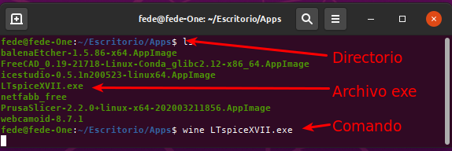
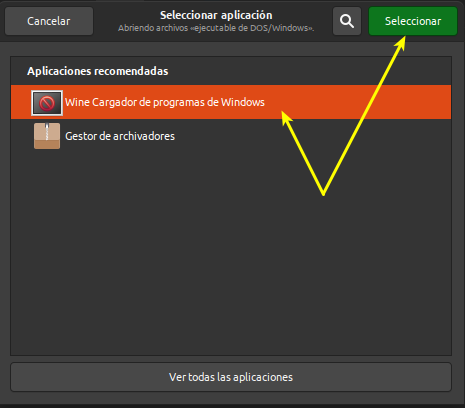
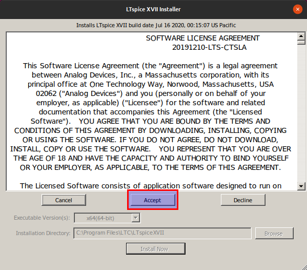
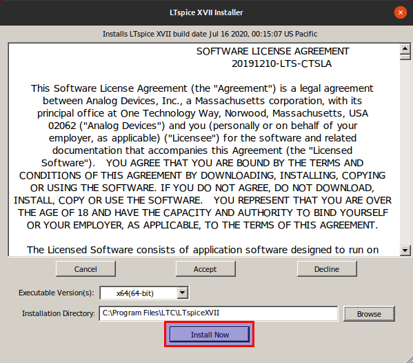
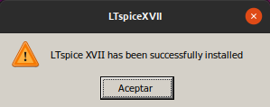
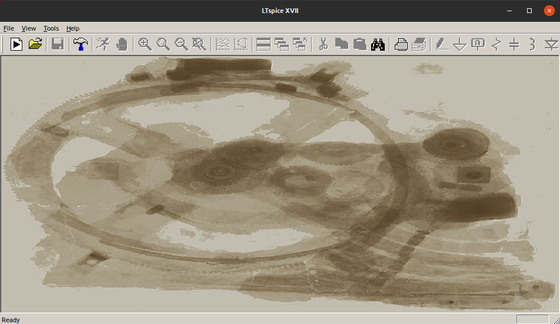
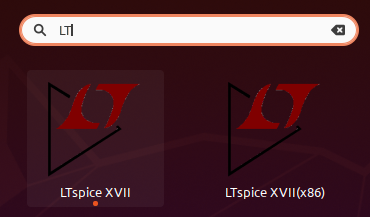

# LTSpice en Linux

## Instalación y ejecución

Ahora podemos [descargar](http://www.linear.com/designtools/software/#LTspice) LTSpice para Windows.

Situamos el archivo .exe en el directorio deseado y procedemos a ejecutarlo a través de Wine, bien como observamos en la imagen 1a.

| Imagen 1a |
|:-:|
|  |
| Localización y ejecución de LTSpice en Wine |

o bien como se observa en la imagen 1b.

| Imagen 1b |
|:-:|
|  |
| Ejecución de LTSpice en Wine de forma gráfica |

Se nos abrirá la ventana que vemos en la imagen 2, donde debemos hacer clic en aceptar la licencia.

| Imagen 2 |
|:-:|
|  |
|  |

Una vez aceptada la licencia se nos muestra la ventana de la imagen 3.

| Imagen 3 |
|:-:|
|  |
| Ventana de instalación |

Cuando finalicen las tareas de instalación se muestra el mensaje que vemos en la imagen 4.

| Imagen 4 |
|:-:|
|  |
| Instalación satisfactoria |

Cuando pulsamos en aceptar de la imagen 4 se nos abre la ventana de LTSpice tal y como la vemos en la imagen 5.

| Imagen 5 |
|:-:|
|  |
| Ventana principal de LTSpice XVII |

Ya estamos preparados para comenzar con la simulación de circuitos con esta aplicación.

A partir de este momento tendremos disponibles las versiones de Wine instaladas a través de nuetro icono de acceso a aplicaciones, tal y como vemos en la imagen 6.

| Imagen 6 |
|:-:|
|  |
| Acceso a LTSpice XVII desde aplicaciones |

