# Mas conceptos de simulación con LTSpice

En este apartado fundamentalmente veremos ejemplos diversos de simulación con breve explicación de algún concepto si creo que resulta necesario.

## Diagrama de Bode

Un diagrama de Bode es una representación gráfica de la respuesta en frecuencia de un circuito. Debe su nombre a su desarrollador [Hendrik Wade Bode](https://es.wikipedia.org/wiki/Hendrik_Wade_Bode). Lo mas habitual es que tenga dos gráficas, una correspondiente al módulo de la función de transferencia (ganancia) expresada en decibelios en función de la frecuencia (o la frecuencia angular) expresada en una escala logarítmica.

El diagrama de fase de Bode representa la fase de la función de transferencia en función de la frecuencia (o frecuencia angular) en escala logarítmica. Se puede dar en grados o en radianes. Permite evaluar el desplazamiento en fase de una señal a la salida del sistema respecto a la entrada para una frecuencia determinada.

Es una herramienta muy utilizada en el análisis de circuitos electrónicos, especialmente importante en el diseño y análisis de filtros y amplificadores.

Vamos a recuperar el filtro pasa bajo para ejemplificar el diagrama de Bode en LTSpice XVII. El circuito que vamos a utilizar es el de la imagen 1.

|Imagen 1 |
|:-:|
| 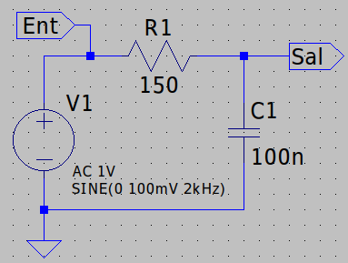 |
| Filtro pasa bajos |
 

Antes de proceder con el análisis vamos a realizar unos sencillos cálculos. Sabemos que $\begin{aligned}X_{c}=1/2\pi fC\end{aligned}$ y que cuando el circuito entra en resonancia se cumple que $X_{C} = R$, por lo que podemos escribir que $\begin{aligned}R=1/2\pi fC\end{aligned}$ de donde obtenemos que la frecuencia de corte que calculamos para el circuito en cuestión, así:

$f_{c}=\dfrac{1}{2\pi RC}=\dfrac{1}{2\pi \cdot 150\cdot 100\cdot 10^{-9}}=10,610Hz\hspace{0.5cm} \simeq \hspace{0.5cm}10\hspace{0.1cm}kHz$

Procedemos a realizar el análisis que se especifica en la imagen 2.

|Imagen 2 |
|:-:|
| 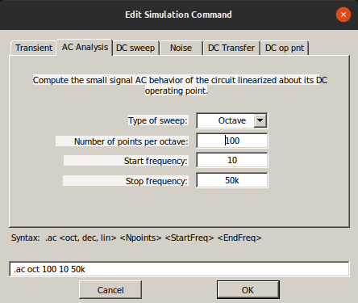 |
| Configuración análisis AC |
 

Situando una sonda de tensión en la salida del circuito obtenemos la respuesta que vemos en la imagen 3. Se observan tanto la curva de trazo continuo para la ganancia como la de trazo discontinuo para la de fase.

|Imagen 3 |
|:-:|
| 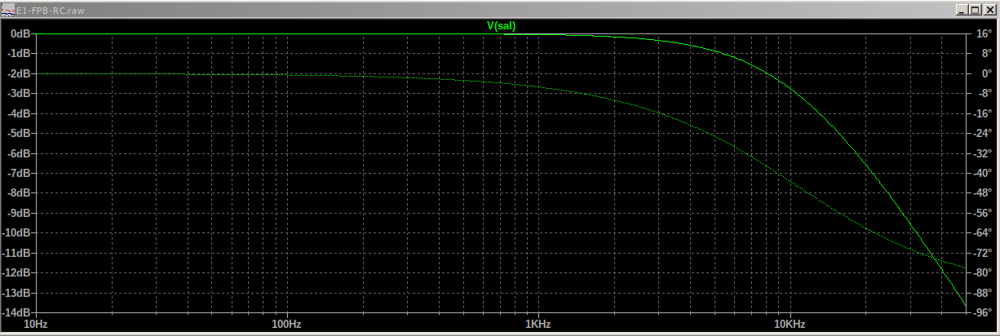 |
| Respuesta en frecuencia del filtro RC |
 

Para hacer análisis sobre esta curva necesitamos de los denominados cursores que están disponibles en LTSpice y que vamos a ver como usar seguidamente.

Tenemos disponibilidad de dos cursores en LTSpice XVII. Si hacemos clic con el botón izquierdo en la etiqueta del título de la forma de onda (situado en la parte superior de la ventana del gráfico) se establecerá un cursor en forma de barra cruzada y una ventana emergente con la información de la posición del cursor. Si movemos el puntero del ratón por el cursor aparecerá un número "1". Si hacemos clic con botón izquierdo en el número que se muestra, podremos mover el cursor por el gráfico. En la siguiente animación vemos como se hace lo descrito.

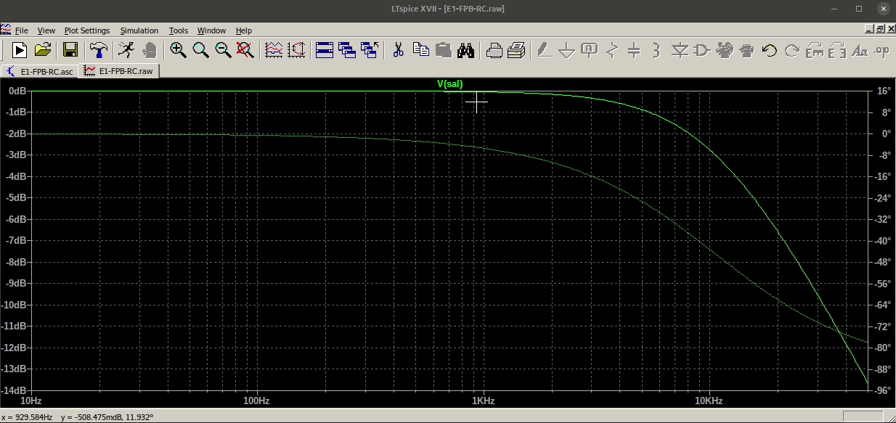

En la imagen 4 observamos como al llevar el cursor aproximadamente a los -3 dB tenemos la frecuencia de corte que coincide con la calculada.

|Imagen 4 |
|:-:|
| 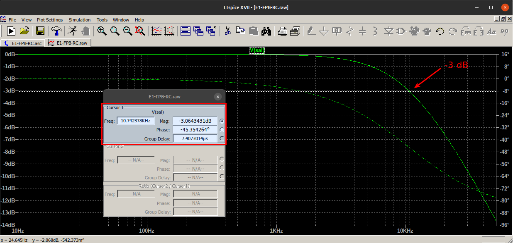 |
| Frecuencia de corte con cursor 1 |
 

Si con el cursor 1 activo hacemos de nuevo clic sobre la etiqueta del título del nodo, obtendremos el cursor número 2 y en la ventana emergente la tendremos la información de ambos cursores así como la relación entre Cursor2 y Cursor1. En la siguiente animación vemos esta forma de activación de ambos cursores y también cómo cambiar la curva de trabajo de estos.

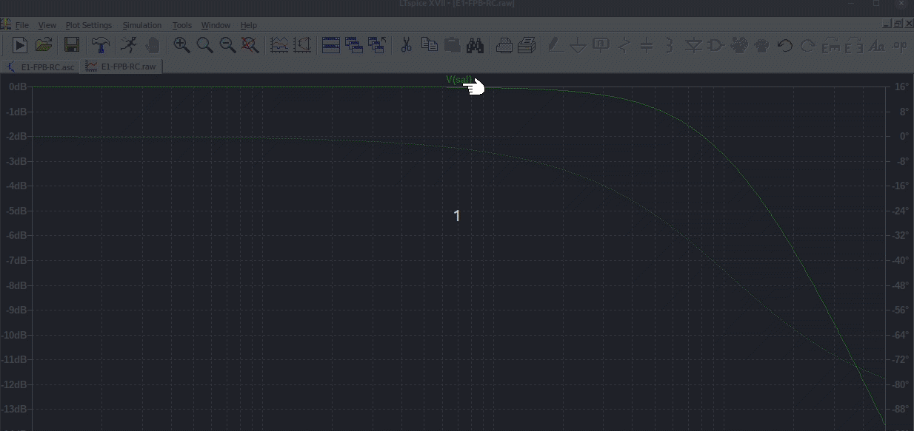

Podemos adjuntar el primero, el segundo o ambos cursores a cualquier traza haciendo clic con el botón derecho en la etiqueta de esa traza y usando el cuadro desplegable que vemos en la imagen 5. Cursor adjunto. Los cursores adjuntos se pueden arrastrar con el mouse o mover con las teclas del cursor.

|Imagen 5 |
|:-:|
| 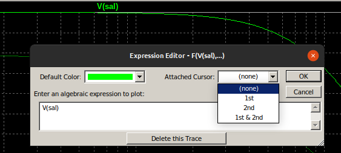 |
| Otra forma de adjuntar cursores |
 

Podemos [descargar](../../Ejemplos/Mas-conceptos/E1-FPB-RC.asc) este ejemplo para su estudio

## Curva característica de un diodo zener

El diodo Zener (que debe su nombre a su inventor [Clarence Melvin Zener](https://es.wikipedia.org/wiki/Clarence_Melvin_Zener)) es un tipo especial de diodo, que siempre se utiliza polarizado inversamente. Es decir:

- Si el diodo zener se polariza directamente se comporta como un diodo normal.
- Si el diodo zener se polarizada inversamente, este no conduce hasta que la tensión inversa aplicada alcance la denominada tensión zener o de ruptura, momento en el que se produce la avalancha zener. 
- Cuando el diodo zener se encuentra en zona de avalancha circula corriente de cátodo a ánodo y se mantiene entre sus terminales una tensión prácticamente constante denominada tensión zener. 

Dado su funcionamiento es evidente que su principal aplicación va a ser como estabilizador de tensión.

En la curva característica tensión/corriente se refleja perfectamente el comportamiento descrito y es por ello que vamos a desarrollar un ejemplo para obtener la de un diodo zener, en concreto la del EDZV10B que es un zener de 10V y 150 mW. El diodo puede soportar una corriente máxima de 15 mA. Montamos el circuito de la imagen 6 sobre el que planteamos un barrido DC que irá desde los -12V hasta 0V. La fuente la definimos de 0V porque no nos interesa la característica de polarización directa.

|Imagen 6 |
|:-:|
| 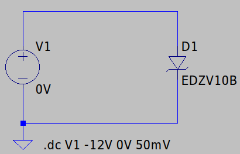 |
| Circuito para obtener característica del zener EDZV10B |
 

Una primera simulación con medida de la corriente por el diodo zener nos arroja la curva de la imagen 7 que resulta poco interesante de cara a leer valores, aunque ya se observa que en torno a los 10V comienza la estabilización.

|Imagen 7 |
|:-:|
| 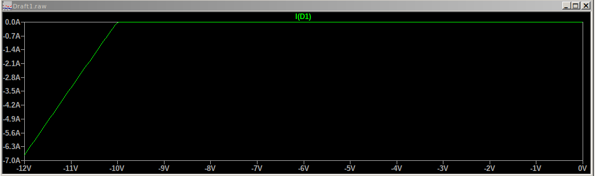 |
| Característica inicial del zener EDZV10B |
 

Considerando que el diodo zener no comenzará a provocar la avalancha zener hasta que no se alcance una corriente mínima y ajustando la escala del eje de corrientes a un valor más lógico a nuestros propósitos obtenemos la imagen 8, que es una curva mas descriptiva del diodo y sobre la que hemos situado un cursor para tener los datos.

|Imagen 8 |
|:-:|
| 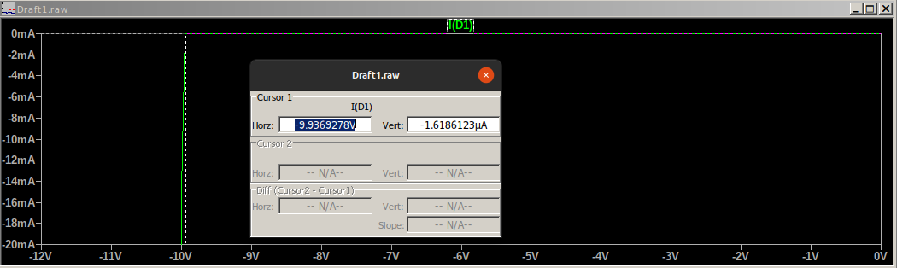 |
| Característica del zener EDZV10B |
 

Podemos [descargar](../../Ejemplos/Mas-conceptos/E2-curva-zener.asc) este ejemplo para su estudio

## Rectificador de doble onda con filtro por condensador

El filtrado es uno de los puntos más importantes cuando hablamos de fuentes de alimentación de tensión continua construidas a partir de la tensión de red pues del mismo va a depender el rizado de la fuente. 

El filtro por condensador está basado en colocar un condensador en paralelo con la carga, aprovechando el comportamiento del condensador que trata de oponerse a las variaciones de la tensión entre sus extremos.

Veamos este funcionamiento en simulación. Partiremos de una señal sinusoidal que convertiremos en corriente continua pulsatoria con un rectificador en puente y después analizaremos el efecto del filtrado con distintos valores de capacidad. En la imagen 9 tenemos el circuito que vamos a analizar.

|Imagen 9 |
|:-:|
| 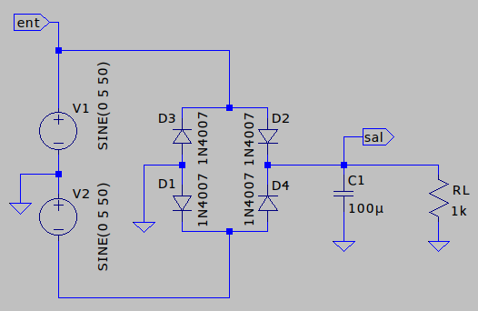 |
| Rectificador en puente con filtro por condensador |
 

La señal sinusoidal la obtenemos de dos fuentes para que la entrada al puente de diodos sea como la procedente del secundario de un transformador con toma intermedia, aspecto este imprescindible para que la referencia sea común a la tensión de entrada y a la de salida. El lector puede analizar este aspecto situando una sola fuente y haciendo el recorrido de la corriente por los diodos y encontrará que no hay un camino cerrado si no se coloca esa toma intermedia.

En la imagen 10 tenemos la representación de las tensiones de entrada y salida con los datos de un marcador que analizamos a continuación.

|Imagen 10 |
|:-:|
| 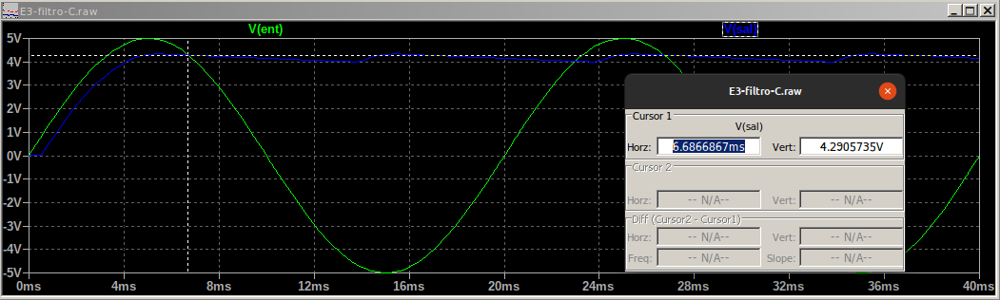 |
| Tensiones de entrada y salida del rectificador en puente con filtro por condensador |
 

La posición del cursor indica el punto donde se cortan ambas curvas que viene a indicar en que valor la tensión en la salida (4.2905735V) es menor que la de entrada debido a la caída de tensión que se produce en los diodos. Podemos observar que cuando el valor instantáneo de la tensión de entrada es mayor que el valor instantáneo en el condensador conducen por pares los diodos D1 y D2 para el semiciclo positivo y D3 y D4 para el negativo y el condensador se carga. Cuando la tensión de entrada en menor que la del condensador esos pares de diodos se polarizan inversamente y el condensador se descarga a través de RL.

En la imagen 11 podemos observar el efecto que tiene aumentar o disminuir el consumo en la carga cambiando su valor y se ve cómo para cargas pequeñas el rizado es excesivamente grande.

|Imagen 11 |
|:-:|
| 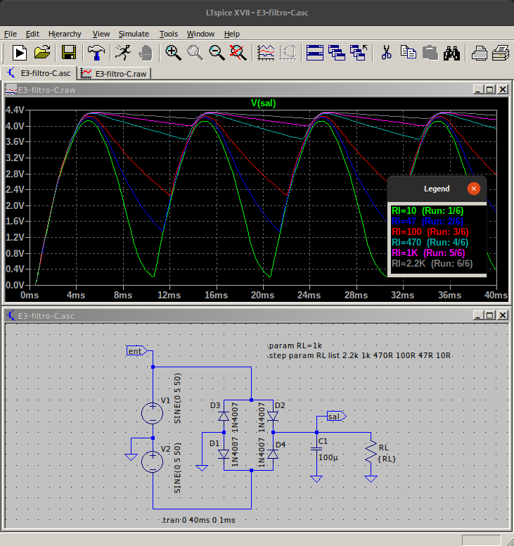 |
| Efecto del valor de RL en el rizado |
 

En la imagen 12 hacemos un análisis del rizado ahora en función del valor de la capacidad. Observese que Rl es de 100 ohmios.

|Imagen 12 |
|:-:|
| 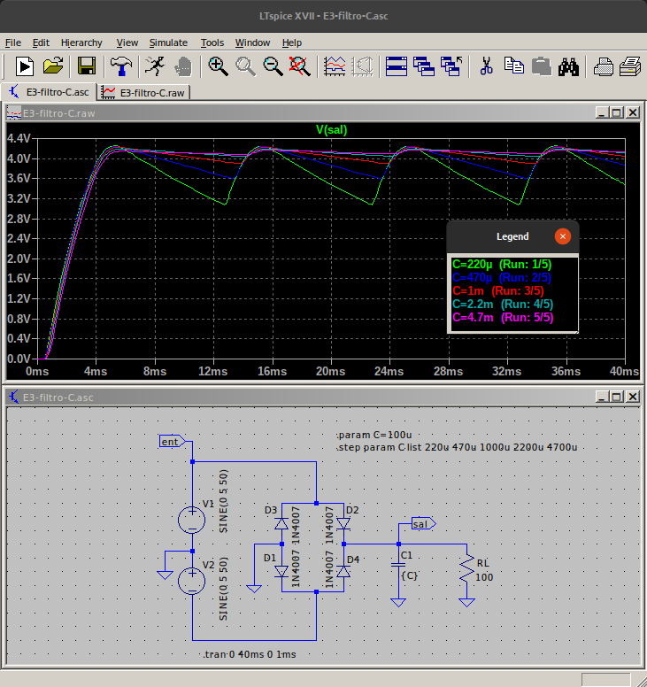 |
| Efecto del valor de C en el rizado |

Es posible calcular los valores medio y eficaz de la tensión de salida, para ello debemos mantener pulsada la tecla CTRL mientras hacemos clic sobre la etiqueta del gráfico que la representa. LTSpice procede a integrar el valor V(sal) en nuestro caso y nos muestra una ventana con los resultados de la integración donde aparecen el intervalo de integración y los valores medio y eficaz de la tensión seleccionada. No es posible hacer esto con análisis paramétrico.

En la animación siguiente vemos el proceso.

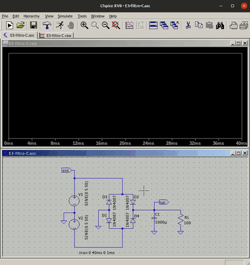

Podemos [descargar](../../Ejemplos/Mas-conceptos/E3-filtro-C.asc) este ejemplo para su estudio

## Regulación con diodo zener

Para mantener constante la tensión de salida y minimizar el rizado en la carga la forma más simple de fuente de alimentación es colocar a un filtrado por condensador un zener en paralelo junto con su correspondiente resistencia limitadora. Para ver esto en funcionamiento construimos el circuito de la imagen 13, formado por un rectificador puente con filtro por condensador y un regulador de tensión con diodo Zener BZX84C12VL para una tensión de salida de 12 V.

|Imagen 13 |
|:-:|
| 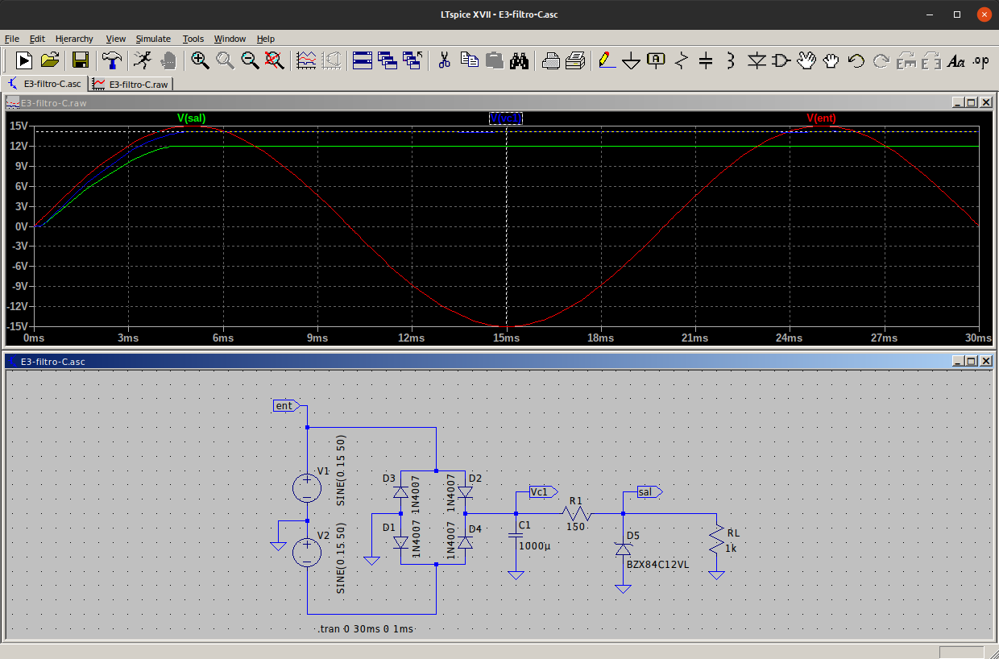 |
| Regulación con diodo zener |

Es evidente que el circuito es capaz de entregar muy poca corriente pues el diodo zener puede disipar un máximo de 250 mW ($I_{zmax}=21 mA$) lo que se pone de manifiesto disminuyendo la RL, tal y como vemos en la imagen 14, donde claramente el diodo no está estabilizando porque se supera la corriente máxima.

|Imagen 14 |
|:-:|
| 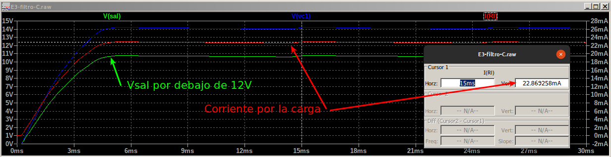 |
| Vz no es estable porque se supera la $I_{zmax}=21 mA$ |

Esto se soluciona de forma sencilla introduciendo un transistor como elemento regulador que sea el encargado de entregar la corriente a la carga y que la corriente de control de zener quede dividida por la ganancia en corriente de dicho transistor, y si resulta necesaario se puede usar un par en montaje D'Arlington. En la imagen 15 tenemos un rápido ejemplo de lo dicho con un aumento considerable en la corriente por la carga. La tensión de salida ha caído por debajo de los 12V debido a la caida de tensión base-emisor del transistor.

|Imagen 15 |
|:-:|
| 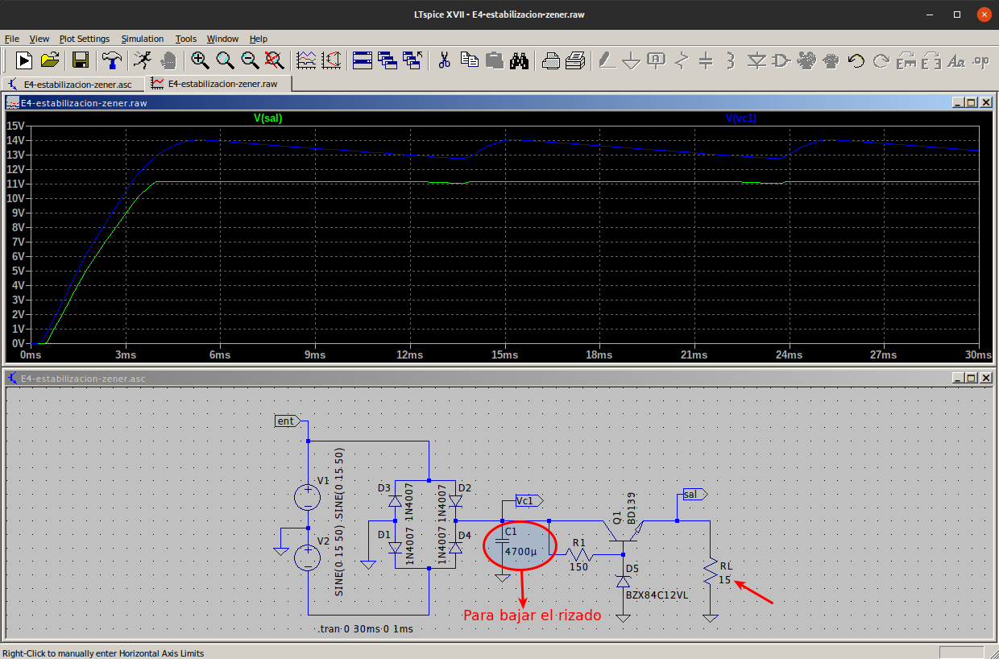 |
| Regulación con transistor |

Podemos [descargar](../../Ejemplos/Mas-conceptos/E5-regulacion-transistor.asc) este ejemplo para su estudio

## Transistor autopolarizado

En la imagen 16 vemos el circuito típico de una autopolarización de un transistor bipolar que mantiene el punto de trabajo estático muy estable respecto a las variaciones de temperatura.

|Imagen 16 |
|:-:|
| 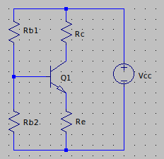 |
| Circuito típico de autopolarización |

Pues bien, en este apartado vamos a utilizar LTspice XVII para realizar el análisis en corriente continua del punto de trabajo (.OP). Para ello vamos a tomar el circuito de la imagen 16, le vamos a poner componentes con valores y vamos a etiquetar los diferentes nodos de importancia a fin de que la lectura de resultados sea mas sencilla. En la imagen 17 vemos el circuito, la configuración de simulación y los resultados obtenidos. 

|Imagen 17 |
|:-:|
| 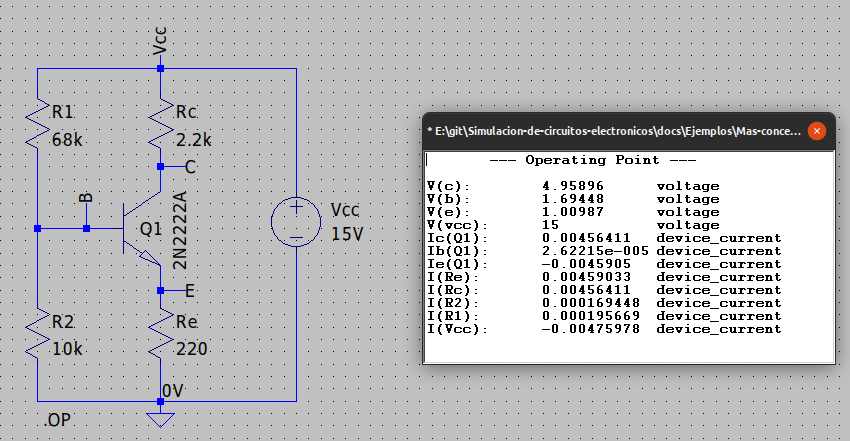 |
| Análisis .op de un transistor con autopolarización |

Si queremos ver los datos en el propio circuito podemos hacer clic con botón izquierdo sobre el nodo deseado o bien situando el cursor sobre el nodo hacer clic derecho y escoger `Place .op Data Label` y obtendremos algo similar a lo que vemos en la imagen 18.

|Imagen 18 |
|:-:|
| 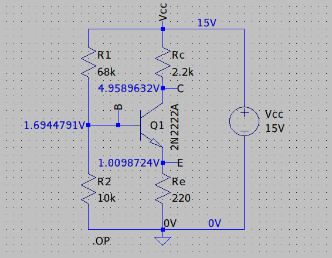 |
| Datos análisis .op en el esquema |

Si realizamos un análisis para una temperatura de por ejemplo 90° (.TEMP 90) obtenemos los resultados que vemos en la imagen 19. Si comparamos estos con los obtenidos en la imagen 17 vemos que cambian muy poco a pesar del gran aumento de temperatura.

|Imagen 19 |
|:-:|
| 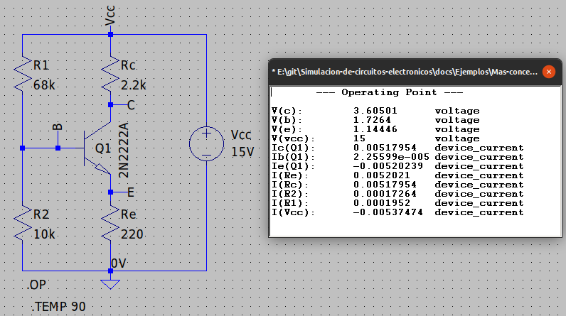 |
| Análisis .op a una temperatura especificada |

Podemos [descargar](../../Ejemplos/Mas-conceptos/E7-autopolarizacion.asc) este ejemplo para su estudio

## Amplificador básico en emisor común

Un circuito autopolarizado es la base principal de un amplificador clase A con solo dotarlo de los correspondientes condensadores de acople en la entrada y la salida y el de desacople en el emisor del transistor. Los condensadores de acople tienen la misión de aislar la corriente continua de polarización con las señales de entrada/salida y el condensador de desacople evita perdidas de ganancia del amplificador. En la imagen 20 tenemos el esquema característico con una fuente de excitación colocada en la entrada.

|Imagen 20 |
|:-:|
| 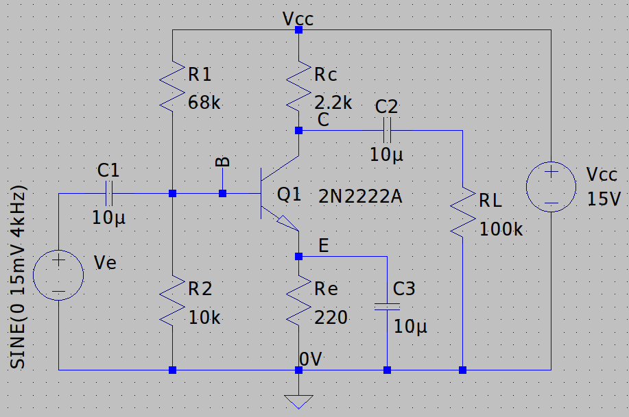 |
| Amplificador en emisor común |

En la siguiente animación podemos ver como añadir trazar para una visualización mejor de las señales de entrada y salida y se observa como las señales de entrada y salida están desfasadas unos 180°.

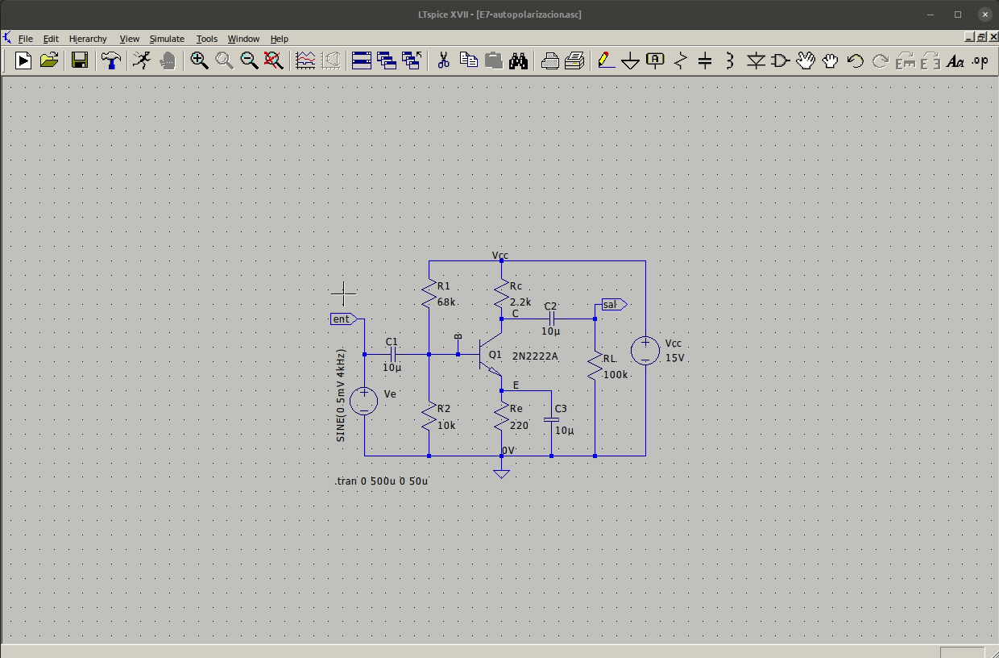

Podemos calcular la ganancia en tensión aproximada utilizando los cursores en cada gráfica para obtener el valor de la tensión pico a pico de las señales de entrada y de salida. En la imagen 21 vemos los resultados obtenidos.

| Imagen 21a | Imagen 21b |
|:-:|:-:|
| 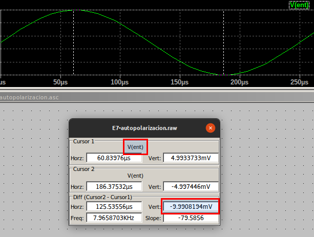 | 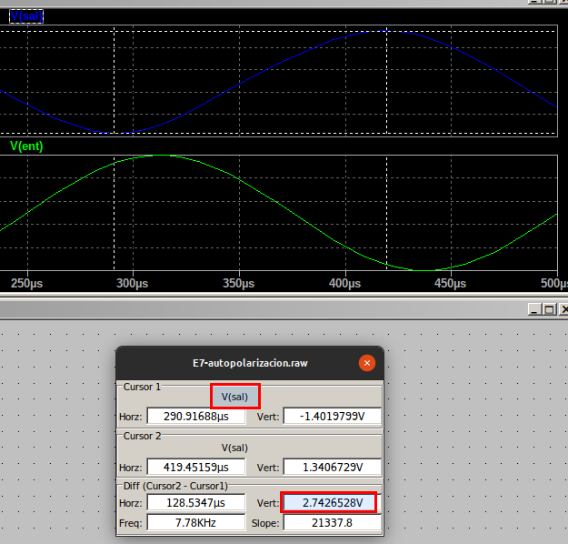 |
| Señal de entrada | Señal de salida |

Con estos valores podemos hacer el cálculo de ganancia en tensión siguiente:

$\begin{aligned}A_{v}=\dfrac{Vsal}{Vent}=\dfrac{2.74\times 10^{3}mV}{9.99mV}=274\end{aligned}$

De forma similar podemos obtener las corrientes de entrada y salida del amplificador para calcular la ganancia en corriente. En la imagen 22 tenemos las gráficas y los resultados de los cursores.

|Imagen 22 |
|:-:|
| 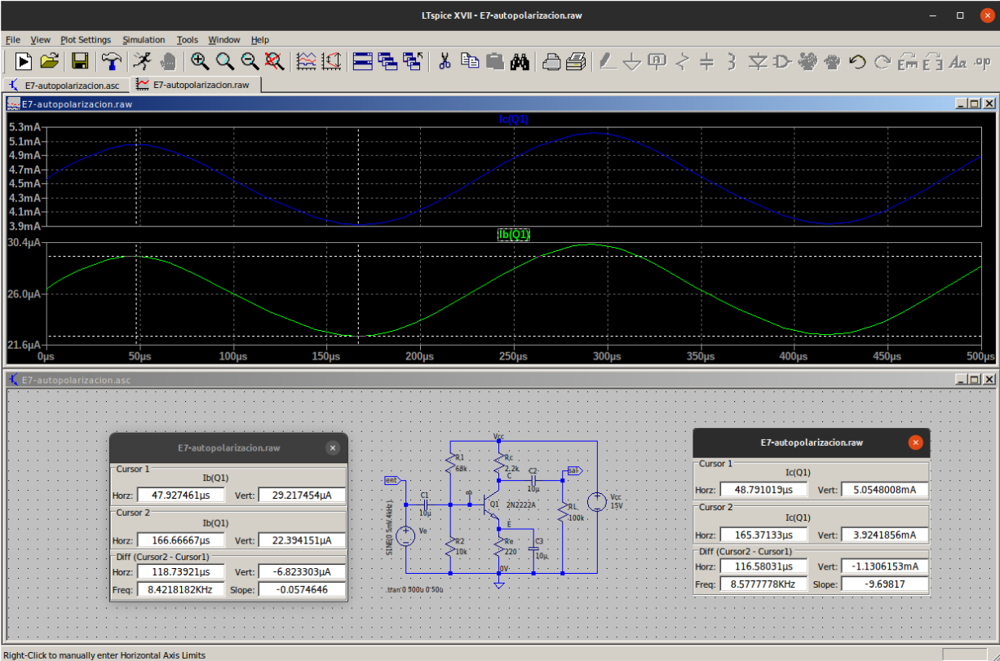 |
| Medida de las corrientes de entrada y salida |

Con los valores obtenidos podemos hacer el cálculo de ganancia en corriente siguiente:

$\begin{aligned}A_{I}=\dfrac{I_{C}}{I_{B}}=\dfrac{1.13\times 10^{-3}}{6.82\times 10^{-6}}=166\end{aligned}$

Podemos [descargar](../../Ejemplos/Mas-conceptos/E8-amplificador-EC.asc) este ejemplo para su estudio

## Algo sobre amplificadores operacionales

No podía ser de otra forma que antes de dar por concluida esta entrada hablásemos del que probablemente sea el circuito integrado mas versátil construido, hablamos del LM741 que viene a ser como el "abuelo" de los amplificadores operacionales y que tanto juego ha dado, y sigue dando, en electrónica.

El primer problema que nos encontramos, y esto puede ocurrirnos con otros muchos componentes, es que este operacional no está en las librerías de LTSpice XVII, pero esto no va a ser un problema ya que es bastante sencillo encontrar el modelo SPICE del mismo en internet. Una búsqueda del tipo `modelo SPICE LM741` nos arrojará diferentes resultados que podemos descargar para, a partir de ellos crear el símbolo que se asocia a la macro descargada, y esto es el proceso que vamos a describir a continuación, además cuando tengamos nuestro símbolo haremos alguna simulación sencilla.

### Amplificador Operacional LM741

Comenzamos por [descargar la macro del uA741](https://gist.github.com/s-estay/693b8471bdf4b02f9b6021e102de0bf2) desde el github de [Sebastian Stay](https://gist.github.com/s-estay) y situamos el archivo .sub descargado en el directorio *Mis_Componentes* creando anteriormente en estos tutoriales. El siguiente paso va a consistir en arrastrar el archivo a la zona de trabajo de LTSpice tal y como vemos en la siguiente animación:

En la imagen 23 podemos observa el orden de los pines asignado a la creación del subcircuito correspondiente.

|Imagen 23 |
|:-:|
| 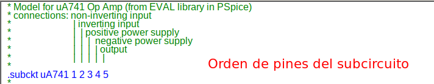 |
| Orden de pines para el subcircuito |

Si hacemos clic derecho sobre la directiva *.subckt uA741 1 2 3 4 5* nos aparecerá una ventana en la disponemos de la entrada *Create Symbol*. Vemos este proceso a continuación:

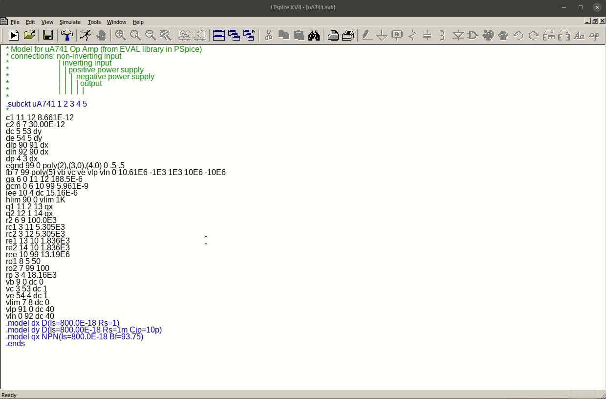

El símbolo que se crea no parece el más apropiado para este dispositivo por lo que vamos a proceder a editarlo para adaptarlo a uno genérico ya existente. Vamos a abrir el archivo *uA741.asy* con el editor de textos y veremos algo similar a la imagen 24.

|Imagen 24 |
|:-:|
| 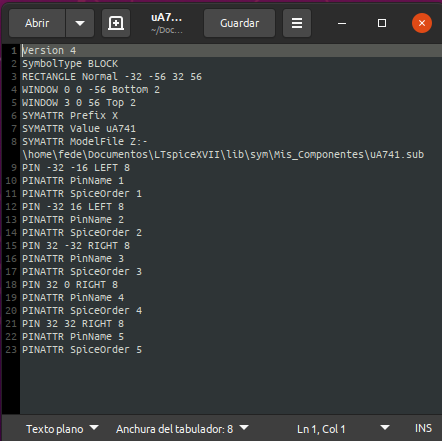 |
| Símbolo uA741 abierto en editor de texto |

En las librerías vamos a buscar un operacional genérico que tenga un símbolo con cinco pines, puede ser por ejemplo el que vemos en la imagen 25.

|Imagen 25 |
|:-:|
| 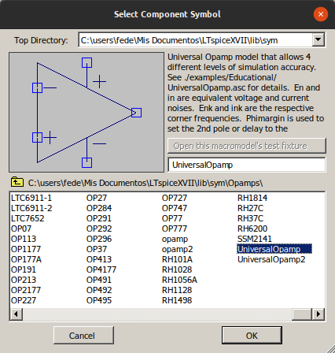 |
| Símbolo de un operacional genérico |

Una vez localizado lo abrimos también en modo texto y vamos a observar en primer lugar que las líneas destacadas en la imagen 26 corresponden con el dibujo en sí del símbolo por lo que vamos a reemplazar las del que hemos creado nosotros por las del genérico.

|Imagen 26 |
|:-:|
| 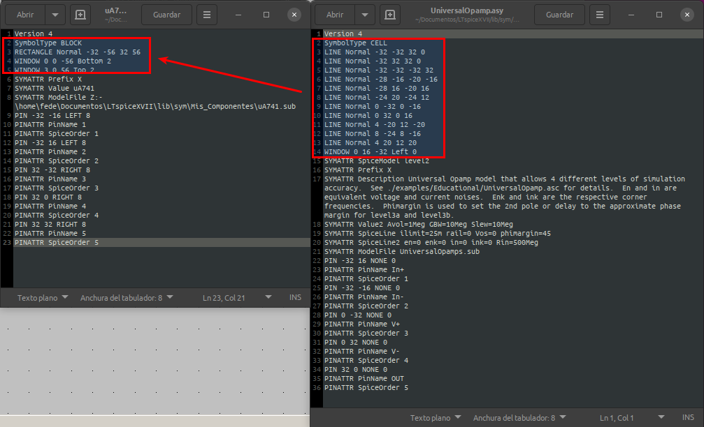 |
| Reemplazo de líneas |

De forma similar a la anterior realizamos el reemplazo de las últimas líneas que corresponden a los pines del dispositivo.

Con esto ya tenemos disponible en nuestra librería el nuevo símbolo para el uA741 asociado al modelo Spice descargado que podemos utilizar para nuestros circuitos. El aspecto del símbolo creado lo vemos en la imagen 27 donde vemos el texto añadido para que al cargar el símbolo en nuestro esquema nos aparezca el modelo de operacional al que corresponde.

|Imagen 27 |
|:-:|
| 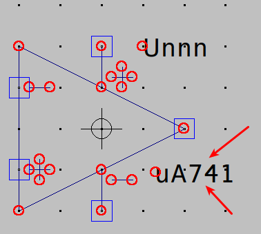 |
| Símbolo de uA741 |

El símbolo creado automáticamente se guarda por defecto en el directorio ...\LTspiceXVII/lib/sym/AutoGenerated, aunque para nuestros propósitos lo hemos trasladado al directorio propio *Mis_Componentes*.

### Simulación con uA741

Como ejemplo vamos a simular la obtención de la curva *Voltaje de salida máximo en función de la frecuencia* que podemos ver en el datasheet del uA741 y que vemos reproducido en la imagen 28. Si observamos la curva vemos que la tensión de salida permanece constante hasta los 7 kHZ, y es esto precisamente lo que vamos a comprobar.

|Imagen 28 |
|:-:|
| 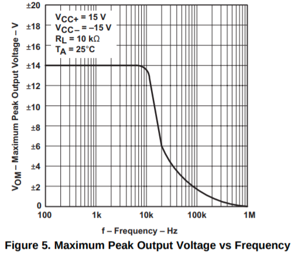 |
| Voltaje de salida máximo en función de la frecuencia |
| Obtenido de [Texas Instruments](https://www.ti.com/lit/ds/symlink/ua741.pdf?HQS=TI-null-null-mousermode-df-pf-null-wwe&ts=1598001790402&ref_url=https%253A%252F%252Fwww.mouser.es%252F) |

Para ello vamos a utilizar una configuración de amplificador inversor como la de la imagen 29 en el que hemos configurado las condiciones establecidas en la esquina superior izquierda de la imagen 27.

|Imagen 29 |
|:-:|
| 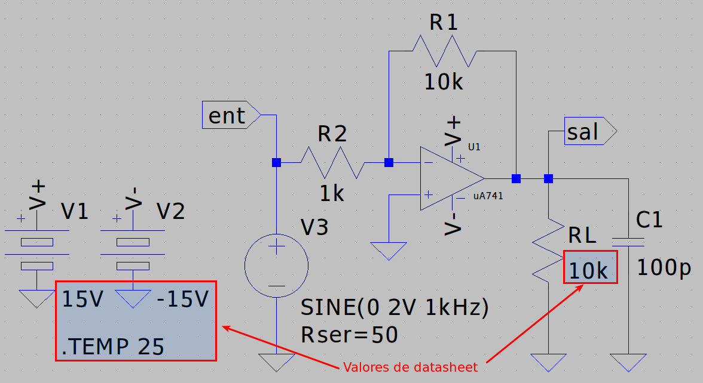 |
| Circuito para obtener la curva de voltaje de salida máximo en función de la frecuencia |

Un primer análisis transitorio para las condiciones establecidas nos arroja el resultado que vemos en la imagen 30, donde se aprecia claramente que el amplificador está saturado y, dada la alimentación que tiene y su ganancia en tensión que es de 10, la salida está un poco por debajo de los 15V debido a la no idealidad del dispositivo.

|Imagen 30 |
|:-:|
| 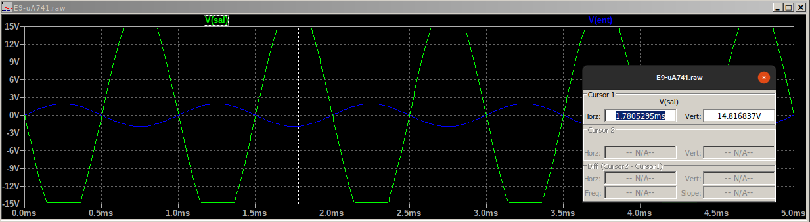 |
| Análisis en saturación |

Cambiamos las condiciones de la señal de entrada y de simulación a *SINE(0 1.5V 100Hz / .tran 20m* para ver como se comporta el circuito. En la imagen 31 tenemos los resultados.

|Imagen 31 |
|:-:|
| 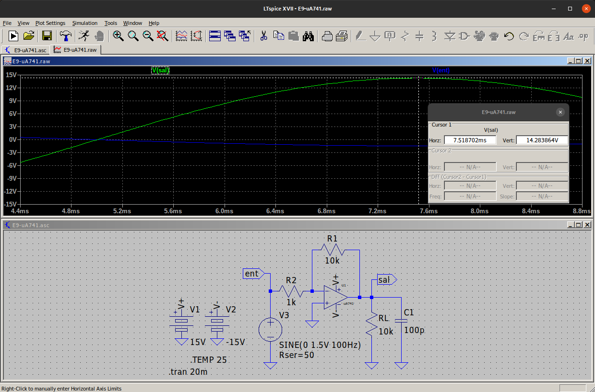 |
| Análisis a 100 Hz |

Podemos observar como la tensión de salida permanece constante dentro del margen dinámico del uA741. En la animación siguiente vemos como obtener una ventana de zoom de acercamiento para fijar el cursor con mayor precisión. Esto lo hacemos con un clic izquierdo y arrastrando el ratón hasta tener la ventana deseada. En la animación también vemos como recuperar el nivel de zoom.

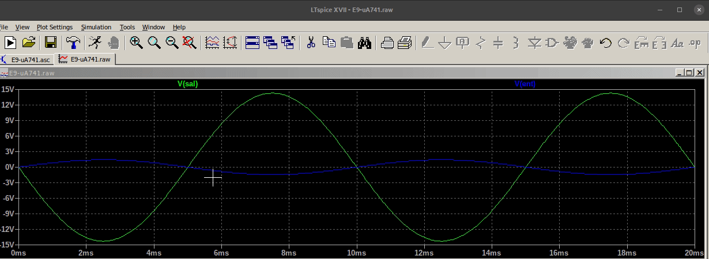

Ahora cambiamos de nuevo las condiciones de la señal de entrada y de simulación a *SINE(0 1.5V 4kHz / .tran 0.5m* para ver como se comporta el circuito a otra frecuencia dentro del rango. En la imagen 32 tenemos los resultados.

|Imagen 32 |
|:-:|
|  |
| Análisis a 4kHz |

Observamos de nuevo que la tensión de salida permanece casi invariable.

Vamos ahora a establecer las condiciones de la señal de entrada y de simulación a *SINE(0 1.5V 7kHz / .tran 0.3m* para ver como se comporta el circuito a una frecuencia justo en el límite de la zona horizontal de la curva de la imagen 28. En la imagen 33 tenemos los resultados.

|Imagen 33 |
|:-:|
| 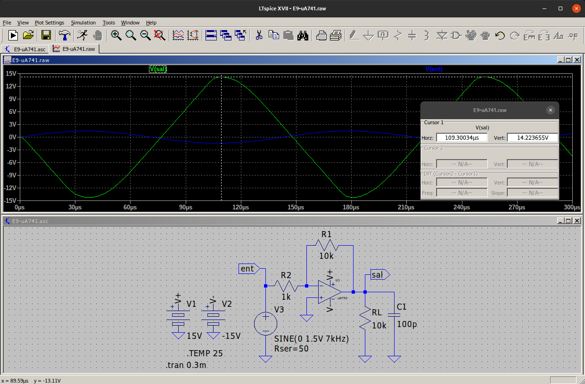 |
| Análisis a 7kHz |

Observamos que la tensión de salida permanece casi invariable pero que la señal de salida ya comienza a sufrir cierta deformación.

Un cambio en las condiciones de la señal de entrada y de simulación a *SINE(0 1.5V 8kHz / .tran 0.3m* para estar en la zona del codo de la curva nos permite observar que la tensión de salida ya comienza a tener una caida importante, como vemos en la imagen 34. 

|Imagen 34 |
|:-:|
| 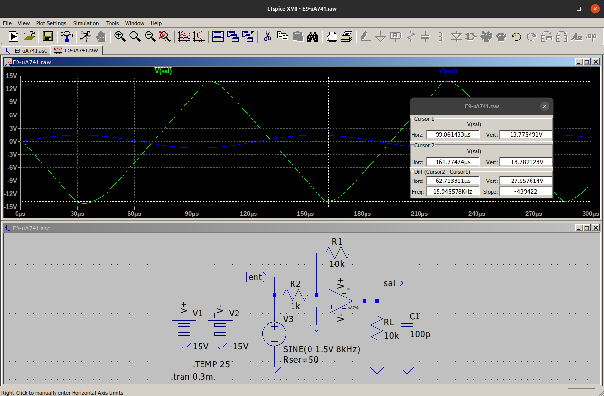 |
| Análisis a 8kHz |

La tensión de salida ya sufre una caída apreciable.

Si nos vamos a 20kHz vemos que la tensión de salida está por debajo de los 6V y que además la señal comienza a perder su simetría respecto a 0V. Esto lo vemos en la imagen 35.

|Imagen 35 |
|:-:|
| 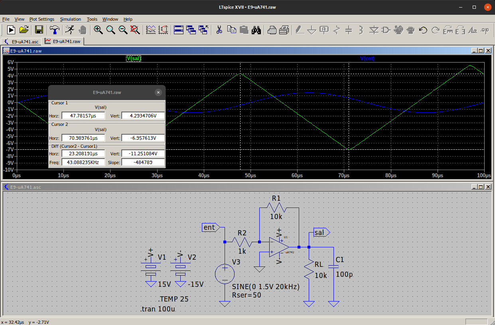 |
| Análisis a 20kHz |

Si seguimos aumentando la frecuencia la señal de salida será cada vez mas débil, como vemos en la imagen 36.

|Imagen 36 |
|:-:|
| 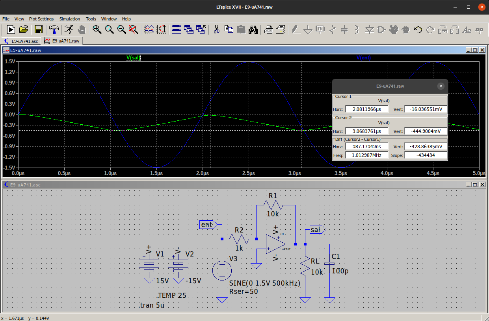 |
| Análisis a 500kHz |

Vamos ahora a realizar un análisis de respuesta en frecuencia del circuito para comprobar el funcionamiento y ver el valor de la frecuencia de corte del amplificador. En la imagen 37 vemos las condiciones de simulación y los resultados obtenidos.

|Imagen 37 |
|:-:|
| 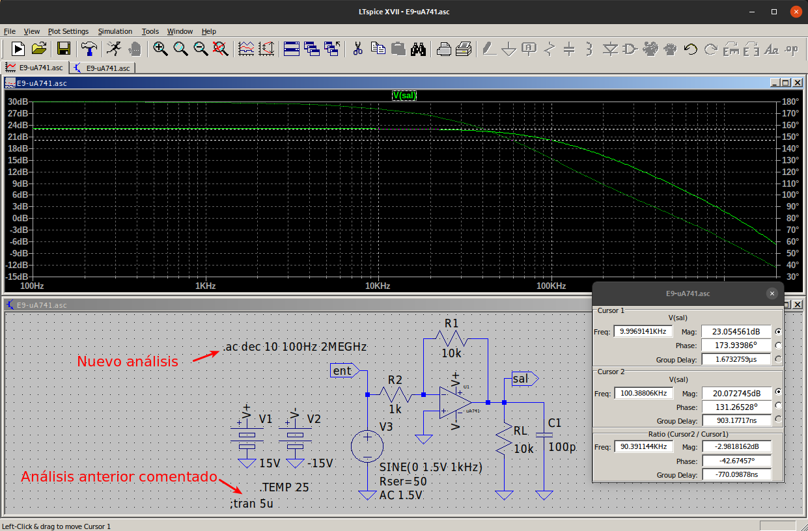 |
| Respuesta en frecuencia del amplificador inversor con uA741 |

Podemos [descargar]() este ejemplo para su estudio

Cuando configuramos el análisis AC es muy importante dar la amplitud para dicho análisis en la fuente de señal, tal y como se muestra en la imagen 38a. Si no lo especificamos nos generará el error que vemos en la imagen 38b.

| Imagen 38a | Imagen 38b |
|:-:|:-:|
| 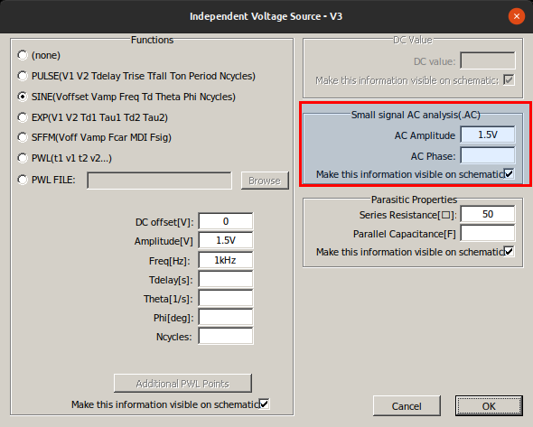 |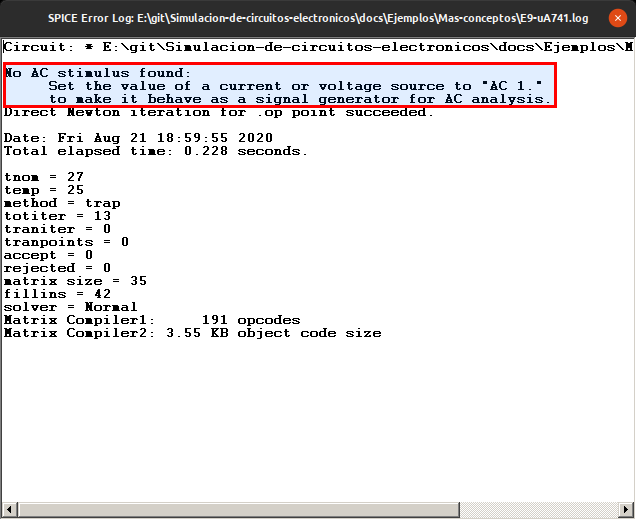 |
| Configuración del análisis AC | Error por análisis AC mal configurado |

