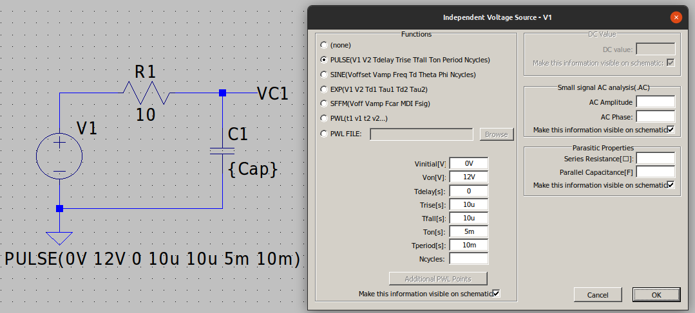

# Tipos de análisis en SPICE

Veremos en este apartado los tipos de análisis disponibles en LTSpice acompañando las descripciones con ejemplo de uso que ayuden a entender mejor como funciona el tipo tratado.

Los tipos de análisis disponibles los vemos en la imagen 1 a la que se accede desde el menú *Simulation -> Edit simulation cmd*.

| Imagen 1 |
|:-:|
|  |
| Tipos de simulación disponibles en LTSpice |

Antes de comenzar las descripciones en la tabla siguiente se describen las extensiones de los tipos de archivo que maneja LTSpice.

| Extensión | Descripción|
|:-:|---|
| *.asc | Esquemático. Es una netlist basada en los comandos de SPICE|
| *.cir, *.net, *.sp | Netlist |
| *.fft | Archivo binario de salida (del inglés Fast Fourier Transform) |
| *.lib | Librerías de modelos |
| *.raw, *.fra | Formas de onda |
| *.sub | Subcircuito |
| *.asy| Símbolos |
| *.log | Archivo de resgistro del proceso de simulación |

## DC op pnt - Punto de trabajo en continua

Este tipo de análisis nos permite determinar cuál es el punto de trabajo de corriente continua del circuito que tengamos bajo prueba. En este tipo de análisis en corriente continua los condensadores se consideran circuitos abiertos y las bobinas cortocircuitos. Los resultados son almacenados en un archivo de texto y/o se pueden mostrar directamente sobre el esquema. En general, los tres tipos de resultados que se pueden obtener son:

* Tensiones en cada nodo del circuito  
* Corrientes que circulan por los componentes  
* Lista de parámetros que indican los parámetros de pequeña señal de los componentes no lineales.

La sintaxis de este tipo de analisis es:

> .op
  
Vamos a realizar este análisis capturando el circuito que vemos en la imagen 2.

| Imagen 2 |
|:-:|
|  |
| Circuito para análisis DC op pnt |

Ahora accedemos a los comandos de simulación (desde el icono o desde el menú) y escogemos, según vemos en la imagen 3, el análisis DC op pnt.

| Imagen 3 |
|:-:|
|  |
| Selección del tipo de analisis DC op pnt |

Una vez que pulsamos el botón Ok, y transcurrido el tiempo necesario para la ejecución del análisis, nos aparecerá una ventana con los resultados, tal y como vemos en la imagen 4, donde además se observa en el circuito que el tipo de operación es *.op*, es decir, punto de trabajo.

| Imagen 4 |
|:-:|
|  |
| Resultados de la simulación DC op pnt |

En la imagen 5 podemos ver los archivos que componen el ejemplo en este momento.

| Imagen 5 |
|:-:|
|  |
| Archivos ejemplo simulación DC op pnt |

En la tabla siguiente se indica que es cada archivo.

| Archivo | Contenido |
|:-:|:-:|
| E1-DC-op-pnt.asc | Esquema|
| E1-DC-op-pnt.log | Datos relativos a la simulación|
| E1-DC-op-pnt.net | Netlist |
| E1-DC-op-pnt.raw | Formas de onda. En este caso los datos que vemos a la derecha en la imagen 4|

Podemos [descargar](../../Ejemplos/Tipos/E1-DC-op-pnt.asc) este ejemplo para su estudio.

## DCsweep - Análisis de barrido en corriente continua

Este tipo de análisis permite la simulación de un circuito a partir de un rango de valores, de un parámetro del componente o de la temperatura de operación de la fuente de excitación. De esta forma podemos observar la variación de la variable de salida barriendo la variable de entrada.

En forma general, una vez establecido la variable sobre la que se efectuará el barrido y su nombre, se pueden seleccionar distintos tipos de barrido:

* Lineal: se define con los valores inicial y final y el incremento para las variables.  
* Octavas: se define con los valores inicial y final y el número de puntos por octava.  
* Décadas: se define con los valores inicial y final y el número de puntos por década.  
* Lista de valores: se introducen, en forma de lista, los valores separados por comas.  
* Barrido anidado: se utilizan dos variables. Para cada valor de una de las variables se realiza el barrido completo de todos los valores de la segunda variable.

La sintaxis de este tipo de analisis es:

> .dc (<oct,dec,lin\>) <source1\> <start\> <stop\> \[<Incr\>\] \[<source2\>...\]

### Curva característica del diodo 1N4148

Como primer ejemplo de uso vamos a crear las condiciones que vemos en la imagen 6 para analizar el funcionamiento del diodo.

| Imagen 6 |
|:-:|
|  |
| Circuito y condiciones de simulación por barrido DC |

En la imagen 7 vemos el resultado de la simulación y algunas observaciones del resultado.

| Imagen 7 |
|:-:|
|  |
| Resultado inicial de simulación por barrido DC con diodo 1N4148 |

Vamos a realizar algunas modificaciones y las presentamos mediante la animación siguiente.

Podemos [descargar](../../Ejemplos/Tipos/E2-barridoDC-1N4148.asc) este ejemplo para su estudio.

### Curva característica de un zener

En la imagen 8 vemos otro ejemplo de barrido DC, en este caso con un diodo zener de 12V

| Imagen 8 |
|:-:|
|  |
| Barrido DC con zener de 12V |

Podemos [descargar](../../Ejemplos/Tipos/E2-barridoDC-zener12V.asc) este ejemplo para su estudio.

### Curvas características del BC547B

Vamos a ver un ejemplo mas de barrido DC, en este caso vamos a obtener las curvas características del transistor BC547B. Para ello capturamos el circuito que vemos en la imagen 9 y conimagenmos los valores de componentes tal y como se observa en la misma imagen. Es evidente que la fuente Vcc corresponde en este caso a la VCE.

| Imagen 9 |
|:-:|
|  |
| Esquema para obtener las curvas características de un transistor |

Ahora vamos a configurar los parámetros de simulación para ambas fuentes teniendo en cuenta que la que pongamos como *1st source*, corresponderá al parámetro del eje de abscisas. En las imágenes 10a y 10b tenemos estos datos de configuración.

| Imagen 10a | Imagen 10b |
|:-:|:-:|
|  |  |
| Primera fuente: Vcc | Segunda fuente: IB |

En la animación siguiente observamos como obtener las curvas características del transistor a partir de las configuracion es de las fuentes de excitación vistas. Las curvas aparecen al hacer clic con el ratón y situar la pinza amperimétrica midiendo la corriente de colector del transistor.

Podemos [descargar](../../Ejemplos/Tipos/E2-barridoDC-BC547B.asc) este ejemplo para su estudio.

## Transient - Análisis temporal

El análisis temporal o función del tiempo nos permite calcular la respuesta del circuito desde un instante de tiempo inicial hasta un instante de tiempo final, o sea, podemos hacer simulaciones no lineales en el dominio del tiempo que nos permite obtener las formas de onda en los nodos del circuito tomando como variable el tiempo. En realidad se obtiene un funcionamiento muy similar al que realizaría un osciloscopio.

La sintaxis de este tipo de analisis es:

> .tran <Tstop\> \[<option\> \[<option\>\] ...\]

Como ejemplo muy típico vamos a analizar el comportamiento de un circuito rectificador de media onda con diodo 1N4007. Nos encontramos con un problema, ese diodo no está en las librerias de instalación de LTSpice XVII y vamos a describir una forma simple de solucionar este y algún otro problema que citamos a continuación.

### Cambio de librerías
* Una primera solución la encontramos en la [LT wiki](http://ltwiki.org/index.php?title=Main_Page) donde encontramos un enlace a libreria de componentes y circuitos de ejejmplo denominado [Components Library and Circuits](http://ltwiki.org/index.php?title=Components_Library_and_Circuits).  
* Una vez entramos en el enlace tenemos disponibles varias opciones y hay una en concreto de Bordodynov que comparte toda una recopilación de componentes y ejemplo en un archivo zip de unos 33 MEG. Aunque está construido para la versión IV es perfectamente válido para la XVII.  
* [Descargamos](http://ltwiki.org/files/LargeCollection.zip) el archivo y lo descomprimimos en algún lugar para tenerlo disponible.  
* Localizamos el directorio LTspiceXVII que normalmente estará alojado en Documentos y lo abrimos, veremos un directorio *examples* y un directorio *lib*. Realizamos una copia de seguridad de los mismos y procedemos a sustituirlos por los que vienen en el archivo comprimido.  
* La próxima vez que arranquemos LTSpice se indexaran los archivos y quedará todo preparado para poder usarlo sin mas que esperar unos instantes a que el programa realice las tareas. Esto puede durar mas o menos tiempo en función del procesador que tengamos logicamente.  
* En la página de la wiki tenemos [acceso a una captura de pantalla](http://ltwiki.org/files/contaiing_AEI.jpg) donde se ven los archivos eliminados de la colección. Estos modelos AEI SPICE se han eliminado debido a posibles violaciones de derechos de autor. Si tenemos necesidad de alguno de ellos debemos proceder a su busqueda en internet.  
* En la misma página tenemos enlaces a los contenidos expandidos del archivo zip para poder ver su contenido completo.

### Ejemplo rectificador de media onda

La imagen 11 muestra el esquema y las condiciones de simulación del rectificador de media onda. Se ha establecido un tiempo de 100 ms dado que la tensión sinusoidal de entrada tiene una frecuencia de 50 Hz, lo que indica un periodo de 20 ms y con los 100 ms tendremos tiempo suficiente para observar varios ciclos.

| Imagen 11 |
|:-:|
|  |
| Rectificador de media onda y opciones de simulación |

En las opciones de simulación hemos establecido algunos parámetros que procedemos a explicar a continuación, dejando el resto para otro momento.

* Stop Time - Es el tiempo final que se estable para el análisis, o dicho de otra forma, el tiempo que dura la simulación si *Time to start saving data* es cero.  
* Time to start saving data - Es el tiempo establecido para comenzar la simulación.  
* Maximum Timestep - Es el valor establecido para cada paso en la simulación y de el depende la resolución de las curvas de salida, pero también el tiempo que tarda en simularse por lo que hay que establecer un compromiso entre ambos.

En la imagen 12 vemos el resultado de la simulación con las condiciones establecidas.

| Imagen 12 |
|:-:|
|  |
| Señal de salida del rectificador de media onda |

Podemos [descargar](../../Ejemplos/Tipos/E3-rectificador-media-onda.asc) este ejemplo para su estudio.

### Ejemplo rectificador de doble onda en puente

En la imagen 13 podemos ver este otro ejemplo con el nuevo circuito y los resultados obtenidos.

| Imagen 13 |
|:-:|
|  |
| Rectificador de doble onda en puente |

Podemos [descargar](../../Ejemplos/Tipos/E3-rectificador-doble-onda-puente.asc) este ejemplo para su estudio.

## AC analysis - Análisis en frecuencia

Esta simulación nos permite calcular la respuesta en frecuencia de un circuito. El barrido en frecuencia se puede seleccionar entre lineal o logarítmico, y para este último caso tenemos las opciones por décadas o por octavas.

La forma mas simple de analizar esto es con un filtro y para poder entender claramente los resultados vamos a recordar conceptos fundamentales relacionados con esto.

La sintaxis de este tipo de analisis es:

> .ac <oct,dec,lin\> <Npoints\> <StartFreq\> <EndFreq\>

### Conceptos básicos de filtros

Un filtro es un 'aparato' (construido con resistencias, condensadores, bobinas, amplificadores operacionales, etc) que deja pasar unas frecuencias y otras no. En electrónica hay cuatro tipos, que son:

* **F.P.B.** o Filtro Pasa Baja. Es un filtro que deja pasar las frecuencias inferiores a una determinada denominada frecuencia de corte (fc), y no deja pasar las que están por encima de la fc. En la imagen 14 vemos la curva de respuesta.

| Imagen 14 |
|:-:|
|  |
| Respuesta en frecuencia de un F.P.B. |

El F.P.B. pasivo mas simple es el RC que vemos en la imagen 15 donde también vemos la ecuación que permite su cálculo.

| Imagen 15 |
|:-:|
|  |
| Esquema de un F.P.B. |

* **F.P.A.** o Filtro Pasa Alta. Es un filtro de No deja pasar las frecuencias inferiores a la de corte y si las que están por encima. En la imagen 16 vemos su curva de respuesta.

| Imagen 16 |
|:-:|
|  |
| Respuesta en frecuencia de un F.P.A. |

En la imagen 17 vemos el esquema y la ecuación de cálculo del F.P.A. RC pasivo.

| Imagen 17 |
|:-:|
|  |
| Esquema de un F.P.A. |

* **F.P-Bd.** o Filtro Pasa Banda. Es un filtro que deja pasar las frecuencias comprendidas entre la de corte inferior y la de corte superior y rechaza las que están por debajo de la fci y por encima de la fcs, siendo siempre fcs > fci. En la imagen 18 vemos su curva de respuesta.

| Imagen 18 |
|:-:|
|  |
| Respuesta en frecuencia de un F.P.Bd. |

Si observamos la curva de respuesta está compuesta por las de F.P.B. para la fcs y F.P.A. para la fci. En la imagen 19 vemos el esquema y las ecuaciones de cálculo del F.P.Bd. RC pasivo.

| Imagen 19 |
|:-:|
|  |
| Esquema de un F.P.Bd. |

* **F.R.Bd.** o Filtro Rechaza Banda. Es un filtro que NO deja pasar las frecuencias comprendidas entre fci y fcs y SI deja pasar las que están por debajo de la fci y las que están por encima de la fcs, siendo siempre fcs > fci. En la imagen 20 vemos su curva de respuesta.

| Imagen 20 |
|:-:|
|  |
| Respuesta en frecuencia de un F.R.Bd. |

Este filtro está compuesto por el paralelo de un F.P.B y un F.P.A de forma que el F.P.B. no dará la fci y el F.P.A. la fcs. De esta forma una señal con frecuencia inferior a la fci tendrá permitido el paso por el F.P.B. mientras que es rechazada por el F.P.A. y cuando la frecuencia es mayor que la fcs su paso estará permitido por el F.P.A. mientras que el F.P.B. las rechazará, quedando de esta forma rechazada la banda entre ambas frecuencias.

En la imagen 21 vemos el esquema y las ecuaciones de cálculo del F.R.Bd. RC pasivo.

| Imagen 21 |
|:-:|
|  |
| Esquema de un F.R.Bd. |

Mientras mas inclinada queramos que sea la curva de subida o bajada mayor complejidad tendrá el filtro y utilizará muchos mas componentes. Existen infinidad de posibilidades y realmente existen filtros de muchísima complejidad que ya no serán pasivos sino filtros activos.

Ejemplos de filtros pasivos de mejor calidad son los conocidos como filtros en PI y en T que vemos en la imagen 22.

| Imagen 22 |
|:-:|
|  |
| Esquemas de filtro en PI y en T |

En la imagen 23 vemos la respuesta en frecuencia de tipos complejos de filtros pasivos.

| Imagen 23 |
|:-:|
|  |
| Curvas de respuesta de tipos de filtros |
| [Imagen obtenida en este enlace](https://www.analog.com/en/design-center/reference-designs/circuits-from-the-lab/cn0304.html#rd-description) | 

### Orden de un filtro

La pendiente de caida, que idealmente debiera coincidir con el eje de ordenadas, determina el orden del filtro. El orden de los filtros y la perdida por cada decada los vemos en la tabla siguiente:

| Orden del filtro | Perdida |
|:-:|:-:|
| 1 | 20 dB/dec |
| 2 | 40 dB/dec |
| 3 | 60 dB/dec |
| 4 | 80 dB/dec |
| 5 | 100 dB/dec |
| ... | ... |

Las caídas siempre van de 20 en 20 decibelios por decada.

En la imagen 24 vemos representado el concepto de decada y la determinación del orden del filtro por los decibelios perdidos. La decada para calcular las perdidas siempre debe tomarse en la parte recta de la caída.

| Imagen 24 |
|:-:|
|  |
| Concepto de decada y orden de un filtro |

A mayor orden de filtro mas complejidad tendrá el circuito y será mas caro de construir.

De forma similar se puede trabajar con octavas y tendremos la tabla siguiente:

| Orden del filtro | Perdida dB/dec | Perdida dB/oct |
|:-:|:-:|:-:|
| 1 | 6 dB/oct | 20 dB/dec |
| 2 | 12 dB/oct | 40 dB/dec |
| 3 | 18 dB/oct | 60 dB/dec |
| 4 | 24 dB/oct | 80 dB/dec |
| 5 | 30 dB/oct | 100 dB/dec |
| ... | ... | ... |

Las caídas siempre van de 6 en 6 decibelios por octava.

Recordemos que dos frecuencias están separadas una decada cuando una frecuencia es el doble de la otra, por ejemplo en una escala 0, 100, 200, 300, 400, 500, 600,... entre 100 y 200 hay una octava, entre 200 y 400 hay otra, entre 300 y 600 otra y así sucesivamente.

La frecuencia de corte se establece para una pérdida de la mitad de la potencia y esto se produce cuando la ganancia ha caído 3 dB por debajo de la máxima que corresponderá a la parte plana de la curva de respuesta. En la imagen 25 vemos el concepto representado.

| Imagen 25 |
|:-:|
|  |
| Perdida de 3 dB (fc) |

### Ejemplo de F.P.B. RC pasivo

La imagen 26 muestra el esquema y las condiciones de simulación del F.P.B. Se ha establecido 5 décadas para tener, con esos valores de componentes, una visualización óptima. 

| Imagen 26 |
|:-:|
|  |
| F.P.B., fuente AC y opciones de simulación |

En las opciones de simulación hemos establecido los parámetros que procedemos a explicar a continuación.

* Type of sweep - Establecemos el tipo de barrido en decadas.  
* Number of points per decade - Con 50 puntos por decada tendremos una buena resolución.  
* Start frequency - Comenzamos el análisis a una frecuencia de 1 Hz.
* Stop frequency - Detenemos el análisis 5 decadas después, o sea a 100 kHz.

En la imagen 27 vemos el resultado de la simulación con las condiciones establecidas.

| Imagen 27 |
|:-:|
|  |
| Respuesta en frecuencia y fase del F.P.B. |

Si calculamos la frecuencia de corte tendremos que:

En la imagen 28 se analizan los resultados obtenidos y vemos como el filtro cumple perfectamente con todo lo explicado.

| Imagen 28 |
|:-:|
|  |
| Análisis de la respuesta en frecuencia del F.P.B. |

Podemos [descargar](../../Ejemplos/Tipos/E3-rectificador-media-onda.asc) este ejemplo para su estudio.

## Análisis paramétrico

Se trata de un análisis que se realiza algún parámetro del circuito, como puede ser la temperatura, una variable, el valor de un componente o la temperatura. Para cada valor del parámetro se repite el análisis obteniendo un conjunto de resultados.

### Con el valor de un componente

El ejemplo que vamos a analizar es ver el efecto de variar la constante de tiempo de carga y descarga en un circuito RC variando el valor de la capacidad. Para definir una capacidad variable hay que colocar el nombre que le demos entre llaves, por ejemplo {Cap}.

Vamos a comenzar por capturar el esquema de la imagen 29 configurando los distintos componentes tal y como aparece en la misma.

| Imagen 29 |
|:-:|
|  |
| Circuito RC para análisis parámetrico |

Para establecer el parámetro de la capacidad debemos abrir el editor de texto de LTSpice y asegurarnos que tenemos seleccionada la opción *SPICE directive*. Debemos establecer una directiva con la sintaxis siguiente:

> .step param <variable\> <valor_inicial\> <valor_final\> <increment\>

En nuestro caso vamos a establecer esta directiva tal y como se observa en la imagen 30.

| Imagen 30 |
|:-:|
|  |
| Directiva con los parámetros de variación de la capacidad |

El siguiente paso es configurar como tipo de análisis el temporal con la configuración que vemos en la imagen 31.

| Imagen 31 |
|:-:|
|  |
| Configuración del tipo de análisis para observar los cambios en la constante de tiempo |

En la imagen 32 podemos observar las 8 curvas que se obtienen con los parámetros definidos.

| Imagen 32 |
|:-:|
|  |
| Resultado del análisis paramétrico |

Podemos [descargar](../../Ejemplos/Tipos/E5-parametrico.asc) este ejemplo para su estudio.

### Con la temperatura

La temperatura nominal (TNOM) establecida por defecto en SPICE es de 27ºC aunque es posible seleccionar otra diferente. LTSpice permite configurar las distintas opciones de simulación, dándonos un mayor control sobre la simulación de los circuitos. La sentencia que se utiliza es la siguiente:

> .options <option\> <option = value\> <option = value\> ...

La diferencia entre option solo o con una igualdad radica en que existen opciones que tienen valor numérico y otras que no lo tienen. Las opciones sin valor son banderas que se activan con solo nombrarlas. Por ejemplo, la sentencia siguiente suprime la descripción del circuito en el fichero de salida.

> .options NOECHO

Si necesitamos cambiar esta temperatura por defecto podemos poner, por ejemplo la siguiente sentencia:

> .options TNOM = 40C

y el análisis se realizará a esa temperatura.

También se puede establecer la temperatura del análisis. Si indicamos más
de una temperatura resultará un análisis paramétrico con la temperatura como variable. La forma básica de esta directiva es:

> .temp <T1\> <T2\> <T3\> ...

Esto es equivalente a realizar un análisis paramétrico del siguiente tipo:

> .step Temperaturas <T1\> <T2\> <T3\> ...

En la imagen 33 tenemos un circuito con diodo 1N4007, las condiciones establecidas y dos curvas para hacer la comparación de la sentencia TNOM = 40C anterior. Si observamos con detalle vemos que las curvas son totalmente diferentes aunque en un principio se parezcan mucho, basta observar la escala del eje de ordenadas y comprobar como para un mismo valor de tensión la corriente es mayor en el caso de 27 ºC.

| Imagen 33 |
|:-:|
|  |
|  |
| Análisis del cambio de TNOM |

En la imagen 34 tenemos las curvas del diodo 1N4007 obtenidas a las diferentes temperaturas establecidas.

| Imagen 34 |
|:-:|
|  |
| Curvas características del diodo 1N4007 entre 20 y 120 ºC |

Podemos [descargar](../../Ejemplos/Tipos/E5-temperatura-1N4007.asc) este ejemplo para su estudio.
