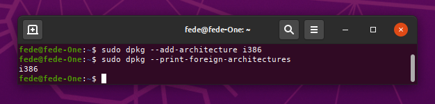
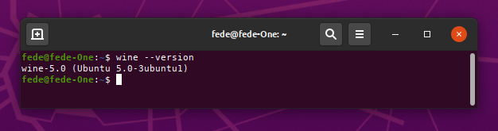
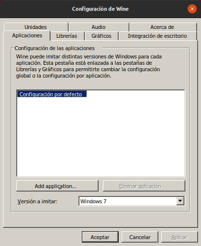
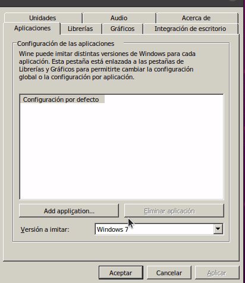

# Como instalar wine en ubuntu 20.04

## Introducción

A veces, como ocurre en esta ocasión, el software que necesitamos no está disponible para distribuciones Linux. En muchos casos es suficiente con instalar Wine (Wine Is Not an Emulator) para poder ejecutar estas aplicaciones. Wine es una implementación de una interfaz de aplicaciones de Windows para sistemas operativos basados en Unix.

## Soporte para arquitectura de 32 bits

Lo primero que vamos a hacer es agregar soporte para arquitectura de 32 bits.

Abrimos una terminal de comandos y ejecutamos:

`$ sudo dpkg --add-architecture i386`

Si el comando anterior ha tenido éxito, el que vemos a continuación deberá devolvernos `i386`.

`$ sudo dpkg --print-foreign-architectures`

En la imagen 1 observamos lo anterior.

| Imagen 1 |
|:-:|
|  |
| Terminal con comandos para añadir arquitectura de 32 bits |

## Añadir repositorio e instalar Wine

Es un poco complicado saber que versión de Wine es la mejor para nuestro software, incluso es posible tener instaladas varias versiones al mismo tiempo, aunque hay que tener mucho cuidado con los conflictos entre dependencias entre versiones múltiples.

En el enlace tenemos la [base de datos oficial de aplicaciones wine](https://appdb.winehq.org/) por si queremos investigar el tema de forma mas profunda.

Vamos a descargar y añadir el repositorio WineHQ tecleando los siguientes comandos:

Descargamos y agregamos la clave (key) del repositorio:

`$ wget -O - https://dl.winehq.org/wine-builds/winehq.key | sudo apt-key add -`

Agregamos el repositorio, en nuestro caso Ubuntu 20.04 Focal Fosa:

`$ sudo apt-add-repository https://dl.winehq.org/wine-builds/ubuntu/`

Ahora actualizamos los paquetes:

`$ sudo apt update`

Procedemos a instalar la versión de Wine de entre las disponibles:

* Estable: `sudo apt install --install-recomienda winehq-stable`
* En desarrollo: `$ sudo apt install --install-recomienda winehq-devel`
* En preparación: `$ sudo apt install --install-recomienda winehq-staging`

Una vez finalizada la instalación podemos ver si todo ha funcionado solicitando la versión instalada con el comando `$ wine --version`, tal y como observamos en la imagen 2.

| Imagen 2 |
|:-:|
|  |
| Versión de Wine instalada |

## Configuración de Wine

Ahora podemos entrar en la configuración de Wine tecleando en una terminal `$ winecfg`y se nos abrirá una ventana como la que vemos en la imagen 3.

| Imagen 3 |
|:-:|
|  |
| Ventana de configuración de Wine |

Si se solicita instalar .NET framework, Wine Gecko o Mono framework procedemos con la instalación.

Desde la ventana de la imagen 3 podemos, por ejemplo, seleccionar la versión de sistema operativo Windows con la que deseamos trabajar. En la animación siguiente observamos este punto.

 

## Desinstalar Wine

Si necesitamos eliminar Wine de nuestro sistema ejecutamos los comandos siguientes:

`$ sudo apt-get purge wine wine-*`  
`$ sudo apt-get autoremove --purge`

Para tener una desinstalación limpia eliminamos el directorio que contiene todos los datos generados durante el tiempo de ejecución de wine.

`$ rm -rf ~/.wine/`  
`$ rm -rf ~/.local/share/applications/wine*`

