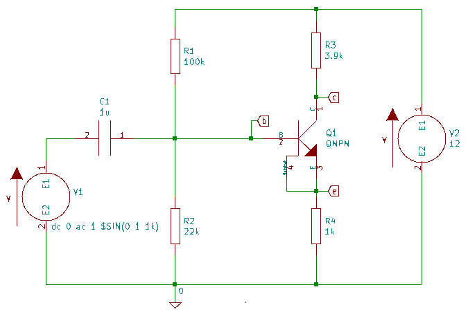
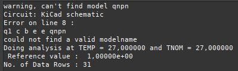
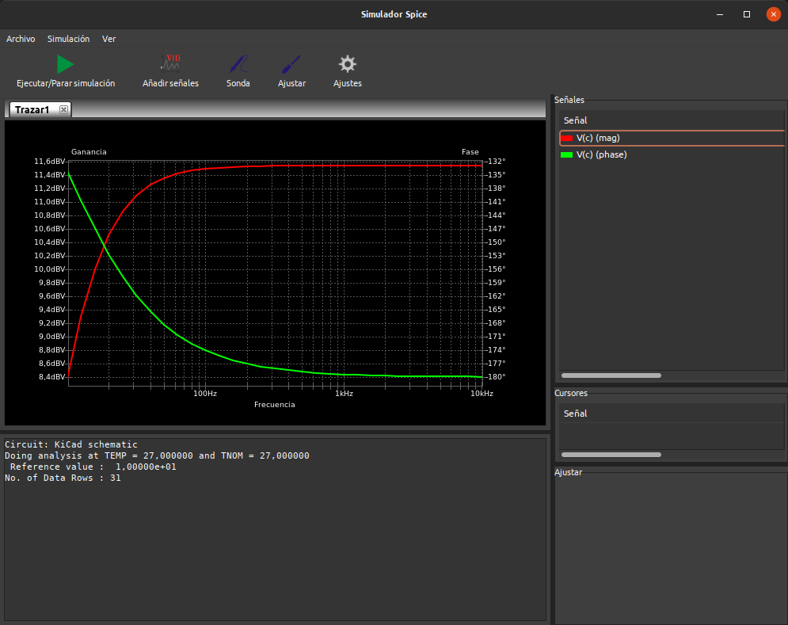
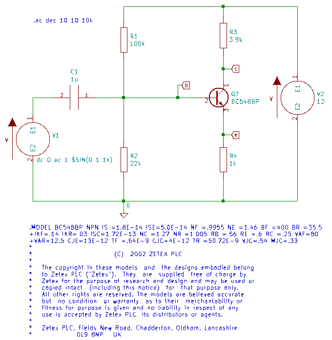
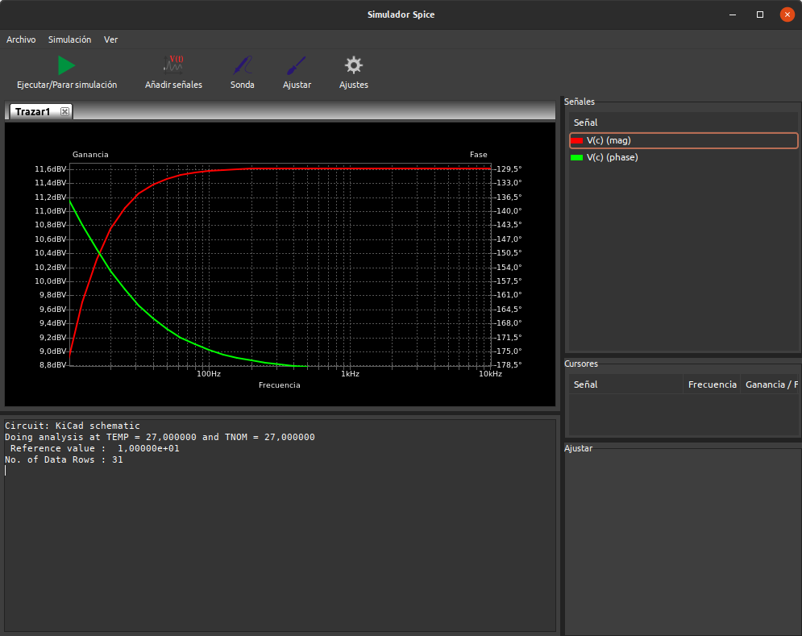
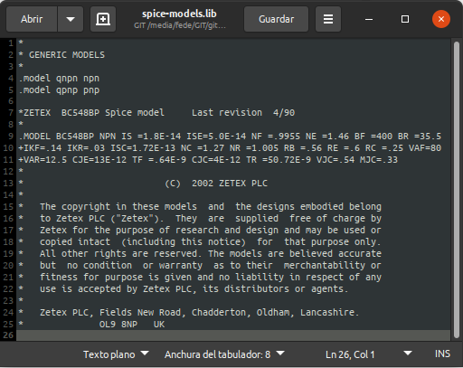
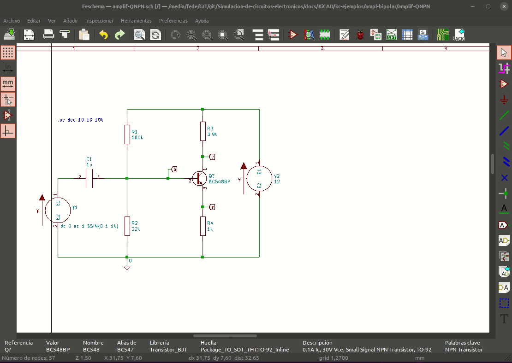
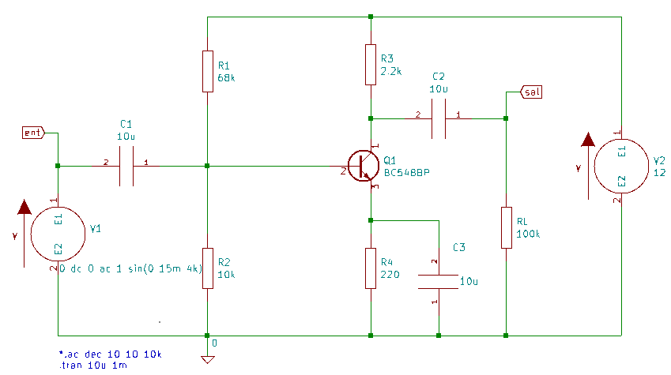
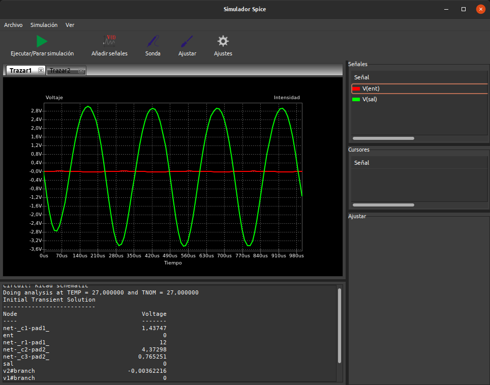
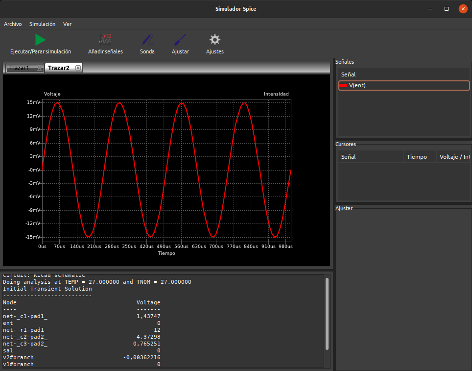

# Amplificador con transistor bipolar

Se trata de realizar un circuito como el visto para LTSpice denominado [Amplificador básico en emisor común](http://127.0.0.1:8000/Instalaciones/LTSpice/Mas-conceptos/#amplificador-basico-en-emisor-comun) pero en esta ocasión desde KiCAD y para ello disponemos de dos posibilidades, utilizar el transistor genérico QNPN que viene en las librerías que, aunque funcional, va a resultar poco útil para transistores reales, o bien asignar un modelo de un transistor específico. Nosotros vamos a ver las dos formas.

Por tanto el circuito que vamos a montar es un amplificador clase A de una etapa con autopolarización.

## Amplificador con QNPN

QNPN es el transistor NPN estándar que incluye KiCAD en las librerías para simulación que podemos hacer funcionar de una forma sencilla para una simulación inicial de circuitos de polarización y amplificadores clase A monoetapa.

Vamos a montar el circuito que vemos en la imagen 1 y vemos que ocurre para analizarlo.

| Imagen 1 |
|:-:|
|  |
| Esquema a montar a partir del transistor QNPN |

La fuente de excitación (` dc 0 ac 1 $SIN(0 1 1k)`) nos genera una señal AC sinusoidal de 1 kHZ con amplitud de 1V.

El ejemplo lo tenemos disponible para [descargar]() y modificar según nuestras necesidades. Si creamos una simulación .ac e intentamos ejecutarla nos vamos a encontrar con un mensaje como el que vemos en la imagen 2. El error nos avisa de que no encuentra un modelo válido para QNPN y de otras circunstancias como la temperatura a la que se va a realizar la simulación.

| Imagen 2 |
|:-:|
|  |
| Error por no asignar modelos a QNPN |

Una primera solución del problema va a ser utilizar la directiva `.model` para especificar el modelo de transistor. Para especificar un NPN genérico basta con poner en el esquema la directiva `.model qnpn npn` que permitirá realizar la simulación. Si creamos una simulación `.ac dec 10 10 10k`, abrimos la herramienta de simulación, ejecutamos el análisis y añadimos la señal V(c) tendremos algo similar a lo que vemos en la imagen 3, donde resulta evidente que SPICE está funcionando.

| Imagen 3 |
|:-:|
|  |
| Resultado simulación AC tras añadir un modelo genérico al transistor QNPN |

Una segunda forma es poner un modelo SPICE válido de un transistor concreto que podemos descargar de la web.  En nuestro caso vamos a utilizar el modelo de Zetex que podemos ver en la imagen 4. 

| Imagen 4 |
|:-:|
|  |
| Añadir un modelo BC548BP |

Debemos observar varias cosas:

1. El transistor debemos cambiarlo por uno de la librería de componentes y cambiarle el nombre para que coincida exactamente con el que aparece en `.model` o el intento de simulación nos dará errores.

2. Es necesario, aunque no para la simulación, agregar la licencia del modelo puesto que la tiene.

3. Toda la información del modelo ocupa bastante espacio en el esquema y no aporta nada al mismo, por lo que sería interesante poder disponer de esa información en un formato más compacto, como veremos seguidamente.

El resultado de simular este nuevo circuito es el que vemos en la imagen 5. El resultado es muy similar al obtenido en la imagen 3 pero se ponen de manifiesto los detalles de no idealidad al tratarse de un componente real y no genérico.

| Imagen 5 |
|:-:|
|  |
| Resultado simulación AC tras añadir un modelo BC548 |

Una tercera alternativa es crearnos nuestra propia biblioteca con los modelos que usemos de forma habitual y añadir esa información a las propiedades del componente. Debemos guardar el archivo en una ubicación que recordemos para poder recurrir al mismo cuando sea necesario. El archivo debe crearse como texto plano y podría ser algo similar a lo que vemos en la imagen 6.

| Imagen 6 |
|:-:|
|  |
| Archivo spice-models.lib personal |

Para asignar nuestra librería al componente vamos a proceder como vemos en la animación siguiente.

La librería personal creada la tenemos disponible para [descargar](../KiCAD/library/spice-models.lib) y utilizar a nuestra conveniencia.

Una cuarta forma, muy similar a la anterior, es descargar una librería completa de la web y añadir esa librería compatible de la misma forma que hemos visto en la animación anterior. Para el caso que nos ocupa una librería que contiene el transistor buscado la podemos [descargar desde este enlace](../KiCAD/library/ZETEX-Spice-Model-Library.lib). En este [otro enlace de Diodes Incorporated](https://www.diodes.com/design/tools/spice-models/) tenemos disponibles multitud de librerías para su descarga.

El ejemplo lo podemos [descargar](..//KiCAD/kc-ejemplos/ampl-bipolar/amplif-QNPN.zip) para trabajar con el mismo.

## Amplificador con BC548

Con todo lo visto en el punto anterior ya podemos configurar un amplificador en emisor común autopolarizado similar al visto en el [apartado correspondiente](http://127.0.0.1:8000/Instalaciones/LTSpice/Mas-conceptos/#amplificador-basico-en-emisor-comun) con LTSpice.

Vamos a comenzar por montar el circuito que vemos en la imagen 7.

| Imagen 7 |
|:-:|
|  |
| Amplificador en EC con BC548 |

La fuente de excitación la configuramos como `0 dc 0 ac 1 sin(0 15m 4k)` que indica que el valor de la componente continua es cero, que activamos como fuente AC con una tensión sinusoidal de 15 mV y una frecuencia de 4 kHz.

El tipo de análisis lo configuramos de la siguiente forma:

`*.ac dec 10 10 10k`

`.tran 10u 1m`

La primera línea precedida de un asterísco hace que esa simulación quede comentada y la segunda línea habilita un análisis transitorio que dura 1 ms con incrementos de 10 us.

En la imagen 8 vemos la simulación con las señales de entrada y salida añadidas dando una ganancia en tensión cercana a 400.

| Imagen 8 |
|:-:|
|  |
| Comparativa señales de entrada y salida |

En la imagen 9 vemos la señal de entrada en una nueva ventana de trazado añadida desde el menú Archivo -> Nuevo trazado (Ctrl+N).

| Imagen 9 |
|:-:|
|  |
| Señal de entrada en un nuevo trazado |

El ejemplo lo podemos [descargar](..//KiCAD/kc-ejemplos/ampl-bipolar/amplif-BC548.zip) para trabajar con el mismo.
