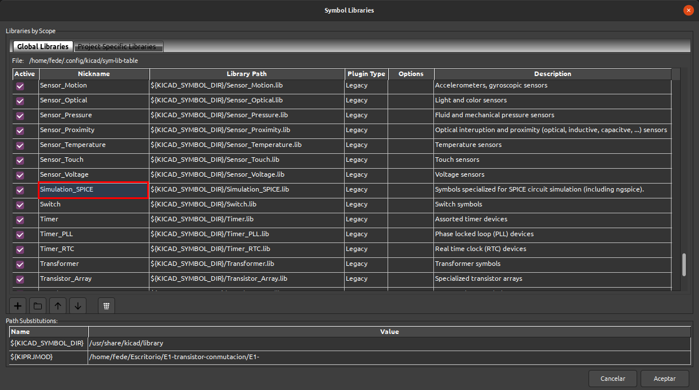

# Simulación con KiCAD

Partiremos de la base de que el lector sabe crear diagramas esquemáticos con [KiCAD](http://kicad-pcb.org/) ya que nuestro enfoque es simular circuitos con el programa y no tanto ser un tutorial de kiCAD.

En la web hay muchos tutoriales y recursos que nos ayudan a aprender a crear esquemas, incluido el [manual de KiCad - Eeschema](https://docs.kicad-pcb.org/5.1/es/eeschema/eeschema.html). También hay información, aunque un poco anticuada, en este [repo](https://github.com/fgcoca/KiCAD-PCBs-soldadura-desoldadura)

Los ejemplos estarán desarrollados en la version 5.1.6 de KiCAD corriendo bajo Ubuntu 20.04.

KiCad utiliza [ngspice](http://ngspice.sourceforge.net/) para realizar las simulaciones de circuitos y está basado en **SPICE**. Por lo tanto, para llevar a buen termino una simulación, necesitamos agregar la información apropiada relacionada con SPICE al esquema para que ngspice pueda trabajar.

NGSpice es parte del proyecto [gEDA](http://www.geda-project.org/), un conjunto completo de diseño electrónico GPL (General Public License).

KiCAD incluye la librería Spice que vemos en la imagen 1 donde asigna implícitamente modelos a componentes pasivos, como resistencias y condensadores, sin embargo, los modelos para dispositivos semiconductores, como diodos y transistores, deben asignarse explícitamente. 

| Imagen 1 |
|:-:|
|  |
| Libreria Spice en KiCAD |

