# Amplificadores operacionales

Vamos a introducir aquí un par de circuitos para simulación desde KiCAD. Aprenderemos a trabajar con Netlist y explicaré los que a mi entender son los tres tipos de análisis fundamentales y para ello vamos a utilizar un circuito estándar con amplificador operacional como es el amplificador inversor de una determinada ganancia.

## Amplificador inversor

Veamos en primer lugar el circuito a montar y como generamos una netlist. En la imagen 1 tenemos el esquemático del circuito a simular. El esquema corresponde a un amplificador inversor de ganancia 25 con una fuente de alimentación dual de 15V.

| Imagen 1 |
|:-:|
| 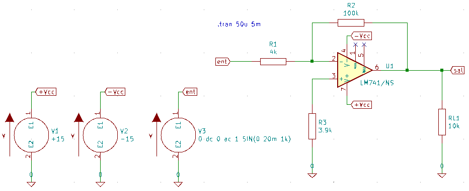 |
| Esquema del amplificador inversor |

Podemos utilizar los modelos spice de proveedores como [Texas Instruments](http://www.ti.com/) o [Linear Technology](http://www.linear.com/) para definir el amplificador operacional. En nuestro caso vamos a utilizar el [modelo del LM741 de Texas Instruments](https://www.ti.com/lit/zip/snom211) para trabajar.

Tenemos por otro lado el problema de que la numeración de pines que hay en la descripción del modelo spice (imagen 2) no cumple con la numeración de pines del símbolo U1 de KiCad, el LM741. El modelo requiere la siguiente secuencia:

* entrada no inversora
* entrada inversora
* Alimentación positiva
* Alimentación negativa
* Salida

| Imagen 2 |
|:-:|
| 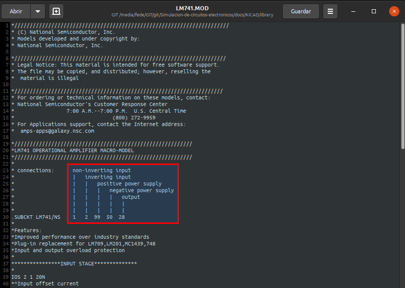 |
| Numeración de pines en el modelo spice del LM741 |

En KiCAD los pares son:

* entrada inversora -> 2
* entrada no inversora -> 3
* Alimentación negativa -> 4
* Alimentación positiva -> 7
* Salida 6

Es decir, necesitamos que los pines de KiCad estén ordenarse en la secuencia 3 2 7 4 6 y para ello dispone del campo 'Secuencia alternativa de nodo'. El proceso completo de asignación de modelo y secuencia de pines lo vemos en la imagen 3, donde se ven los ajustes finales.

| Imagen 3 |
|:-:|
| 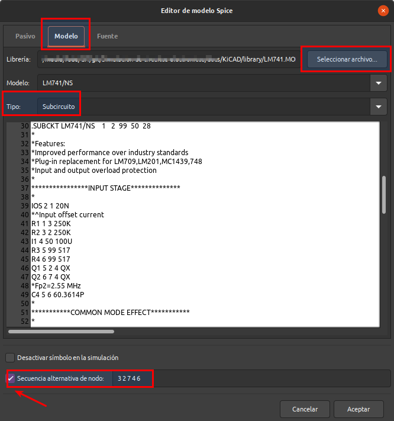 |
| Ajustes finales de asignación del modelo spice del LM741 |

Los resultados de la simulación los vemos en la imagen 4.

| Imagen 4 |
|:-:|
| 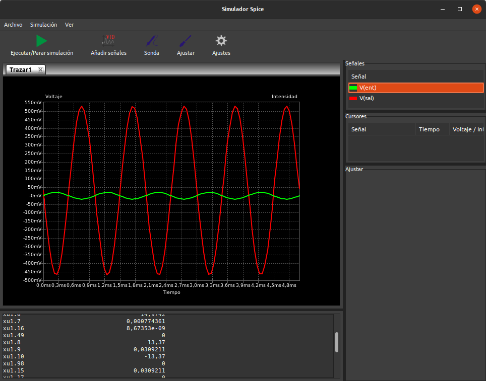 |
| Resultado de la simulación .tran |

Vamos ahora a introducir una nueva simulación, en este caso `.ac` para ver la respuesta en frecuencia, así que procedemos a comentar la anterior (`*.tran 50u 5m`) y a introducir `.ac dec 10 1 1MEG`. Ejecutamos los pasos habituales y en la imagen 5 podemos ver el resultado de la nueva simulación.

| Imagen 5 |
|:-:|
| 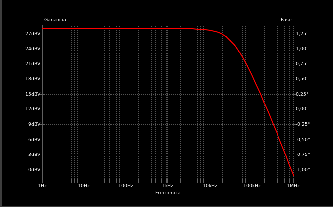 |
| Respuesta en frecuencia del amplificador inversor |

Vamos a generar la lista de conexiones del circuito accediendo a través del icono correspondiente y seleccionando de entre las opciones disponibles la de *Spice*, tal y como observamos en la imagen 6.

| Imagen 6 |
|:-:|
| 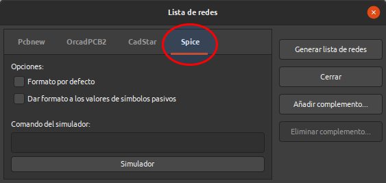 |
| Ventana de selección de tipo de netlist |

Pulsamos en *Generar lista de redes* y se creará un archivo .cir en el directorio de nuestro proyecto. Si abrimos ese archivo con un editor de texto veremos lo que aparece en la imagen 7.

| Imagen 7 |
|:-:|
| 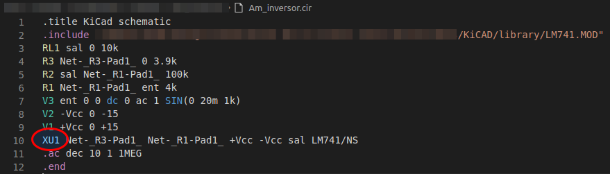 |
| Netlist Spice del amplificador inversor |

Podemos observar el nombre del archivo, la librería que estamos utilizando, la lista de conexiones en formato texto legibles por otras aplicaciones que integren spice y cabe destacar como la referencia del circuito integrado se ha renombrado a XU1, indicando la X que es un modelo Spice. Podemos comprobarlo accediendo desde el esquemático a las propiedades del componente y se nos mostrará la ventana de la imagen 8.

| Imagen 8 |
|:-:|
| 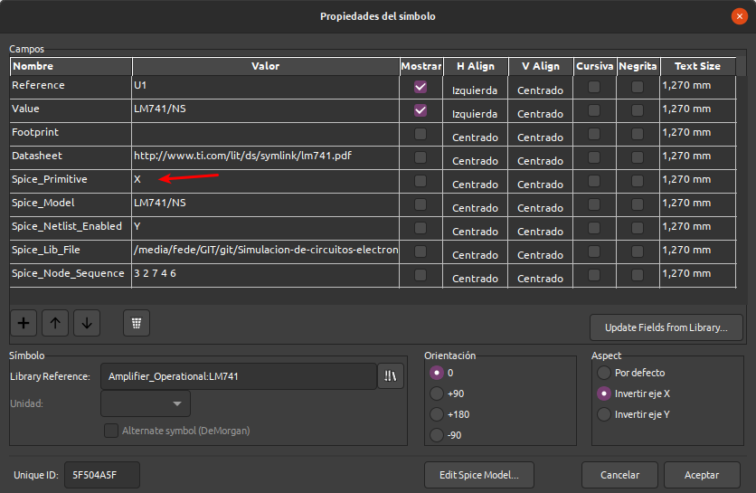 |
| Propiedades del compoente U1 |

El ejemplo lo podemos [descargar](../KiCAD/kc-ejemplos/opamp/Am_inversor/Am_inversor.zip) para trabajar con el mismo.

## Filtros de Sallen-Key

Vamos a aprovechar que con KiCAD viene con un filtro pasa baja de orden 2 de este tipo para introducir este tipo de filtro y finalmente construir un filtro pasa banda con células Sallen-Key.

### Introducción

Cuando hablamos de configuraciones sencillas de filtros de primer orden y segundo orden Sallen-Key es una de las configuraciones más comunes que se puede convertir en un bloque que permita crear filtros de ordenes mas altas.

Ahora bien, existe una relación entre la ganancia en tensión y el factor de calidad por efecto del amplificador operacional que se utiliza. Se pueden obtener valores de Q mayores que 0.5 porque al usar una configuración no inversora, la ganancia en tensión siempre será mayor que la unidad, pero debe ser menor que 3 o el sistema se volverá inestable.

Un filtro pasa alta de Sallen-Key lo vemos en la imagen 9. Podemos observar que los condensadores no están conectados a GND sino en la realimentación positiva del amplificador y que el operacional está configurado como un búfer de ganancia unidad.

| Imagen 9 |
|:-:|
| 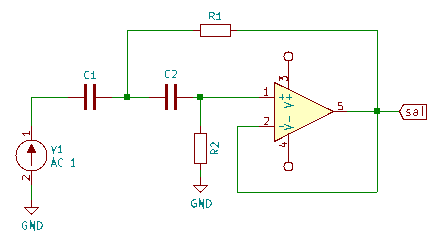 |
| Célula Sallen-Key pasa alta |

Con C1, R1, C2 y R2 se forma el filtro de segundo orden en el que los condensadores para las bajas frecuencias se comportan como circuitos abiertos no reflejándose la señal de entrada en la salida y para las altas frecuencias apenas tendrán efecto en la señal de entrada pasando esta a la salida. Ahora bien, cerca del punto correspondiente a la frecuencia de corte las reactancias capacitivas serán del mismo valor que las resistencias por lo que existe realimentación positiva a través de C2 que proporciona ganancia en tensión.

La frecuencia de corte vendrá dada por:

$f_{c}=\dfrac{1}{2\pi\sqrt {R_{1}\cdot C_{1}\cdot R2\cdot C2}}$

Y si hacemos que las capacidades sean C1 = C2 = C y las resistencias R1 = R2 = R podemos poner que:

$f_{c}=\dfrac{1}{2\pi\sqrt {R \cdot C}}$

En el directorio "/usr/share/kicad/demos/simulation/sallen_key" tenemos el filtro pasa baja que se distribuye con KiCAD que vamos a ver brevemente. Lo adecuado es hacer una copia del directorio en nuestro directorio de trabajo para no correr el riesgo de estropear algo en el original.

El esquema del circuito lo vemos en la imagen 10.

| Imagen 10 |
|:-:|
| 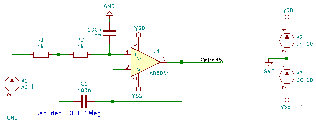 |
| Filtro pasa baja demo |

Si ejecutamos el análisis podemos ver que se comporta como un filtro pasa baja de segundo orden. Será este tipo de filtro el que usemos para construir un filtro pasa banda utilizando un modelo de amplificador operacional dual.

### Filtro pasa banda con operacional dual

Para hacer el filtro vamos a necesitar un filtro pasa baja y un filtro pasa alta ambos construidos con células de Sallen-Key por lo que vamos a necesitar dos operacionales. Es evidente que se puede hacer con dos operacionales individuales, pero si lo fabricamos con un amplificador operacional dual ahorramos mucho espacio (un circuito integrado) y conseguimos que las características de ambos circuitos integrados sean muy parecidas. Vamos entonces a buscar modelos de operacionales duales y a ver como configurar todo para que funcione. La familia TL08x de Texas Instruments dispone de un modelo dual, el TL082 del que disponemos del [modelo spice TL082.301](https://www.ti.com/product/TL082) para descargar y proceder a incorporarlo a nuestras librerías.

Si una vez descargado abrimos el archivo de librería con el editor de textos vemos, al principio del mismo lo que apreciamos en la imagen 11, donde la flecha nos indica que es el modelo TL082 y el recuadro el orden de pines.

| Imagen 11 |
|:-:|
| 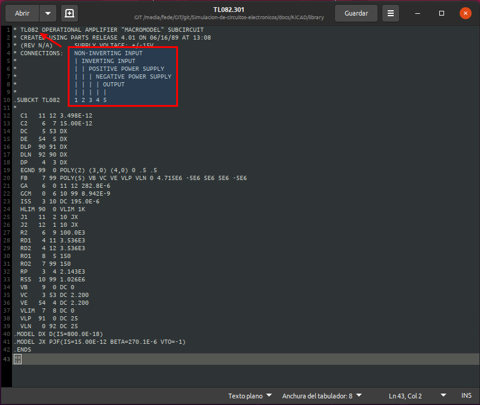 |
| Librería TL082.301 |

Observamos que el modelo solamente dispone de una entrada inversora, una entrada no inversora, una salida y los pines de alimentación.

Si en el esquemático de KiCAD intentamos añadir el operacional nos encontramos con algo similar a la imagen 12.

| Imagen 12 |
|:-:|
| 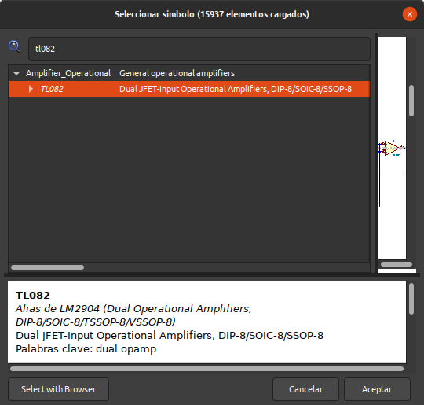 |
| Modelo TL082 en las liberias de KiCAD |

Vemos como claramente habla de un amplificador operacional dual.

Si accedemos a las propiedades del componente podemos ver que dispone de tres unidades (imagen 13), dos corresponden a las patillas de cada operacional, unidades A y B, y la unidad C que corresponde a la alimentación común a ambos operacionales.

| Imagen 13|
|:-:|
| 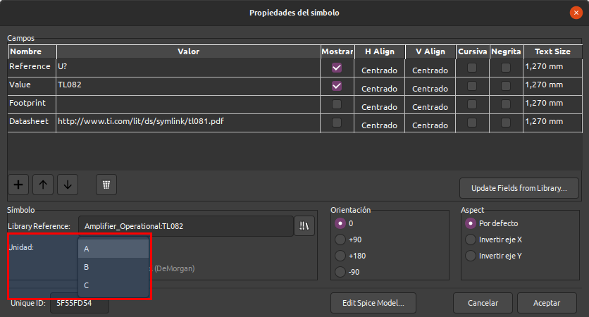 |
| Unidades del componente TL082 |

Si colocamos las tres unidades en KiCAD como en la imagen 14 vemos el aspecto que toma y como cada amplificador tiene sus propios pines de entradas y salidas. 

| Imagen 14 |
|:-:|
| 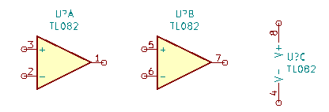 |
| TL082 en KiCAD |

A partir de las partes que vemos en la imagen 14 vamos a configurar el esquema de filtro pasa banda que vemos en la imagen 15.

| Imagen 15 |
|:-:|
| 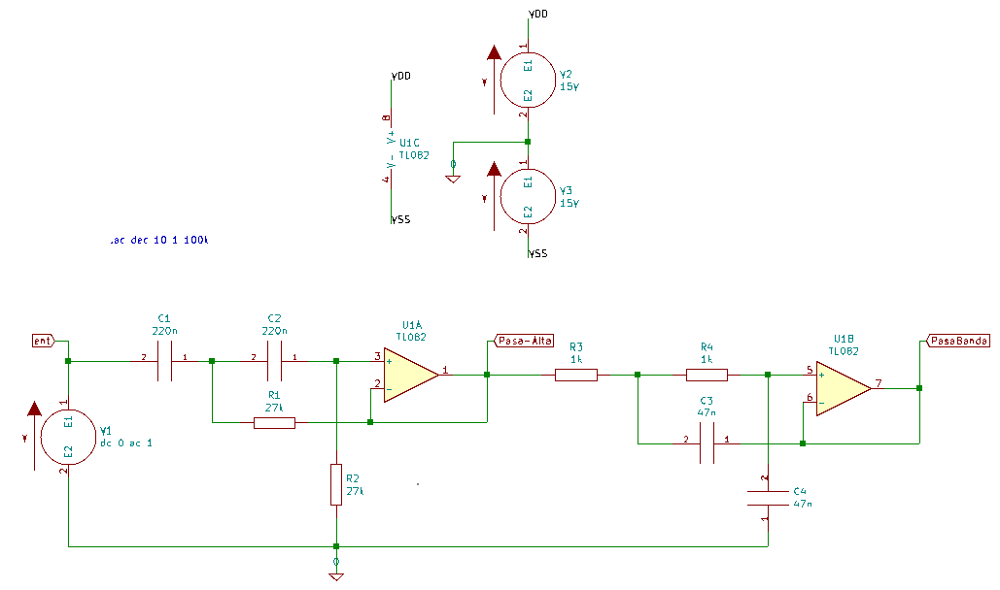 |
| Esquema de filtro pasa banda con TL082 |

Necesitamos agregar el modelo spice al amplificador operacional pero ya hemos visto que el modelo descargado solamente dispone de los pines (IN+, IN-, V+, V- y OUT). Sin embargo, de acuerdo con la [hoja de datos TL082](https://www.ti.com/lit/ds/symlink/tl082.pdf?HQS=ti-null-null-sf-df-pf-SEP-wwe&ts=1599469341100) y el diseño del circuito, necesitaremos 8 pines (1IN+, 1IN-, V+, V-, 1OUT, 2IN+, 2IN- y 2OUT) y necesitamos llamar al modelo dos veces porque tenemos dos amplificadores en el circuito. Como conclusión diremos que no se puede usar el modelo TL082.301 de TI directamente, sino que debemos convertirlo en una versión con dos amplificadores, que son los que contiene el TL082.

Vamos a crear un archivo librería como el que vemos en la imagen 16 que contiene el código necesario para crear el subcircuito ngspice. Es necesario que el archivo librería y el original descargado estén en el mismo directorio. Las líneas de código son las siguientes:

`* Modelo ngspice de amplificador operacional dual`

`* nombre del archivo: TL0822-dual.lib`

`.subckt TL082 1OUT 1IN- 1IN+ Vcc- 2IN+ 2IN- 2OUT Vcc+`

`.include TL082.301`

`XU1A 1IN+ 1IN- Vcc+ Vcc- 1OUT TL082`

`XU1B 2IN+ 2IN- Vcc+ Vcc- 2OUT TL082`

`.ends`

| Imagen 16 |
|:-:|
| 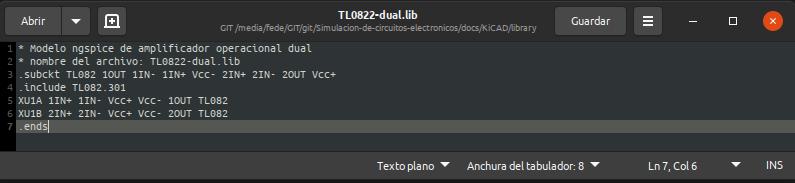 |
| Librería amplificador operacional dual |

Ejecutamos la simulación y ya podemos ver la respuesta en frecuencia del filtro pasa banda de orden dos, imagen 17, construido a partir de células de Sallen-Key.

| Imagen 17 |
|:-:|
| 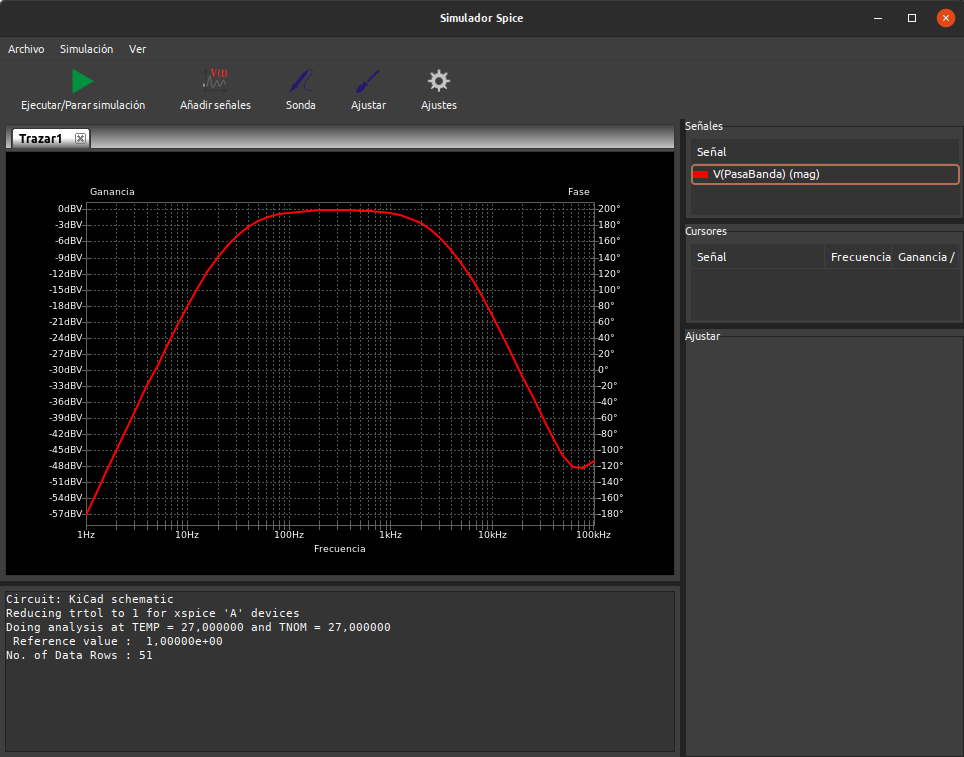 |
| Respuesta en frecuencia del filtro pasa banda Sallen-Key |

El ejemplo lo podemos [descargar](../KiCAD/kc-ejemplos/opamp/pasa-banda-sallen-key/pasa-banda-sallen-key.zip) para trabajar con el mismo.
