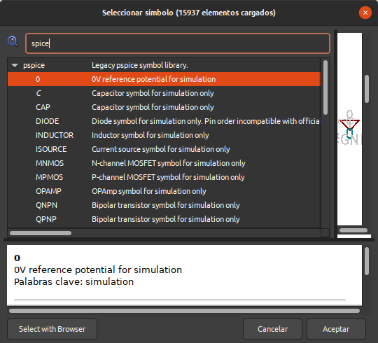

# Ejemplo de circuito con componentes pasivos

El objetivo va a ser analizar el comportamiento en corriente alterna de una red RC básica. Para ello creamos nuestro esquemático en KiCAD y procedemos a colocar componentes de la librería Spice en el mismo para obtener algo similar a lo que vemos en la imagen 1.

| Imagen 1 |
|:-:|
|  |
| Red RC básica con componentes para simulación |

En la imágenes 2a a 2d podemos ver de donde se ha tomado cada uno de los componentes colocados en el esquemático.

| Imagen 2a |  Imagen 2b |
|:-:|:-:|
|  |  |
| Componente: 0V o referencia | Componente: Condensador para simulación |

| Imagen 2c |  Imagen 2d |
|:-:|:-:|
|  |  |
| Componente: Resistencia para simulación | Componente: Fuente de tensión para simulación |

Ponemos valor a los componentes y mediante la herramienta annotate procedemos a dar nombre significativo a cada uno de los componentes para tener un esquema como el de la imagen 3.

| Imagen 3 |
|:-:|
|  |
| Anotación del esquema |

### Análisis AC

El siguiente paso es decirle a ngspice qué simular. En nuestro caso queremos una corriente alterna con frecuencia de 1 Hz a 100 kHz y con 10 puntos por década. Para ver como configurar adecuadamente esto tendremos que mirar, si no lo sabemos ya, el capitulo 15 del manual de ngspice dado en la [webgrafía](../Miscelanea/webgrafia.md), en concreto el punto 15.3.1 del que vemos parte en la imagen 4.

| Imagen 4 |
|:-:|
|  |
| Configuración análisis AC |

Tenemos dos formas de crear la directiva de análisis:

1. Colocando en el esquema la línea de texto `.ac dec 10 1 100k`. Esto pondrá estos datos en los ajustes del propio simulador, tal y como observamos en la imagen 5.

| Imagen 5 |
|:-:|
|  |
| Configuración análisis AC |

2. Desde la ventana de ajustes del simulador en la opción *Personalizado* de la imagen 5. Escribiendo la línea en esta ventana. **OJO** esto no actualizará la vista en el esquemático.

El acceso al simulador lo hacemos como vemos en la imagen 6.

| Imagen 6 |
|:-:|
|  |
| Acceso al simulador desde KiCAD |

La imagen 7 muestra el aspecto del simulador antes de ejecutar la simulación.

| Imagen 7 |
|:-:|
|  |
| Simulador recien abierto |

Como ya lo hemos dejado todo preparado para la simulación a partir de abrir el simulador podemos actuar tal y como observamos en la animación siguiente:

También observamos como añadir cursores y ocultar y mostrar señales.

En el menú ver del simulador tenemos opciones para cambiar el nivel de zoom en la gráfica que también podemos hacer con la rueda del ratón. Los ejes ajustan sus valores al nivel de zoom actual de forma automática. En la imagen 8 vemos una captura correspondiente a un nivel de zoom de acercamiento mostrando el cursor en la frecuencia de corte del filtro pasa baja que tiene como salida PB1. 

| Imagen 8 |
|:-:|
|  |
| Nivel de zoom para mostrar frecuencia de corte en PB1 |

### Análisis transitorio

Lógicamente debemos cambiar el tipo de análisis y también tenemos que cambiar la fuente de señal de entrada. La información de configuración de fuentes de tensión y corriente la encontramos en el capitulo 4 del manual de ngspice dado en la [webgrafía](../Miscelanea/webgrafia.md) o consultando el [resumen](resumen-manual.md) en el apartado correspondiente de este tutorial.

La fuente de tensión la vamos a configurar como `PULSE (0 5 1u 1u 1u 1 1)`. El significado de los parámetros de PULSE es: la tensión de entrada varía de 0 a 5 V, con un retardo de 1us, los tiempos de subida y bajada son de 1us, el ancho del pulso y el periodo son de 1s.

Vamos a crear el tipo de análisis como `.tran 1u 100m` que es mucho menor que el periodo por lo que en el tiempo que dura la simulación veremos el flanco ascendente de la señal.

En la imagen 8 tenemos el circuito con las condiciones actuales. Podemos observar como el análisis anterior se ha precedido por un punto y coma en lugar de un punto, lo que hace que no sea tenido en cuenta pero no lo perdemos y si queremos volver a usarlo basta con cambiar el punto y coma por un punto. De esta forma podemos tener todos los tipos que necesitemos siempre y cuando solamente uno esté activo.

| Imagen 9 ||
|:-:|:-:|
|  |  |
| Circuito para simulación transitoria | Gráfica de la simulación transitoria |

Este tipo de simulación la tenemos disponible en los ajustes de simulación por lo que podemos configurarla como se observa en la imagen 10.

| Imagen 10 |
|:-:|
|  |
| Configuración de la simulación en modo gráfico |

El ejemplo lo tenemos disponible para [descargar](../KiCAD/kc-ejemplos/red-RC/red-RC.zip) y modificar según nuestras necesidades.

