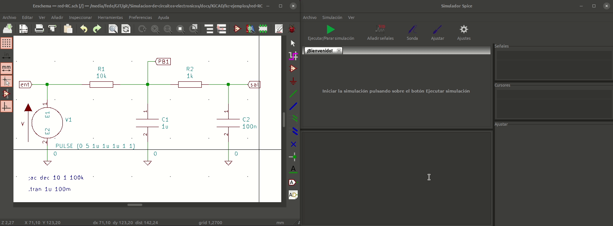

# Elementos Sonda y Ajustar del simulador

Veremos con animaciones como trabajar con estos dos elementos a partir del análisis temporal del ejemplo utilizado en el apartado [Red RC básica](red-rc.md).

## Sonda

Cuando queremos añadir una señal de un punto de un circuito que no hemos etiquetado y del que no conocemos el nombre del nodo podemos recurrir a esta herramienta que como vemos en la siguiente animación nos permite seleccionar un punto en un circuito desde el esquema. En esta ocasión elegimos el nodo *ent* y vemos que se añade *V(ent)*. Lógicamente esto mismo lo podemos hacer desde *Añadir señales*.

## Ajustar

Esta herramienta nos va a permitir realizar un ajuste del valor del componente (o de los componentes, pues podemos añadir mas de uno) entre dos valores comprendidos entre la mitad del valor especificado en el esquema y el doble del mismo. En la animación observamos como cambia la salida cuando actuamos sobre la barra deslizable para ajustar el valor del condensador de 100nF.

