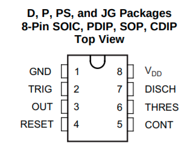
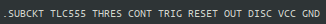
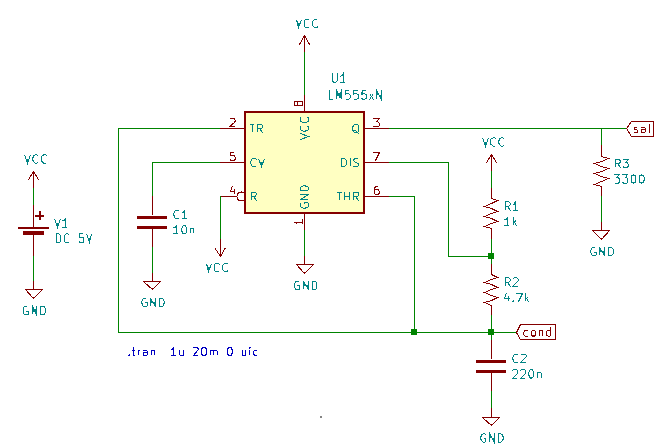
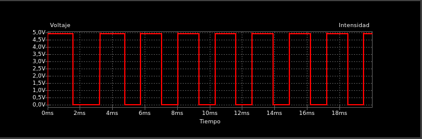
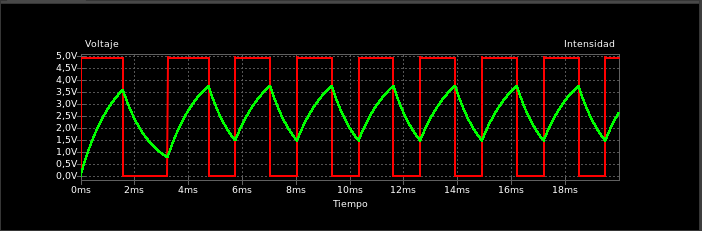
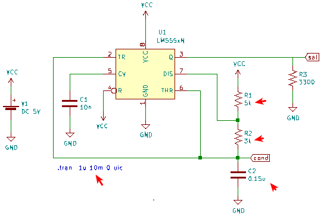
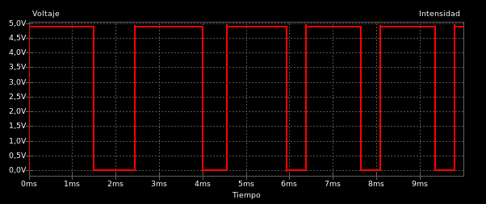
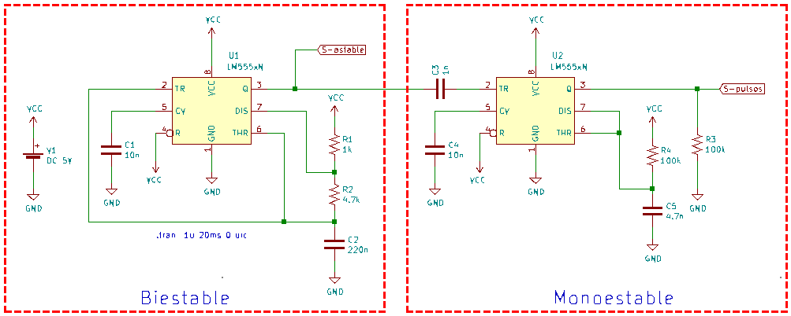
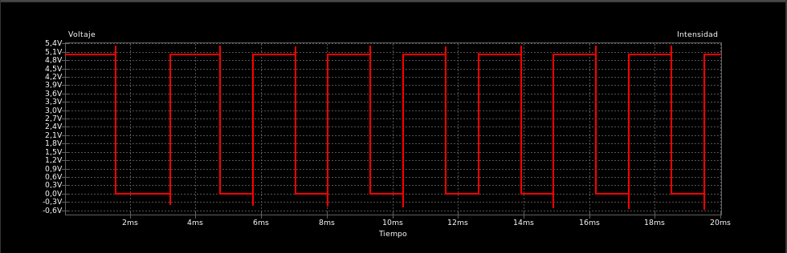
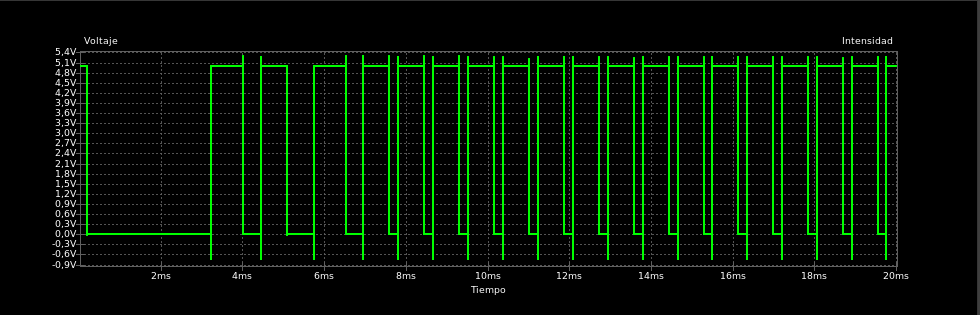

# Circuito integrado 555

## Introducción

El temporizador 555 es un circuito integrado (chip) que se utiliza en la generación de temporizadores, pulsos y oscilaciones. El 555 puede ser utilizado para proporcionar retardos de tiempo, como un oscilador, y como un circuito integrado flip flop. Sus derivados proporcionan hasta cuatro circuitos de sincronización en un solo paquete.

El circuito integrado 555 posee dos modos de operación principales que veremos con ejemplos:

* Multivibrador biestable

* Multivibrador monoestable

La primera tarea va a ser localizar una librería spice que implemente el circuito y en primera instancia la vamos a encontrar para el modelo [TLC555 de Texas Instruments](https://www.ti.com/product/TLC555#design-development##design-tools-simulation) de donde podemos descargarla y agregarla al componente LM555 que viene en las librerías genéricas de KiCAD. Nos encontraremos con el problema de que dicha librería tiene errores.

En los foros de discusión de [sourceforge.net](https://sourceforge.net/p/ngspice/discussion/) podemos encontrar una librería con estos errores ya corregidos y lista para usar con ngspice. En el enlace podemos descargar esta librería [LTC555ng](https://sourceforge.net/p/ngspice/discussion/ngspice-tips/thread/d2048be2/04a7/attachment/TLC555ng.LIB).

Pero por algún motivo la librería pone un orden de pines que no se corresponde con los que indica el [datasheet TLC555]() en la directiva `.subckt` que nos dará errores en la simulación. Si accedemos al datasheet podemos ver el orden de pines que se observa en la imagen 1.

| Imagen 1 |
|:-:|
|  |
| Pines del TLC555 |

En la tabla siguiente y a modo de recordatorio vemos la descripción de cada pin.

| Pin | Nombre | Descripción |
|:-:|:-:|---|
| 1 | GND | Terminal negativo de alimentación |
| 2 | TRIG | Es el pulso de disparo de la temporización. Cuando TRIG < CONT/2 la salida se pone en alto y la descarga en abierto |
| 3 | OUT | Es el pin de salida |
| 4 | RESET | Si lo activamos por debajo de 0.7V pone la ssalida a nivel bajo. Normalmente se conecta a Vcc para evitar el reinicio |
| 5 | CONT | Umbral de control del comparador. | 
| 6 | THRES | Es la entrada de un comparador interno  de umbral que se emplea para poner la salida a nivel bajo |
| 7 | DISCH | Salida de colector abierto para descargar el condensador externo |
| 8 | VDD o Vcc | Terminal positivo de alimentación. Máximo 18V |

En la imagen 2 vemos el orden de pines establecido en la librería LTC555ng.

| Imagen 2 |
|:-:|
|  |
| Orden de pines en la libreria original LTC555ng |

Podemos observar como el orden no se corresponde con el real indicado en el datasheet. En la tabla siguiente vemos el orden de pines de la librería comparados con los del datasheet para configurar correctamente la directiva.

| En LTC555ng.lib | Pin | En datasheet |
|:-:|:-:|:-:|
| THRES | 1 | GND |
| CONT | 2 | TRIG |
| TRIG | 3 | OUT |
| RESET | 4 | RESET |
| OUT | 5 | CONT |
| DISC | 6 | THRES |
| VCC | 7 | DISCH |
| GND | 8 | VDD |

Por tanto, utilizando los nombres usados en la librería, podemos configurar la directiva correctamente escribiéndola así:

`.SUBCKT TLC555 GND TRIG OUT RESET CONT THRES DISC VCC`

La librería la podemos [descargar](../KiCAD/library/TLC555ng.LIB) corregida y la tenemos lista para usar.

## Multivibrador biestable

Se trata de la operación del circuito en modo astable o de dos estados estables. En el datasheet nos dan la configuración del circuito, las ecuaciones de cálculo y un ejemplo con las señales obtenidas.

En la imagen 3 vemos el circuito capturado en KiCAD.

| Imagen 3 |
|:-:|
|  |
| Circuito para modo astable |

Indicar en este punto que ninguno de los componentes que vemos en el circuito proceden de las librerías spice sino del resto de librerías y que el funcionamiento es totalmente correcto. De esta forma reducimos el problema de simular un componente a tener disponible, o crear (este punto no es objeto de este tutorial) nosotros mismos el modelo spice.

Asignamos la librería al 555, damos valores a los componentes, anotamos el circuito y creamos una simulación transitoria y obtenemos la respuesta que vemos en la imagen 4.

| Imagen 4 |
|:-:|
|  |
| Resultado de la simulación de la configuración astable |

El ejemplo lo podemos [descargar](../KiCAD/kc-ejemplos/555/astable/astable.zip) para trabajar con el mismo.

Si añadimos la tensión en el condensador a la gráfica de la imagen 4 podemos observar como en cuanto el condensador estabiliza su carga la señal se convierte en el tren de pulsos estable que observamos en la imagen 5 en rojo.

| Imagen 5 |
|:-:|
|  |
| Señales en la salida y en el condensador |

Podemos trabajar con la opción ajustar para variar los valores de R1, R2 y C2 y ver como varían los tiempos de estado en alto y en bajo o cambiar directamente los valores de los componentes, como vemos en la imagen 6.

| Imagen 6a | Imagen 6b |
|:-:|:-:|
|  |  |
| Circuito con valores cambiados | Señal de salida |

## Multivibrador Monoestable

Vamos a partir de un multivibrador astable para excitar la entrada de uno monoestable y así generar un tren de pulsos. El circuito general lo vemos en la imagen 7.

| Imagen 7 |
|:-:|
|  |
| Astable como excitador de monoestable |

Podemos observar claramente los dos montajes diferentes. En la imagen 8 vemos el resultado de la simulación para la salida astable.

| Imagen 8 |
|:-:|
|  |
| Salida astable |

En la imagen 9 podemos observar el tren de pulsos generado por el multivibrador monoestable de la imagen 7.

| Imagen 9 |
|:-:|
|  |
| Salida del monoestable |

El ejemplo lo podemos [descargar](../KiCAD/kc-ejemplos/555/monoestable/monoestable.zip) para trabajar con el mismo.
